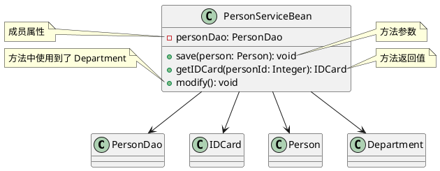
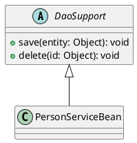
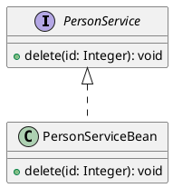
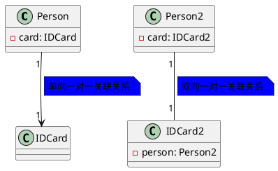
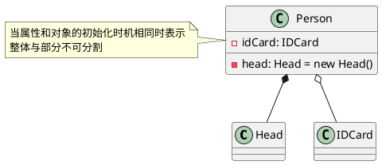

# 设计模式

## 简介

- 软件工程中，设计模式是对**软件设计中普遍存在(反复出现)的问题**，所提出的**解决方案**
- 使用设计模式，可以提高项目的**可扩展性，可维护性，规范性**
- 设计模式的目的
  1. **代码重用性**: 相同功能的代码，不用多次编写
  2. **可读性**：编程规范性，便于团队开发
  3. **可扩展性**(可维护性)：当需要增加新的功能时，非常方便
  4. **可靠性**：当我们增加新的功能后，对原来的功能不会造成太大影响
  5. 使程序呈现**高内聚，低耦合**的特性
- 设计模式七大原则
  1. 单一职责原则
  2. 接口隔离原则
  3. 依赖倒转原则
  4. 里氏替换原则
  5. 开闭原则
  6. 迪米特法原则
  7. 合成复用原则

## 七大原则

### 单一职责原则

> 基本介绍

对一个类来说，我们需要保证其只负责一项职责；如果一个类 A 负责两个不同职责(1/2)，由于职责1的需求改变而改变 A 时，可能会导致职责2执行错误，这时候就需要将类 A 的粒度分解为 A1，A2

> 应用实例-交通工具案例

```java
/**
 * 交通工具案例  - 方案1
 * @author 小丶木曾义仲丶哈牛柚子露丶蛋卷
 * @version 1.0
 * @date 2022/5/9 10:52
 */
public class Demo1 {

    public static void main(String[] args) {
        new Vehicle().run("汽车");
        new Vehicle().run("摩托");
        new Vehicle().run("飞机");
    }

}

/**
 * 交通工具类
 *  - 违背了单一职责原则(这里一个方法管 天上飞的/地上跑的/水里游的)
 *  - 解决方案：根据交通方法的运行方式不同，分解成不同类即可
 */
class Vehicle {
    public void run(String vehicleName) {
        System.out.println(vehicleName + " 在公路上run");
    }
}
```


```java
/**
 * 交通工具案例  - 方案2
 * @author 小丶木曾义仲丶哈牛柚子露丶蛋卷
 * @version 1.0
 * @date 2022/5/9 10:56
 */
public class Demo2 {

    public static void main(String[] args) {
        new RoadVehicle().run("摩托车");
        new AirVehicle().run("飞机");
        new WaterVehicle().run("游轮");
    }

}

/**
 * 对方案1的改进 - 将一个职责拆分成一个类
 * 优点：遵守单一职责原则
 * 缺点：本身的代码量较少，但这样改动对 服务端&客户端 原本的代码修改太大了
 * 解决方案：基于方案1，只修改 Vehicle 类，减少改动的代码
 */
class RoadVehicle {

    public void run(String vehicleName) {
        System.out.println(vehicleName + " 在公路上run");
    }

}

class AirVehicle {

    public void run(String vehicleName) {
        System.out.println(vehicleName + " 在天空上run");
    }

}

class WaterVehicle {

    public void run(String vehicleName) {
        System.out.println(vehicleName + " 在水上run");
    }

}
```


```java
/**
 * 交通工具案例  - 方案3
 * @author 小丶木曾义仲丶哈牛柚子露丶蛋卷
 * @version 1.0
 * @date 2022/5/9 11:01
 */
public class Demo3 {

    public static void main(String[] args) {
        new Vehicle2().run("汽车");
        new Vehicle2().runAir("飞机");
        new Vehicle2().runWater("游轮");
    }

}

/**
 * 在代码量不多，耦合度不高时，可以不遵守[类级别的单一职责原则]，从而保证[方法级别的单一职责原则]
 */
class Vehicle2 {
    public void run(String vehicleName) {
        System.out.println(vehicleName + " 在公路上run");
    }

    public void runAir(String vehicleName) {
        System.out.println(vehicleName + " 在天空上run");
    }

    public void runWater(String vehicleName) {
        System.out.println(vehicleName + " 在水上run");
    }
}
```


> 注意事项和细节

1. 降低类的复杂度，尽量保证一个类只负责一项职责
2. 提高类的可读性，可维护性
3. 降低变更引起的风险
4. 通常情况下，**我们应当遵守单一职责原则**
   - 只有逻辑足够简单，才可以在代码级违反单一职责原则
   - 只有类中的方法数量足够少，才可以在方法级别保持单一职责原则

### 接口隔离原则

> 基本介绍

当一个类依赖一个接口，而为了避免实现该接口的实现类写多余的方法，导致代码臃肿，我们应该将接口进行拆分，进行**接口隔离**

> 应用案例 - 不使用接口隔离原则


```java
public class Demo1 {

    public static void main(String[] args) {
        A a = new A();
        // 类A只依赖类B中的三个方法
        a.depend1(new B());
        a.depend2(new B());
        a.depend3(new B());
        // 类C只依赖类D中的三个方法
        C c = new C();
        c.depend1(new D());
        c.depend4(new D());
        c.depend5(new D());

    }

}

interface Interface1 {
    void operation1();
    void operation2();
    void operation3();
    void operation4();
    void operation5();
}

class B implements Interface1 {
    @Override
    public void operation1() {
        System.out.println("B.operation1()....");
    }

    @Override
    public void operation2() {
        System.out.println("B.operation2()....");
    }

    @Override
    public void operation3() {
        System.out.println("B.operation3()....");
    }

    @Override
    public void operation4() {
        System.out.println("B.operation4()....");
    }

    @Override
    public void operation5() {
        System.out.println("B.operation5()....");
    }
}

class D implements Interface1 {
    @Override
    public void operation1() {
        System.out.println("D.operation1()....");
    }

    @Override
    public void operation2() {
        System.out.println("D.operation2()....");
    }

    @Override
    public void operation3() {
        System.out.println("D.operation3()....");
    }

    @Override
    public void operation4() {
        System.out.println("D.operation4()....");
    }

    @Override
    public void operation5() {
        System.out.println("D.operation5()....");
    }
}

class A {
    public void depend1(Interface1 i) {
        i.operation1();
    }
    public void depend2(Interface1 i) {
        i.operation2();
    }
    public void depend3(Interface1 i) {
        i.operation3();
    }
}

class C {
    public void depend1(Interface1 i) {
        i.operation1();
    }
    public void depend4(Interface1 i) {
        i.operation4();
    }
    public void depend5(Interface1 i) {
        i.operation5();
    }
}
```


> 应用案例 - 使用接口隔离原则


```java
public class Demo2 {

    public static void main(String[] args) {
        // 类A通过Interface1,Interface2依赖类B，类B并不需要因此实现多余的方法
        A a = new A();
        a.depend1(new B());
        a.depend2(new B());
        a.depend3(new B());
        // 类C通过Interface1,Interface3依赖类D，类D并不需要因此实现多余的方法
        C c = new C();
        c.depend1(new D());
        c.depend4(new D());
        c.depend5(new D());

    }

}

interface Interface1 {
    void operation1();
}

interface Interface2 {
    void operation2();

    void operation3();
}

interface Interface3 {
    void operation4();

    void operation5();
}

class B implements Interface1, Interface2 {
    @Override
    public void operation1() {
        System.out.println("B.operation1()....");
    }

    @Override
    public void operation2() {
        System.out.println("B.operation2()....");
    }

    @Override
    public void operation3() {
        System.out.println("B.operation3()....");
    }
}

class D implements Interface1, Interface3 {
    @Override
    public void operation1() {
        System.out.println("D.operation1()....");
    }

    @Override
    public void operation4() {
        System.out.println("D.operation4()....");
    }

    @Override
    public void operation5() {
        System.out.println("D.operation5()....");
    }
}

class A {
    public void depend1(Interface1 i) {
        i.operation1();
    }

    public void depend2(Interface2 i) {
        i.operation2();
    }

    public void depend3(Interface2 i) {
        i.operation3();
    }
}

class C {
    public void depend1(Interface1 i) {
        i.operation1();
    }

    public void depend4(Interface3 i) {
        i.operation4();
    }

    public void depend5(Interface3 i) {
        i.operation5();
    }
}
```

> 与单一职责原则的区别

- 单一职责原则原注重的是职责；而接口隔离原则注重对接口依赖的隔离
- 单一职责原则主要是约束类，其次才是接口和方法，它针对的是程序中的实现和细节；而接口隔离原则主要约束接口方法，主要针对抽象，针对程序整体框架的构建。

> 接口隔离的原则

- 接口尽量小，但是要有限度。对接口进行细化可以提高程序设计灵活性是不挣的事实，但是如果过小，则会造成接口数量过多，使设计复杂化。所以一定要适度。
- 为依赖接口的类定制服务，只暴露给调用的类它需要的方法，它不需要的方法则隐藏起来(private)。只有专注地为一个模块提供定制服务，才能建立最小的依赖关系。
- 提高内聚，减少对外交互。使接口用最少的方法去完成最多的事情。

### 依赖倒转原则

> 基本介绍

- 高层模块不应该直接依赖于底层模块，二者都应该依赖其抽象
- **抽象不应该依赖细节，细节应该依赖抽象**
- 依赖倒转的**核心**在于**面向接口编程**
- 设计理念：相对于细节的多变性，抽象的东西要稳定的多，以抽象为基础搭建的架构要比以细节为基础的架构要稳定的多。在 java 中，抽象指的是接口/抽象类，而细节就是实现类
- 使用**接口/抽象类**的目的就是定制好**规范**，而**不涉及任何具体的操作**，把展现细节的任务交给**实现类去完成**

> 应用案例 - 不使用依赖倒转

```java
class Email {
    public void send() {
        System.out.println("发送电子邮件");
    }
}

class Person {
    /**
     * 高层模块直接使用底层模块
     * 优点：编码简单
     * 缺点：可扩展性低，如果这个时候说要发送wx/qq等等其他消息就需要对代码进行重构
     * @param email
     */
    public void toSend(Email email) {
        email.send();
    }
}
```

> 应用案例 - 使用依赖倒转

```java
interface MessageType {
    void sendMessage();
}

class Email2 implements MessageType {
    @Override
    public void sendMessage() {
        System.out.println("发送邮件");
    }
}

class WeChat implements MessageType {

    @Override
    public void sendMessage() {
        System.out.println("发送微信");
    }
}

class Person2 {
    /**
     * 高层模块不直接使用底层模块细节(实现类)，而是依赖其抽象，从而屏蔽底层实现细节，提高代码的可扩展性和维护性
     * @param messageType
     */
    public void toSend(MessageType messageType) {
        messageType.sendMessage();
    }
}
```

> 依赖传递的三种方式

1. 接口传递

   ```java
   interface Type {
       void test();
   }
   
   class TypeA implements Type {
       @Override
       public void test() {
           System.out.println("TypeA....test");
       }
   }
   
   /**
    * 1. 接口传递
    */
   class Memeber {
       /**
        * 通过接口(方法)参数传递依赖
        * @param type
        */
       public void seeType(Type type) {
           type.test();
       }
   }
   ```

2. 构造方法传递

   ```java
   /**
    * 2. 通过构造器传递
    */
   class Member {
   
       private Type iType;
   
       public Member(Type iType) {
           this.iType = iType;
       }
   
       public void seeType() {
           this.iType.test();
       }
   }
   ```

3. setter 方式传递

   ```java
   /**
    * 3. 通过setter方法传递
    */
   class Member {
       private Type iType;
   
       public void seeType() {
           this.iType.test();
       }
   
       public void setiType(Type iType) {
           this.iType = iType;
       }
   }
   ```

> 原则和注意事项

1. 底层模块尽量都有抽象类或接口(也可以二者都有)，程序稳定性更好
2. 变量的声明类型尽量是抽象类/接口，这样变量和实际对象间，就存在一个缓冲层，利于程序的扩展和优化
3. 继承时遵守**里氏替换原则**

### 里氏替换原则

> OOP中的继承性的思考和说明

1. 继承其实包含了这样的一层含义：父类中凡是已经实现好的方法，实际上是在**设计规范和契约**，虽然不强制要求所有子类必须遵循这些契约。但如果子类对这些实现的方法任意修改，就会对整个继承体系造成破坏
2. 继承给程序设计带来便利的同时，也带来了弊端，比如使用继承会给程序带来侵入性，程序的可移植性降低，增加对象间的耦合性，当我们需要修改父类时，必须要考虑到所有子类，并且父类修改后，所有涉及到子类的功能可能会产生故障

> 基本介绍：

- 在我们使用父类的地方，如果将其全部替换成任意子类，也不会影响程序的运行，就能保证所有**引用基类的地方能透明的使用其子类的对象**
- 即在使用继承时，在子类中**尽量**不要重写父类的方法
- 其实继承让两个类的耦合性增强了，在适当的情况下，可以通过聚合，组合，依赖来解决问题

> 应用案例 - 不遵守里氏替换原则

```java
public class Demo1 {

    public static void main(String[] args) {
        A a = new A();
        System.out.println("1 + 8 ==> " + a.func1(1, 8));
        B b = new B();
        System.out.println("1 + 8 ==> " + b.func1(1, 8));
        // 输出结果并不同，该程序中类B不能代替类A，就违反了里氏替换原则
    }

}

class A {
    public int func1(int a, int b) {
        return  a + b;
    }
}

class B extends A {
    @Override
    public int func1(int a, int b) {
        return a - b;
    }

    public int func2(int a, int b, int c) {
        return func1(a, b) + c;
    }
}
```

当我们无意的去重写父类的方法后，可能会造成原有功能出错。在实际编程中，我们常常通过重写父类的方法完成新的功能，虽然写起来简单，但会导致继承体系的复用性比较差，特别是运行多态比较频繁的时候

通常的做法：原来的**父类和特殊的子类继承一个更通俗的基类**，将原有的继承关系去掉，采用依赖，聚合，组合等关系代替

> 应用案例 - 遵守里氏替换原则

```java
public class Demo2 {

    public static void main(String[] args) {
        C c = new C();
        System.out.println("8 + 8 ==> " + c.func1(8, 8));
        // 因为我们将 func1() 抽取了出来，并不作为父类的方法，所以这里是遵循里氏替换原则的(D not extends C)
        D d = new D();
        System.out.println("8 - 8 ==> " + d.func1(8, 8));

    }

}

class Base {
    // 抽取类C和类D的公共方法(代码)
}

class C extends Base {
    public int func1(int a, int b) {
        return  a + b;
    }
}

class D extends Base {
    // 使用组合的方式引用类C的对象
    private final C c = new C();

    public int func1(int a, int b) {
        return a - b;
    }

    public int func2(int a, int b, int c) {
        return this.c.func1(a, b) + c;
    }
}
```

### 开闭原则

> 基本介绍

1. 开闭原则(OCP)是编程中**最基础，最重要**的设计原则
2. 一个项目中的类/模块/函数应该**对扩展开放(从提供方的角度出发)，对修改关闭(从使用方的角度出发)**，用抽象构建框架，用实现扩展细节
3. 当软件需求变化时，尽量**通过扩展软件实体**的行为实现变化，而不是通过修改已有代码来实现变化
4. 编程中遵循其他原则，以及使用设计模式的目的就是遵循**开闭原则**

> 应用案例 - 不遵守开闭原则

```java
public class Demo1 {

    public static void main(String[] args) {
        new GraphicEditor().drawShape(new Rectangle());
        new GraphicEditor().drawShape(new Circle());
    }

}

class GraphicEditor {
    public void drawShape(Shape s) {
        if (s.type == 1) {
            drawRectangle(s);
        } else if (s.type == 2) {
            drawCircle(s);
        }
    }

    private void drawRectangle(Shape shape) {
        System.out.println("绘制矩形");
    }

    private void drawCircle(Shape shape) {
        System.out.println("绘制圆型");
    }
}

class Shape {
    int type;
}

class Rectangle extends Shape {
    public Rectangle() {
        this.type = 1;
    }
}


class Circle extends Shape {
    public Circle() {
        this.type = 2;
    }
}
```

存在问题：当我们需要扩展 Shape 类型时，不仅需要 新建类&修改客户端调用代码(Demo1.main())，还需要修改 **GraphicEditor.drawShape()** 方法里面的处理逻辑，不仅麻烦而且没有遵守 OCP

> 应用案例 - 遵守 OCP

```java
public class Demo1 {

    public static void main(String[] args) {
        new GraphicEditor().drawShape(new Rectangle());
        new GraphicEditor().drawShape(new Circle());
    }

}

class GraphicEditor {
    public void drawShape(Shape s) {
        s.draw();
    }
}

abstract class Shape {
    int type;

    abstract void draw();
}

class Rectangle extends Shape {
    public Rectangle() {
        this.type = 1;
    }

    @Override
    void draw() {
        System.out.println("绘制矩形");
    }
}


class Circle extends Shape {
    public Circle() {
        this.type = 2;
    }

    @Override
    void draw() {
        System.out.println("绘制圆型");
    }
}
```

将原父类修改为 `abstract` 并定义抽象方法 `draw()`，当提供方需要扩展程序时(例如新建一个类)，继承该抽象类然后实现方法即可，同时使用方(**GraphicEditor.drawShape()**)不需要进行任何修改，遵守了 OCP 开闭原则

### 迪米特法则

> 基本介绍

1. 一个对象应该对其他对象保持最少的了解

2. 类与类关系越密切，耦合度越大

3. 迪米特法则又称为 **最少知道原则**，即一个类对自己依赖的类知道的越少越好，也就是说，对于被依赖的类不管多复杂，都尽量将逻辑封装到类的内部，对外除了提供 public 方法，不对外泄露任何信息

4. 简单定义：只与**直接的朋友**通信

   直接的朋友：每个对象都会于其他对象有耦合关系，只要两个对象之间有耦合关系，就代表两个对象之间是朋友关系；耦合的方式很多(依赖/关联/组合/聚合等)，其中，我们称**成员变量/方法参数/方法返回值中的类**为直接的朋友，其他的类最好不要以局部变量的形式出现在类的内部

> 应用案例

```java
public class Demo1 {

    public static void main(String[] args) {
        SchoolManager schoolManager = new SchoolManager();
        schoolManager.printAllEmployee(new CollegeManager());
    }

}

//学院员工类
class CollegeEmployee {
    private String id;

    public String getId() {
        return id;
    }

    public void setId(String id) {
        this.id = id;
    }
}

//管理学院员工的管理类:
class CollegeManager {
    /**
     * 返回学院的所有员工，这里的 CollegeEmployee 就是直接朋友
     *
     * @return
     */
    public List<CollegeEmployee> getAllEmployee() {
        List<CollegeEmployee> list = new ArrayList<>();
        //这里我们增加了10 个员工到list ，
        for (int i = 0; i < 10; i++) {
            CollegeEmployee emp = new CollegeEmployee();
            emp.setId("学院员工id " + i);
            list.add(emp);
        }
        return list;
    }
}

//学校总部员工类
class SchoolEmployee {
    private String id;

    public String getId() {
        return id;
    }

    public void setId(String id) {
        this.id = id;
    }
}

//学校管理类
class SchoolManager {
    /**
     * 返回学校总部的员工，直接朋友 SchoolEmployee
     *
     * @return
     */
    public List<SchoolEmployee> getAllEmployee() {
        List<SchoolEmployee> list = new ArrayList<SchoolEmployee>();
        for (int i = 0; i < 5; i++) { //这里我们增加了5个员工到list
            SchoolEmployee emp = new SchoolEmployee();
            emp.setId("学校总部员工id= " + i);
            list.add(emp);
        }
        return list;
    }

    /**
     * 该方法完成输出学校总部和学院员工信息(id)
     *
     * @param sub CollegeManager 直接朋友
     */
    void printAllEmployee(CollegeManager sub) {
        // 获取到学院员工，并非直接的朋友 CollegeEmployee，想办法优化它
        List<CollegeEmployee> list1 = sub.getAllEmployee();
        System.out.println("---学院员工----");
        for (CollegeEmployee e : list1) {
            System.out.println(e.getId());
        }

        //获取到学校总部员工
        List<SchoolEmployee> list2 = this.getAllEmployee();
        System.out.println("------学校总部员工------");
        for (SchoolEmployee e : list2) {
            System.out.println(e.getId());
        }
    }
}
```

在第79行使用了局部变量**List\<CollegeEmployee>**而其中的**CollegeEmployee**并不是直接的朋友，所以我们需要想办法优化它

> 应用案例 - 遵守迪米特法则

```java
//管理学院员工的管理类:
class CollegeManager {
    ...

    public void printAllEmployee() {
        List<CollegeEmployee> list1 = this.getAllEmployee();
        System.out.println("---学院员工----");
        for (CollegeEmployee e : list1) {
            System.out.println(e.getId());
        }
    }
}

//学校管理类
class SchoolManager {
    ...
    /**
     * 该方法完成输出学校总部和学院员工信息(id)
     *
     * @param sub CollegeManager 直接朋友
     */
    void printAllEmployee(CollegeManager sub) {
        // 对于不是'直接的朋友'的类我们可以对代码进行封装，避免出现在该类中
        sub.printAllEmployee();

        //获取到学校总部员工
        List<SchoolEmployee> list2 = this.getAllEmployee();
        System.out.println("------学校总部员工------");
        for (SchoolEmployee e : list2) {
            System.out.println(e.getId());
        }
    }
}
```

> 注意事项和细节

1. 迪米特法则的核心是降低类之间的耦合
2. 但是注意：由于每个类都减少了不必要的依赖，因此迪米特法则只是降低了类间(对象间)耦合关系，并不是要求完全没有依赖关系

### 合成复用原则

> 基本介绍

原则是尽量使用合成/聚合的方式，而不是使用继承


### 设计原则核心思想

1. 找出应用可能需要变化之处，把它们独立出来，不要和那些不需要变化的代码混在一起
2. 针对接口编程，而不是针对实现编程
3. 为了交互对象之间的**松耦合设计**而努力

## UML 类图

> 基本介绍

- 统一建模语言，是一种用户软件系统分析和设计的语言工具，用户帮助软件开发人员进行思考和记录思路的结果
- UML 本身是一套符号的规定，就像数学符号和化学符号一样，这些符号用于描述软件模型中的各个元素和他们之间的关系(类/接口/实现/泛化等等)
- 使用 UML 来建模，常用工具有 Rational Rose，也可以使用一些插件来建模

> 使用

- 这里使用 **PlantUML** 进行 UML 建模，可以参考：https://plantuml.com/zh/class-diagram#6e0d446ea2c5bf82

> 分类

- 用例图(use case)
- 静态结构图：**类图**，对象图，包图，组件图，部署图
- 动态行为图：交互图(时序图/协作图)，状态图，活动图

> 说明

- 用于描述系统中类(对象)本身的组成和其他类(对象)之间的各种静态关系
- 类之间的关系：**依赖/泛化(继承)/实现/关联/聚合/组合**

> 类的依赖关系：只要在类中使用到了对方

 

比较常见的几种情况：

- 类的成员属性
- 方法的返回类型
- 方法接收的参数类型
- 方法中使用到的(局部变量)



> 类的泛化关系：实际上就是继承关系，是**依赖关系的特例**

 

如果A类继承了B类，那么A类与B类就存在泛化关系



> 类的实现关系：也是**依赖关系的特例**

 



> 类的关联关系：类与类之间的联系特征，也是**依赖关系的特例**

- 关联具有导航性(单向/双向)
- 关联具有多重性("1"表示有且只有一个;"0"表示0个或多个;"0,1"表示0/1个;"n...m"表示n到m个都可以;"m...*"表示最少m个等等)




> 类的聚合关系：表示的是整体和部分的关系，但**整体和部分可以分开，聚合关系是关联关系的特例**，所以它也具有关联的**导航性和多重性**

 

```pnml
@startuml
'https://plantuml.com/class-diagram

class Mouse
class Monitor
class Computer {
    - mouse: Mouse
    - monitor: Monitor
    + setMouse(mouse: Mouse): void
    + setMonitor(monitor: Monitor): void
}
note left: 属性的初始化和对象的初始化时机不同,\n所以是聚合关系

Computer o-- Mouse
Computer o-- Monitor

@enduml
```

> 类的组合关系：也是整体与部分的关系&关联关系的特例，但是**整体和部分不可以分开**

 



特殊情况：初始化不同，但在销毁当前对象时也要**级联删除**的成员对象属性，也是组合关系(例如再删除 Person 时将对应的 IDCard 也进行删除)