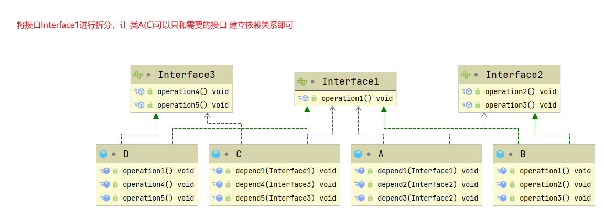
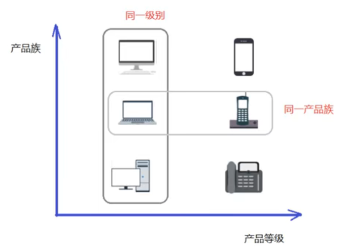
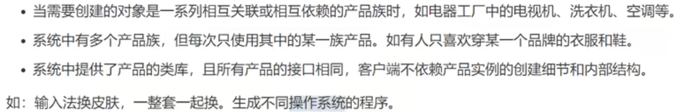

# 设计模式

## 简介

- 软件工程中，设计模式是对**软件设计中普遍存在(反复出现)的问题**，所提出的**解决方案**
- 是程序员在面对同类软件工程设计问题所总结出来的有用的经验，**模式不是代码，而是某类问题的通用解决方案**
- 使用设计模式，可以提高项目的**可扩展性，可维护性，规范性，并降低软件的复杂度**
- 设计模式的目的
  1. **代码重用性**: 相同功能的代码，不用多次编写
  2. **可读性**：编程规范性，便于团队开发
  3. **可扩展性**(可维护性)：当需要增加新的功能时，非常方便
  4. **可靠性**：当我们增加新的功能后，对原来的功能不会造成太大影响
  5. 使程序呈现**高内聚，低耦合**的特性
- 设计模式七大原则
  1. 单一职责原则
  2. 接口隔离原则
  3. 依赖倒转原则
  4. 里氏替换原则
  5. 开闭原则
  6. 迪米特法原则
  7. 合成复用原则

## 七大原则

### 单一职责原则

> 基本介绍

对一个类来说，我们需要保证其只负责一项职责；如果一个类 A 负责两个不同职责(1/2)，由于职责1的需求改变而改变 A 时，可能会导致职责2执行错误，这时候就需要将类 A 的粒度分解为 A1，A2

> 应用实例-交通工具案例

```java
/**
 * 交通工具案例  - 方案1
 * @author 小丶木曾义仲丶哈牛柚子露丶蛋卷
 * @version 1.0
 * @date 2022/5/9 10:52
 */
public class Demo1 {

    public static void main(String[] args) {
        new Vehicle().run("汽车");
        new Vehicle().run("摩托");
        new Vehicle().run("飞机");
    }

}

/**
 * 交通工具类
 *  - 违背了单一职责原则(这里一个方法管 天上飞的/地上跑的/水里游的)
 *  - 解决方案：根据交通方法的运行方式不同，分解成不同类即可
 */
class Vehicle {
    public void run(String vehicleName) {
        System.out.println(vehicleName + " 在公路上run");
    }
}
```


```java
/**
 * 交通工具案例  - 方案2
 * @author 小丶木曾义仲丶哈牛柚子露丶蛋卷
 * @version 1.0
 * @date 2022/5/9 10:56
 */
public class Demo2 {

    public static void main(String[] args) {
        new RoadVehicle().run("摩托车");
        new AirVehicle().run("飞机");
        new WaterVehicle().run("游轮");
    }

}

/**
 * 对方案1的改进 - 将一个职责拆分成一个类
 * 优点：遵守单一职责原则
 * 缺点：本身的代码量较少，但这样改动对 服务端&客户端 原本的代码修改太大了
 * 解决方案：基于方案1，只修改 Vehicle 类，减少改动的代码
 */
class RoadVehicle {

    public void run(String vehicleName) {
        System.out.println(vehicleName + " 在公路上run");
    }

}

class AirVehicle {

    public void run(String vehicleName) {
        System.out.println(vehicleName + " 在天空上run");
    }

}

class WaterVehicle {

    public void run(String vehicleName) {
        System.out.println(vehicleName + " 在水上run");
    }

}
```


```java
/**
 * 交通工具案例  - 方案3
 * @author 小丶木曾义仲丶哈牛柚子露丶蛋卷
 * @version 1.0
 * @date 2022/5/9 11:01
 */
public class Demo3 {

    public static void main(String[] args) {
        new Vehicle2().run("汽车");
        new Vehicle2().runAir("飞机");
        new Vehicle2().runWater("游轮");
    }

}

/**
 * 在代码量不多，耦合度不高时，可以不遵守[类级别的单一职责原则]，从而保证[方法级别的单一职责原则]
 */
class Vehicle2 {
    public void run(String vehicleName) {
        System.out.println(vehicleName + " 在公路上run");
    }

    public void runAir(String vehicleName) {
        System.out.println(vehicleName + " 在天空上run");
    }

    public void runWater(String vehicleName) {
        System.out.println(vehicleName + " 在水上run");
    }
}
```


> 注意事项和细节

1. 降低类的复杂度，尽量保证一个类只负责一项职责
2. 提高类的可读性，可维护性
3. 降低变更引起的风险
4. 通常情况下，**我们应当遵守单一职责原则**
   - 只有逻辑足够简单，才可以在代码级违反单一职责原则
   - 只有类中的方法数量足够少，才可以在方法级别保持单一职责原则

### 接口隔离原则

> 基本介绍

当一个类依赖一个接口，而为了避免实现该接口的实现类写多余的方法，导致代码臃肿，我们应该将接口进行拆分，进行**接口隔离**

> 应用案例 - 不使用接口隔离原则


```java
public class Demo1 {

    public static void main(String[] args) {
        A a = new A();
        // 类A只依赖类B中的三个方法
        a.depend1(new B());
        a.depend2(new B());
        a.depend3(new B());
        // 类C只依赖类D中的三个方法
        C c = new C();
        c.depend1(new D());
        c.depend4(new D());
        c.depend5(new D());

    }

}

interface Interface1 {
    void operation1();
    void operation2();
    void operation3();
    void operation4();
    void operation5();
}

class B implements Interface1 {
    @Override
    public void operation1() {
        System.out.println("B.operation1()....");
    }

    @Override
    public void operation2() {
        System.out.println("B.operation2()....");
    }

    @Override
    public void operation3() {
        System.out.println("B.operation3()....");
    }

    @Override
    public void operation4() {
        System.out.println("B.operation4()....");
    }

    @Override
    public void operation5() {
        System.out.println("B.operation5()....");
    }
}

class D implements Interface1 {
    @Override
    public void operation1() {
        System.out.println("D.operation1()....");
    }

    @Override
    public void operation2() {
        System.out.println("D.operation2()....");
    }

    @Override
    public void operation3() {
        System.out.println("D.operation3()....");
    }

    @Override
    public void operation4() {
        System.out.println("D.operation4()....");
    }

    @Override
    public void operation5() {
        System.out.println("D.operation5()....");
    }
}

class A {
    public void depend1(Interface1 i) {
        i.operation1();
    }
    public void depend2(Interface1 i) {
        i.operation2();
    }
    public void depend3(Interface1 i) {
        i.operation3();
    }
}

class C {
    public void depend1(Interface1 i) {
        i.operation1();
    }
    public void depend4(Interface1 i) {
        i.operation4();
    }
    public void depend5(Interface1 i) {
        i.operation5();
    }
}
```


> 应用案例 - 使用接口隔离原则



```java
public class Demo2 {

    public static void main(String[] args) {
        // 类A通过Interface1,Interface2依赖类B，类B并不需要因此实现多余的方法
        A a = new A();
        a.depend1(new B());
        a.depend2(new B());
        a.depend3(new B());
        // 类C通过Interface1,Interface3依赖类D，类D并不需要因此实现多余的方法
        C c = new C();
        c.depend1(new D());
        c.depend4(new D());
        c.depend5(new D());

    }

}

interface Interface1 {
    void operation1();
}

interface Interface2 {
    void operation2();

    void operation3();
}

interface Interface3 {
    void operation4();

    void operation5();
}

class B implements Interface1, Interface2 {
    @Override
    public void operation1() {
        System.out.println("B.operation1()....");
    }

    @Override
    public void operation2() {
        System.out.println("B.operation2()....");
    }

    @Override
    public void operation3() {
        System.out.println("B.operation3()....");
    }
}

class D implements Interface1, Interface3 {
    @Override
    public void operation1() {
        System.out.println("D.operation1()....");
    }

    @Override
    public void operation4() {
        System.out.println("D.operation4()....");
    }

    @Override
    public void operation5() {
        System.out.println("D.operation5()....");
    }
}

class A {
    public void depend1(Interface1 i) {
        i.operation1();
    }

    public void depend2(Interface2 i) {
        i.operation2();
    }

    public void depend3(Interface2 i) {
        i.operation3();
    }
}

class C {
    public void depend1(Interface1 i) {
        i.operation1();
    }

    public void depend4(Interface3 i) {
        i.operation4();
    }

    public void depend5(Interface3 i) {
        i.operation5();
    }
}
```

> 与单一职责原则的区别

- 单一职责原则原注重的是职责；而接口隔离原则注重对接口依赖的隔离
- 单一职责原则主要是约束类，其次才是接口和方法，它针对的是程序中的实现和细节；而接口隔离原则主要约束接口方法，主要针对抽象，针对程序整体框架的构建。

> 接口隔离的原则

- 接口尽量小，但是要有限度。对接口进行细化可以提高程序设计灵活性是不挣的事实，但是如果过小，则会造成接口数量过多，使设计复杂化。所以一定要适度。
- 为依赖接口的类定制服务，只暴露给调用的类它需要的方法，它不需要的方法则隐藏起来(private)。只有专注地为一个模块提供定制服务，才能建立最小的依赖关系。
- 提高内聚，减少对外交互。使接口用最少的方法去完成最多的事情。

### 依赖倒转原则

> 基本介绍

- 高层模块不应该直接依赖于底层模块，二者都应该依赖其抽象
- **抽象不应该依赖细节，细节应该依赖抽象**
- 依赖倒转的**核心**在于**面向接口编程**
- 设计理念：相对于细节的多变性，抽象的东西要稳定的多，以抽象为基础搭建的架构要比以细节为基础的架构要稳定的多。在 java 中，抽象指的是接口/抽象类，而细节就是实现类
- 使用**接口/抽象类**的目的就是定制好**规范**，而**不涉及任何具体的操作**，把展现细节的任务交给**实现类去完成**

> 应用案例 - 不使用依赖倒转

```java
class Email {
    public void send() {
        System.out.println("发送电子邮件");
    }
}

class Person {
    /**
     * 高层模块直接使用底层模块
     * 优点：编码简单
     * 缺点：可扩展性低，如果这个时候说要发送wx/qq等等其他消息就需要对代码进行重构
     * @param email
     */
    public void toSend(Email email) {
        email.send();
    }
}
```

> 应用案例 - 使用依赖倒转

```java
interface MessageType {
    void sendMessage();
}

class Email2 implements MessageType {
    @Override
    public void sendMessage() {
        System.out.println("发送邮件");
    }
}

class WeChat implements MessageType {

    @Override
    public void sendMessage() {
        System.out.println("发送微信");
    }
}

class Person2 {
    /**
     * 高层模块不直接使用底层模块细节(实现类)，而是依赖其抽象，从而屏蔽底层实现细节，提高代码的可扩展性和维护性
     * @param messageType
     */
    public void toSend(MessageType messageType) {
        messageType.sendMessage();
    }
}
```

> 依赖传递的三种方式

1. 接口传递

   ```java
   interface Type {
       void test();
   }
   
   class TypeA implements Type {
       @Override
       public void test() {
           System.out.println("TypeA....test");
       }
   }
   
   /**
    * 1. 接口传递
    */
   class Memeber {
       /**
        * 通过接口(方法)参数传递依赖
        * @param type
        */
       public void seeType(Type type) {
           type.test();
       }
   }
   ```

2. 构造方法传递

   ```java
   /**
    * 2. 通过构造器传递
    */
   class Member {
   
       private Type iType;
   
       public Member(Type iType) {
           this.iType = iType;
       }
   
       public void seeType() {
           this.iType.test();
       }
   }
   ```

3. setter 方式传递

   ```java
   /**
    * 3. 通过setter方法传递
    */
   class Member {
       private Type iType;
   
       public void seeType() {
           this.iType.test();
       }
   
       public void setiType(Type iType) {
           this.iType = iType;
       }
   }
   ```

> 原则和注意事项

1. 底层模块尽量都有抽象类或接口(也可以二者都有)，程序稳定性更好
2. 变量的声明类型尽量是抽象类/接口，这样变量和实际对象间，就存在一个缓冲层，利于程序的扩展和优化
3. 继承时遵守**里氏替换原则**

### 里氏替换原则

> OOP中的继承性的思考和说明

1. 继承其实包含了这样的一层含义：父类中凡是已经实现好的方法，实际上是在**设计规范和契约**，虽然不强制要求所有子类必须遵循这些契约。但如果子类对这些实现的方法任意修改，就会对整个继承体系造成破坏
2. 继承给程序设计带来便利的同时，也带来了弊端，比如使用继承会给程序带来侵入性，程序的可移植性降低，增加对象间的耦合性，当我们需要修改父类时，必须要考虑到所有子类，并且父类修改后，所有涉及到子类的功能可能会产生故障

> 基本介绍：

- 在我们使用父类的地方，如果将其全部替换成任意子类，也不会影响程序的运行，就能保证所有**引用基类的地方能透明的使用其子类的对象**
- 即在使用继承时，在子类中**尽量**不要重写父类的方法
- 其实继承让两个类的耦合性增强了，在适当的情况下，可以通过聚合，组合，依赖来解决问题

> 应用案例 - 不遵守里氏替换原则

```java
public class Demo1 {

    public static void main(String[] args) {
        A a = new A();
        System.out.println("1 + 8 ==> " + a.func1(1, 8));
        B b = new B();
        System.out.println("1 + 8 ==> " + b.func1(1, 8));
        // 输出结果并不同，该程序中类B不能代替类A，就违反了里氏替换原则
    }

}

class A {
    public int func1(int a, int b) {
        return  a + b;
    }
}

class B extends A {
    @Override
    public int func1(int a, int b) {
        return a - b;
    }

    public int func2(int a, int b, int c) {
        return func1(a, b) + c;
    }
}
```

当我们无意的去重写父类的方法后，可能会造成原有功能出错。在实际编程中，我们常常通过重写父类的方法完成新的功能，虽然写起来简单，但会导致继承体系的复用性比较差，特别是运行多态比较频繁的时候

通常的做法：原来的**父类和特殊的子类继承一个更通俗的基类**，将原有的继承关系去掉，采用依赖，聚合，组合等关系代替

> 应用案例 - 遵守里氏替换原则

```java
public class Demo2 {

    public static void main(String[] args) {
        C c = new C();
        System.out.println("8 + 8 ==> " + c.func1(8, 8));
        // 因为我们将 func1() 抽取了出来，并不作为父类的方法，所以这里是遵循里氏替换原则的(D not extends C)
        D d = new D();
        System.out.println("8 - 8 ==> " + d.func1(8, 8));

    }

}

class Base {
    // 抽取类C和类D的公共方法(代码)
}

class C extends Base {
    public int func1(int a, int b) {
        return  a + b;
    }
}

class D extends Base {
    // 使用组合的方式引用类C的对象
    private final C c = new C();

    public int func1(int a, int b) {
        return a - b;
    }

    public int func2(int a, int b, int c) {
        return this.c.func1(a, b) + c;
    }
}
```

### 开闭原则

> 基本介绍

1. 开闭原则(OCP)是编程中**最基础，最重要**的设计原则
2. 一个项目中的类/模块/函数应该**对扩展开放(从提供方的角度出发)，对修改关闭(从使用方的角度出发)**，用抽象构建框架，用实现扩展细节
3. 当软件需求变化时，尽量**通过扩展软件实体**的行为实现变化，而不是通过修改已有代码来实现变化
4. 编程中遵循其他原则，以及使用设计模式的目的就是遵循**开闭原则**

> 应用案例 - 不遵守开闭原则

```java
public class Demo1 {

    public static void main(String[] args) {
        new GraphicEditor().drawShape(new Rectangle());
        new GraphicEditor().drawShape(new Circle());
    }

}

class GraphicEditor {
    public void drawShape(Shape s) {
        if (s.type == 1) {
            drawRectangle(s);
        } else if (s.type == 2) {
            drawCircle(s);
        }
    }

    private void drawRectangle(Shape shape) {
        System.out.println("绘制矩形");
    }

    private void drawCircle(Shape shape) {
        System.out.println("绘制圆型");
    }
}

class Shape {
    int type;
}

class Rectangle extends Shape {
    public Rectangle() {
        this.type = 1;
    }
}


class Circle extends Shape {
    public Circle() {
        this.type = 2;
    }
}
```

存在问题：当我们需要扩展 Shape 类型时，不仅需要 新建类&修改客户端调用代码(Demo1.main())，还需要修改 **GraphicEditor.drawShape()** 方法里面的处理逻辑，不仅麻烦而且没有遵守 OCP

> 应用案例 - 遵守 OCP

```java
public class Demo1 {

    public static void main(String[] args) {
        new GraphicEditor().drawShape(new Rectangle());
        new GraphicEditor().drawShape(new Circle());
    }

}

class GraphicEditor {
    public void drawShape(Shape s) {
        s.draw();
    }
}

abstract class Shape {
    int type;

    abstract void draw();
}

class Rectangle extends Shape {
    public Rectangle() {
        this.type = 1;
    }

    @Override
    void draw() {
        System.out.println("绘制矩形");
    }
}


class Circle extends Shape {
    public Circle() {
        this.type = 2;
    }

    @Override
    void draw() {
        System.out.println("绘制圆型");
    }
}
```

将原父类修改为 `abstract` 并定义抽象方法 `draw()`，当提供方需要扩展程序时(例如新建一个类)，继承该抽象类然后实现方法即可，同时使用方(**GraphicEditor.drawShape()**)不需要进行任何修改，遵守了 OCP 开闭原则

### 迪米特法则

> 基本介绍

1. 一个对象应该对其他对象保持最少的了解

2. 类与类关系越密切，耦合度越大

3. 迪米特法则又称为 **最少知道原则**，即一个类对自己依赖的类知道的越少越好，也就是说，对于被依赖的类不管多复杂，都尽量将逻辑封装到类的内部，对外除了提供 public 方法，不对外泄露任何信息

4. 简单定义：只与**直接的朋友**通信

   直接的朋友：每个对象都会于其他对象有耦合关系，只要两个对象之间有耦合关系，就代表两个对象之间是朋友关系；耦合的方式很多(依赖/关联/组合/聚合等)，其中，我们称**成员变量/方法参数/方法返回值中的类**为直接的朋友，其他的类最好不要以局部变量的形式出现在类的内部

> 应用案例

```java
public class Demo1 {

    public static void main(String[] args) {
        SchoolManager schoolManager = new SchoolManager();
        schoolManager.printAllEmployee(new CollegeManager());
    }

}

//学院员工类
class CollegeEmployee {
    private String id;

    public String getId() {
        return id;
    }

    public void setId(String id) {
        this.id = id;
    }
}

//管理学院员工的管理类:
class CollegeManager {
    /**
     * 返回学院的所有员工，这里的 CollegeEmployee 就是直接朋友
     *
     * @return
     */
    public List<CollegeEmployee> getAllEmployee() {
        List<CollegeEmployee> list = new ArrayList<>();
        //这里我们增加了10 个员工到list ，
        for (int i = 0; i < 10; i++) {
            CollegeEmployee emp = new CollegeEmployee();
            emp.setId("学院员工id " + i);
            list.add(emp);
        }
        return list;
    }
}

//学校总部员工类
class SchoolEmployee {
    private String id;

    public String getId() {
        return id;
    }

    public void setId(String id) {
        this.id = id;
    }
}

//学校管理类
class SchoolManager {
    /**
     * 返回学校总部的员工，直接朋友 SchoolEmployee
     *
     * @return
     */
    public List<SchoolEmployee> getAllEmployee() {
        List<SchoolEmployee> list = new ArrayList<SchoolEmployee>();
        for (int i = 0; i < 5; i++) { //这里我们增加了5个员工到list
            SchoolEmployee emp = new SchoolEmployee();
            emp.setId("学校总部员工id= " + i);
            list.add(emp);
        }
        return list;
    }

    /**
     * 该方法完成输出学校总部和学院员工信息(id)
     *
     * @param sub CollegeManager 直接朋友
     */
    void printAllEmployee(CollegeManager sub) {
        // 获取到学院员工，并非直接的朋友 CollegeEmployee，想办法优化它
        List<CollegeEmployee> list1 = sub.getAllEmployee();
        System.out.println("---学院员工----");
        for (CollegeEmployee e : list1) {
            System.out.println(e.getId());
        }

        //获取到学校总部员工
        List<SchoolEmployee> list2 = this.getAllEmployee();
        System.out.println("------学校总部员工------");
        for (SchoolEmployee e : list2) {
            System.out.println(e.getId());
        }
    }
}
```

在第79行使用了局部变量**List\<CollegeEmployee>**而其中的**CollegeEmployee**并不是直接的朋友，所以我们需要想办法优化它

> 应用案例 - 遵守迪米特法则

```java
//管理学院员工的管理类:
class CollegeManager {
    ...

    public void printAllEmployee() {
        List<CollegeEmployee> list1 = this.getAllEmployee();
        System.out.println("---学院员工----");
        for (CollegeEmployee e : list1) {
            System.out.println(e.getId());
        }
    }
}

//学校管理类
class SchoolManager {
    ...
    /**
     * 该方法完成输出学校总部和学院员工信息(id)
     *
     * @param sub CollegeManager 直接朋友
     */
    void printAllEmployee(CollegeManager sub) {
        // 对于不是'直接的朋友'的类我们可以对代码进行封装，避免出现在该类中
        sub.printAllEmployee();

        //获取到学校总部员工
        List<SchoolEmployee> list2 = this.getAllEmployee();
        System.out.println("------学校总部员工------");
        for (SchoolEmployee e : list2) {
            System.out.println(e.getId());
        }
    }
}
```

> 注意事项和细节

1. 迪米特法则的核心是降低类之间的耦合
2. 但是注意：由于每个类都减少了不必要的依赖，因此迪米特法则只是降低了类间(对象间)耦合关系，并不是要求完全没有依赖关系

### 合成复用原则

> 基本介绍

原则是尽量使用合成/聚合的方式，而不是使用继承


### 设计原则核心思想

1. 找出应用可能需要变化之处，把它们独立出来，不要和那些不需要变化的代码混在一起
2. 针对接口编程，而不是针对实现编程
3. 为了交互对象之间的**松耦合设计**而努力

## UML 类图

> 基本介绍

- 统一建模语言，是一种用户软件系统分析和设计的语言工具，用户帮助软件开发人员进行思考和记录思路的结果
- UML 本身是一套符号的规定，就像数学符号和化学符号一样，这些符号用于描述软件模型中的各个元素和他们之间的关系(类/接口/实现/泛化等等)
- 使用 UML 来建模，常用工具有 Rational Rose，也可以使用一些插件来建模

> 使用

- 这里使用 **PlantUML** 进行 UML 建模，可以参考：https://plantuml.com/zh/class-diagram#6e0d446ea2c5bf82

> 分类

- 用例图(use case)
- 静态结构图：**类图**，对象图，包图，组件图，部署图
- 动态行为图：交互图(时序图/协作图)，状态图，活动图

> 说明

- 用于描述系统中类(对象)本身的组成和其他类(对象)之间的各种静态关系
- 类之间的关系：**依赖/泛化(继承)/实现/关联/聚合/组合**

> 类的依赖关系：只要在类中使用到了对方

 

比较常见的几种情况：

- 类的成员属性
- 方法的返回类型
- 方法接收的参数类型
- 方法中使用到的(局部变量)


> 类的泛化关系：实际上就是继承关系，是**依赖关系的特例**

 

如果A类继承了B类，那么A类与B类就存在泛化关系


> 类的实现关系：也是**依赖关系的特例**

 


> 类的关联关系：类与类之间的联系特征，也是**依赖关系的特例**

- 关联具有导航性(单向/双向)
- 关联具有多重性("1"表示有且只有一个;"0"表示0个或多个;"0,1"表示0/1个;"n...m"表示n到m个都可以;"m...*"表示最少m个等等)


> 类的聚合关系：表示的是整体和部分的关系，但**整体和部分可以分开，聚合关系是关联关系的特例**，所以它也具有关联的**导航性和多重性**

 

```pnml
@startuml
'https://plantuml.com/class-diagram

class Mouse
class Monitor
class Computer {
    - mouse: Mouse
    - monitor: Monitor
    + setMouse(mouse: Mouse): void
    + setMonitor(monitor: Monitor): void
}
note left: 属性的初始化和对象的初始化时机不同,\n所以是聚合关系

Computer o-- Mouse
Computer o-- Monitor

@enduml
```

> 类的组合关系：也是整体与部分的关系&关联关系的特例，但是**整体和部分不可以分开**

 


特殊情况：初始化不同，但在销毁当前对象时也要**级联删除**的成员对象属性，也是组合关系(例如再删除 Person 时将对应的 IDCard 也进行删除)

## 创建型模式

> 5种：单例模式 + 工厂模式(简单工厂&工厂方法) + 建造者模式 + 抽象工厂 + 原型模式

### 单例模式

#### 简介

采取一定的方法，保证整个系统中某个类只**存在一个对象实例**，并且该类提供一个可以获取去对象实例的方法(静态方法)

 

#### 实现方式

##### 饿汉式

> 静态常量

步骤：

1. 构造器私有化(防止外部 new)
2. 在内部创建类的对象
3. 对外暴漏一个静态的公共方法，可以用来获取创建的对象

代码：

```java
public class Demo1 {

    public static void main(String[] args) {
        Singleton01 instance = Singleton01.getInstance();
        Singleton01 instance2 = Singleton01.getInstance();
        System.out.println(instance == instance2);
    }

}

class Singleton01 {

    /**
     * 1. 私有化构造器
     */
    private Singleton01() {

    }

    /**
     * 2. 在类的内部创建对象实例
     */
    private final static Singleton01 INSTANCE = new Singleton01();

    /**
     * 3. 对外暴漏方法，返回该类的实例
     * @return
     */
    public static Singleton01 getInstance() {
        return INSTANCE;
    }

}
```

优缺点说明：

- 优点：
  - 写法简单
  - 在类加载时完成了实例化，避免了线程同步问题
- 缺点：
  - 在类加载的时候完成了实例化，没有达到 Lazy Loading 的效果
  - 加载后如果长时间不使用，会造成内存的浪费(进行类加载clasloader的可能是其他方法，不一定是 **getInstance**)

- 总结：能用，但可能会造成内存浪费

> 静态代码块

代码：

```java
public class Demo2 {

    public static void main(String[] args) {
        Singleton02 instance = Singleton02.getInstance();
        Singleton02 instance2 = Singleton02.getInstance();
        System.out.println(instance == instance2);
    }

}

class Singleton02 {

    /**
     * 1. 私有化构造器
     */
    private Singleton02() {

    }

    /**
     * 2. 定义实例的变量
     */
    private final static Singleton02 INSTANCE;

    static {
        // 3. 在代码块中完成对实例的初始化
        INSTANCE = new Singleton02();
    }

    /**
     * 4. 对外暴漏方法，返回该类的实例
     * @return
     */
    public static Singleton02 getInstance() {
        return INSTANCE;
    }

}
```

优缺点说明：

- 这种方式和[**静态常量**]差不多,只不过将类实例化的过程放在了静态代码块中；在类加载时，执行静态代码块中的方法，初始化类的实例，优缺点都一样
- 结论：能用，但可能会造成内存浪费

##### 懒汉式

> 线程不安全、

代码：

```java
public class Demo3 {

    public static void main(String[] args) {
        Singleton03 instance1 = Singleton03.getInstance();
        Singleton03 instance2 = Singleton03.getInstance();
        System.out.println(instance1 == instance2);
    }

}

class Singleton03 {
    private Singleton03() {

    }

    private static Singleton03 singleton03;

    /**
     * 懒汉式：只有在调用获取实例的方法时才创建实例
     * @return
     */
    public static Singleton03 getInstance() {
        if (singleton03 == null) {
            singleton03 = new Singleton03();
        }
        return singleton03;
    }
}
```

优缺点说明：

- 优点：起到了 Lazy Loading 的效果
- 缺点：只能在单线程下使用(在多线程情况下，一个线程进入到了 `if (singleton03 == null)` 判断语句块，还未来得及执行下一步，另一个线程也通过了该判断语句，**这时便会产生多个实例**)
- 结论：在实际开发中，不要使用这种方式!

> 线程安全，同步方法

代码：

```java
public class Demo4 {

    public static void main(String[] args) {
        Singleton4 instance = Singleton4.getInstance();
        Singleton4 instance2 = Singleton4.getInstance();
        System.out.println(instance == instance2);

    }

}

class Singleton4 {
    private Singleton4() {

    }

    private static Singleton4 singleton4;

    /**
     * 使用 synchronized 解决多线程问题
     * @return
     */
    public static synchronized Singleton4 getInstance() {
        if (singleton4 == null) {
            singleton4 = new Singleton4();
        }
        return singleton4;
    }
}
```

优缺点说明：

- 优点：完成了 Lazy Loading + 解决了多线程问题
- 缺点：效率太低了，其实只有保证执行一次实例化代码就好了，再后面使用时直接 return 即可，要是后面使用时还 synchronized 那也太慢了hhh
- 结论：在实际开发中，不推荐使用这种方式

> 线程不安全，同步代码块

代码:

```java
/**
 * 单例模式 - 懒汉式 - 同步方法，线程不安全
 * @author 小丶木曾义仲丶哈牛柚子露丶蛋卷
 * @version 1.0
 * @date 2022/5/10 11:35
 */
public class Demo5 {

    public static void main(String[] args) {
        Singleton5 instance = Singleton5.getInstance();
        Singleton5 instance1 = Singleton5.getInstance();
        System.out.println(instance == instance1);
    }

}

class Singleton5 {
    private Singleton5() {

    }

    private static Singleton5 singleton5;

    /**
     * 使用同步方法提高效率
     * @return
     */
    public static Singleton5 getInstance() {
        if (singleton5 == null) {
            synchronized (Singleton5.class) {
                singleton5 = new Singleton5();
            }
        }
        return singleton5;
    }
}
```

优缺点说明：

- 这种方式主要针对 [懒汉式-同步代码块] 中的效率太低的问题所提出的，本身在进行 `if(s5 == null)` 时还是有可能会产生线程安全问题
- 结论：在实际开发中，不能使用这种方式

##### 双重检查(double-check)

代码：

```java
/**
 * 单例模式 - 双重检查
 * @author 小丶木曾义仲丶哈牛柚子露丶蛋卷
 * @version 1.0
 * @date 2022/5/10 12:06
 */
public class Demo6 {

    public static void main(String[] args) {
        Singleton6 instance = Singleton6.getInstance();
        Singleton6 instance1 = Singleton6.getInstance();
        System.out.println(instance == instance1);
    }

}

class Singleton6 {
    private Singleton6() {

    }

    /**
     * 使用 volatile 保证可见性和禁止指令重排
     */
    private static volatile Singleton6 singleton6;

    /**
     * 使用两个 if + 同步代码块 解决 Lazy Loading + 线程安全 问题
     * @return
     */
    public static Singleton6 getInstance() {
        if (singleton6 == null) {
            synchronized (Singleton6.class) {
                if (singleton6 == null) {
                    singleton6 = new Singleton6();
                }
            }
        }
        return singleton6;
    }
}
```

结论：

1. `double-check` 概念是多线程开发中经常使用的，当我们使用两次 `if(s6 == null)` 保证线程安全 
2. 线程安全，Lazy Loading, 效率较高
3. 结论：在实际开发中，**推荐使用**

**为什么要使用 volatile**？

1. 当我们创建实例时 `singleton6 = new Singleton6();`这一行可以分解为三行代码(JVM 内部执行)

   ```java
   memory=allocate();        //1:分配对象的内存空间
   ctorInstance(memory);     //2:初始化对象
   instance = memory;          //3:设置instance指向刚分配的内存地址
   ```

2. 在上面三行代码执行过程中，可能会导致重排序，第2和3行的执行顺序可能会被重排序

   ```java
   memory=allocate();        //1:分配对象的内存空间
   instance = memory;        //3:设置instance指向刚分配的内存地址
                             //注意，此时对象还没有被初始化！
   ctorInstance(memory);     //2:初始化对象
   ```

##### 静态内部类

代码：

```java
/**
 * 单例模式 - 静态内部类
 * @author 小丶木曾义仲丶哈牛柚子露丶蛋卷
 * @version 1.0
 * @date 2022/5/10 22:17
 */
public class Demo7 {

    public static void main(String[] args) {
        Singleton7 instance = Singleton7.getInstance();
        Singleton7 instance2 = Singleton7.getInstance();
        System.out.println(instance == instance2);
    }

}

class Singleton7 {
    private Singleton7() {}

    /**
     * 当类加载时并不会加载对应的静态内部类
     */
    private static class Singleton7Instance{
        private static final Singleton7 SINGLETON7 = new Singleton7();
    }

    /**
     * Java 在进行 Classloader 时线程是安全的
     * @return
     */
    public static Singleton7 getInstance() {
        return Singleton7Instance.SINGLETON7;
    }
}
```

优缺点说明：

1. 这种方式采用了类装载的机制来保证初始化实例时只有一个线程
2. 静态内部类在外部类被装载时并不会被立即实例化，而是调用需要使用静态内部类的方法时，才会装载该内部类
3. 我们将外部类实例设置为内部类的静态属性，这样即实现了 Lazy Loading + 线程安全 + 效率高
4. 优点：避免了**线程不安全**，利用静态内部类特点实现 Lazy Loading，效率高
5. 结论：推荐使用

##### 枚举

代码：

```java
public class Demo8 {

    public static void main(String[] args) {
        Singleton8 instance = Singleton8.getInstance();
        Singleton8 instance1 = Singleton8.getInstance();
        System.out.println(instance == instance1);
    }

}

class Singleton8 {

    /**
     * 私有化构造器
     */
    private Singleton8() {

    }

    private enum Singleton8Enum {

        /**
         * 枚举类实例
         */
        INSTANCE_ENUM;

        private final Singleton8 singleton8;

        Singleton8Enum() {
            // 在初始化枚举类实例时完成对 外部类实例属性的 初始化
            singleton8 = new Singleton8();
        }

        /**
         * 提供一个方法将实例属性暴漏出去,也可以直接访问，但这样扩展性高一点
         * @return
         */
        public Singleton8 getInstance() {
            return singleton8;
        }
    }

    public static Singleton8 getInstance() {
        return Singleton8Enum.INSTANCE_ENUM.getInstance();
    }
    
}
```

优缺点说明：

1. 多线程安全 + Lazy Coding + 效率高
2. 反射安全
3. 序列化/反序列化安全
4. **写法简单**
5. 这种方式是`Effective Java`作者`Josh Bloch`提倡的方式，它不仅能避免多线程同步问题，而且还能防止反序列化**重新创建新的对象**，可谓是很坚强的壁垒啊。
6. 结论：**非常推荐使用**

#### JDK 源码

`java.lang.Runtime` -> [饿汉式-静态常量]

 

#### 注意事项和细节说明

1. 单例模式保证了系统内只存在该类的一个对象，节省系统资源，对于一些需要频繁创建/销毁的对象，使用单例模式可以提高性能
2. 要想实例化一个类是，是通过一个`public static`方法获取，而不是 `new`
3. 使用场景：需要频繁的进行创建/销毁的对象，创建对象时需要消耗过多的资源但又需要经常使用的对象

### 工厂模式

#### 简单工厂(静态工厂)

##### 需求分析

 

##### 传统实现

> UML 类图分析

 

> 代码实现

1. 定义披萨类

   ```java
   public abstract class Pizza {
   
       private String name;
   
       public Pizza(String name) {
           this.name = name;
       }
   
       /**
        * 制作原材料的过程
        */
       public abstract void prepare();
   
       public void bake() {
           System.out.println(this.name + "in bake");
       };
       public void cut() {
           System.out.println(this.name + "in cut");
       };
       public void box() {
           System.out.println(this.name + "in box");
       };
   }
   ```

   ```java
   public class GreekPizza extends Pizza{
   
       public GreekPizza(String name) {
           super(name);
       }
   
       @Override
       public void prepare() {
           System.out.println("Greek Pizza in prepare");
       }
   }
   ```

   ```java
   public class PepperPizza extends Pizza {
   
       public PepperPizza(String name) {
           super(name);
       }
   
       @Override
       public void prepare() {
           System.out.println("PepperPizza in prepare");
       }
   }
   ```

2. 定义一个订单披萨类，用来接收用户请求并创建披萨

   ```java
   public class OrderPizza {
   
       public Pizza createPizza() {
           Pizza pizza = null;
           String orderType = getType(); // 订购的披萨类型
   
           if ("greek".equals(orderType)) {
               pizza = new GreekPizza(" 希腊披萨 ");
           } else if ("pepper".equals(orderType)) {
               pizza = new PepperPizza("胡椒披萨");
           } else {
               System.out.println("该披萨类型不存在");
               return null;
           }
   
           //输出pizza 制作过程
           pizza.prepare();
           pizza.bake();
           pizza.cut();
           pizza.box();
   
           return pizza;
       }
   
       // 写一个方法，可以获取客户希望订购的披萨种类
       private String getType() {
           try {
               BufferedReader strin = new BufferedReader(new InputStreamReader(System.in));
               System.out.println("input pizza 种类:");
               String str = strin.readLine();
               return str;
           } catch (IOException e) {
               e.printStackTrace();
               return "";
           }
       }
   
   }
   ```

3. 创建一个 OrderStoreApp 类，用来下订单

   ```java
   public class PizzaStoreApp {
   
       public static void main(String[] args) {
           OrderPizza orderPizza = new OrderPizza();
           orderPizza.createPizza();
       }
   
   }
   ```

> 优缺点说明

- 优点：编码简单，易于操作

- 缺点：违反了 ocp 原则(对扩展开发，对修改关闭)，当我们给类新增一个功能时，对使用方来说尽量不修改代码(或尽可能少)

  这里如果我们需要新加一个 Pizza 类，不仅需要实现原来的抽象类，对于使用方 **OrderPizza** 中处理披萨的逻辑也要修改

> 改进思路分析：

我们可以将创建 Pizza 对象的过程封装到一个类中，这样当我们有了新的 Pizza 类时，统一修改那个类就好了，对外使用方就不用修改代码了 --> 简单工厂

##### 简单工厂

> UML 类图

 

> 代码实现

1. 创建一个 PizzaFactory 并提供一个方法统一创建 Pizza 对象

   ```java
   public class PizzaFactory {
   
       /**
        * 封装创建实例的过程，避免由于底层代码的扩展而倒是使用者修改大部分代码
        * @param type
        * @return
        */
       public Pizza createPizza(String type) {
           Pizza pizza;
   
           if ("greek".equals(type)) {
               pizza = new GreekPizza(" 希腊披萨 ");
           } else if ("pepper".equals(type)) {
               pizza = new PepperPizza("胡椒披萨");
           } else {
               System.out.println("该披萨类型不存在");
               return null;
           }
   
           //输出pizza 制作过程
           pizza.prepare();
           pizza.bake();
           pizza.cut();
           pizza.box();
   
           return pizza;
       }
   
   }
   ```

2. 重构 **OrderPizza**

   ```java
   public class OrderPizza {
   
       private PizzaFactory pizzaFactory;
   
       public void setPizzaFactory(PizzaFactory pizzaFactory) {
           this.pizzaFactory = pizzaFactory;
       }
   
       /**
        * 使用方只用整合 pizzaFactory，传递数据就能得到结果，而具体实现不用在意
        * @return
        */
       public Pizza createPizza() {
           String type = getType();
           return pizzaFactory.createPizza(type);
       }
   
       // 写一个方法，可以获取客户希望订购的披萨种类
       private String getType() {
           try {
               BufferedReader strin = new BufferedReader(new InputStreamReader(System.in));
               System.out.println("input pizza 种类:");
               String str = strin.readLine();
               return str;
           } catch (IOException e) {
               e.printStackTrace();
               return "";
           }
       }
   
   }
   ```

3. 使用

   ```java
   public class PizzaStoreApp {
   
       public static void main(String[] args) {
           OrderPizza orderPizza = new OrderPizza();
           orderPizza.setPizzaFactory(new PizzaFactory());
           orderPizza.createPizza();
       }
   
   }
   ```

> 优缺点说明

- 优点：
  - 封装了创建对象的过程，可以通过参数获取需要的实例对象，将对象的创建和业务逻辑分开，避免客户端修改代码
  - 如果要扩展新的类，修改工厂类即可，而不需要修改原代码，降低了客户端代码修改的可能性，更加容易扩展
- 缺点：增加新产品时还是需要修改工厂类，违背了 **开闭原则**

##### 静态工厂

其实就是将 Factory 中提供实例的方法改成静态的方便调用

```java
public static Pizza createPizza(String type)
```

```java
public Pizza createPizza() {
    String type = getType();
    return PizzaFactory.createPizza(type);
}
```

```java
public static void main(String[] args) {
    OrderPizza orderPizza = new OrderPizza();
    orderPizza.createPizza();
}
```

#### 工厂方法

##### 需求分析

- 针对简单工厂中没有遵守 ocp 原则的缺陷提出新的方法
- 概念：将进行生成实例的工厂接口化，让实现类决定要生成的产品类对象。工厂方法使一个产品类的实例化延迟到了工厂的子类
- 结构：
  - 抽象工厂：提供创建产品的接口，但具体的产品不在这里定义，只是定义一个规范，调用者可以访问具体工厂来创建具体产品
  - 具体工厂：根据抽象工厂的规范，实现对某一中产品的生产，完成对具体产品的创建
  - 抽象产品：定义了产品的规范，描述产品的主要特性和功能
  - 具体产品：根据抽象产品的规范，实现其接口，由一个对应的具体工厂来创建，与对应的具体工厂之间一一对应

##### 代码实现

> UML 类图

 

> 代码

1. 刚刚的 Pizza 类可以全部保留

2. 新建一个抽象工厂

   ```java
   public interface PizzaFactory {
   
       Pizza createPizza();
   
   }
   ```

3. 根据具体产品创建对应的具体工厂

   ```java
   public class PepperPizzaFactory implements PizzaFactory {
       @Override
       public Pizza createPizza() {
           return new PepperPizza("Pepper Pizza");
       }
   }
   ```

   ```java
   public class GreekPizzaFactory implements PizzaFactory {
       @Override
       public Pizza createPizza() {
           return new GreekPizza("Greek Pizza");
       }
   }
   ```

4. 修改 OrderPizza

   ```java
   public class OrderPizza {
   
       private PizzaFactory pizzaFactory;
   
       public void setPizzaFactory(PizzaFactory pizzaFactory) {
           this.pizzaFactory = pizzaFactory;
       }
   
       public void createPizza() {
           Pizza pizza = pizzaFactory.createPizza();
           pizza.prepare();
           pizza.bake();
           pizza.cut();
           pizza.box();
       }
   }
   ```

5. 使用

   ```java
   OrderPizza orderPizza = new OrderPizza();
   orderPizza.setPizzaFactory(new GreekPizzaFactory());
   orderPizza.createPizza();
   ```

##### 优缺点说明

- 优点：
  - 用户只要知道具体工厂的名称就可以得到所要的产品，无需知道产品的具体创建过程
  - 在系统新增产品的时候，只需要创建对应的具体产品和具体工厂，无须对原工厂和使用方进行任何修改，满足**开闭原则**
- 缺点：
  - 每增加一个产品就要新增两个类，增加了系统的复杂度

#### 抽象工厂

##### 简介

- 工厂方法提供的是针对一种产品的生产

- 一般我们将同类型的产品称为**同等级产品**(例如：笔记本，台式都是电脑)，而抽象工厂**主要应用于多等级产品的生产**

- 我们也将在**同一工厂内不同等级(类型)的产品**称为一个**产品族**

  

- 可以为客户端提供一个能**创建一组相关或相互依赖对象(产品)**的接口，且访问类无需指定所要产品的具体类就能得到**不同等级同一族(当然了是相关/相互依赖的不是瞎凑的)**的产品

- 结构

  

##### 代码实现

> UML 类图

 

> 代码

1. 新建一个抽象产品类 **Drinks** 和两个具体产品类 **Cola & Sprite**

   ```java
   public abstract class Drinks {
       private String name;
   
       public Drinks(String name) {
           this.name = name;
       }
   
       public String getName() {
           return name;
       }
   }
   ```

2. 创建一个抽象工厂并定义可以生产的产品规范

   ```java
   public interface ComboFactory {
   
       Pizza createPizza();
   
       Drinks createDrinks();
   
   }
   ```

3. 以产品族为依据，实现 **ComboFactory** 以实现生产不同的产品

   ```java
   public class PepperPizzaSpriteDrinksFactory implements ComboFactory {
       @Override
       public Pizza createPizza() {
           return new PepperPizza("PepperPizza");
       }
   
       @Override
       public Drinks createDrinks() {
           return new Sprite("Sprite");
       }
   }
   ```

   ```java
   public class GreekPizzaColaDrinksFactory implements ComboFactory {
       @Override
       public Pizza createPizza() {
           return new GreekPizza("Greek Pizza");
       }
   
       @Override
       public Drinks createDrinks() {
           return new Cola("Cola");
       }
   }
   ```

4. 使用

   ```java
   public static void main(String[] args) {
       // GreekPizzaColaDrinksFactory factory = new GreekPizzaColaDrinksFactory();
       PepperPizzaSpriteDrinksFactory factory = new PepperPizzaSpriteDrinksFactory();
       System.out.println(factory.createDrinks().getName());
       System.out.println(factory.createPizza().getName());
   }  
   ```

##### 优缺点说明

优点：当一个产品族的多个对象被设计成**一起工作时**，可以保证客户端始终使用的是同一个产品族中的对象

缺点：当产品族需要增加一个新的产品时，相关的工厂类都需要进行修改

##### 使用场景



#### 配置文件+简单工厂

##### 简介

- 可以通过**工厂模式 + 配置文件** ==>(实现) **工厂对象与产品对象的解耦**

- 在工厂类中加载配置文件，并创建对应的产品对象进行存储，客户端需要时直接获取即可

##### 代码实现

1. 创建 `bean.properties` 用来记录产品对象

   ```java
   greekPizza=pers.prover07.dp.creation.factory.propfactory.entity.GreekPizza
   pepperPizza=pers.prover07.dp.creation.factory.propfactory.entity.PepperPizza
   ```

2. 创建一个工厂类，在类加载时读取配置文件

   ```java
   public class PizzaFactory {
   
       private static HashMap<String, Pizza> pizzaHashMap = new HashMap<>();
   
       static {
           // 创建 properties 对象
           Properties properties = new Properties();
           // 获取配置文件输入流
           InputStream is = PizzaFactory.class.getClassLoader().getResourceAsStream("./pers/prover07/dp/creation/factory/propfactory/bean.properties");
           try {
               // 加载配置文件
               properties.load(is);
               // 获取 properties 文件中定义的 key
               for (Object key : properties.keySet()) {
                   // 获取定义的 className
                   String className = (String) properties.get(key);
                   // 通过反射创建对象
                   Pizza pizza = (Pizza) Class.forName(className).newInstance();
                   // 保存起来
                   pizzaHashMap.put((String) key, pizza);
               }
           } catch (IOException | ClassNotFoundException | IllegalAccessException | InstantiationException e) {
               e.printStackTrace();
           }
   
       }
   
       public static Pizza getPizza(String type) {
           return pizzaHashMap.get(type);
       }
   
   }
   ```

   注意：记得修改产品类，原本的产品类**没有无参构造器**!!

3. 使用

   ```java
   public class OrderStoreApp {
   
       public static void main(String[] args) {
           System.out.println(PizzaFactory.getPizza("greekPizza"));
       }
   
   }
   ```

#### JDK 源码

`java.util.Collection.iterator()` 方法中使用到了[工厂方法]模式 

使用其对集合进行遍历

```java
public class Demo {
    public static void main(String[] args) {
        Collection<String> collection = new ArrayList<>();
        collection.add("令狐冲");
        collection.add("风清扬");
        collection.add("任我行");
        // 获取迭代器对象, Iterator 是迭代器接口，这里实际上是 ArrayList 内部实现的迭代器(具体产品)
        Iterator<String> it = collection.iterator();
        // 使用迭代器遍历
        while(it.hasNext()) {
            String ele = it.next();
            System.out.println(ele);
        }
    }
}
```

可以发现，我们通过调用 `Collection.iterator()` 就能得到对应的 **Iterator** 对象，我们可以将其分个角色:

- Collection - 抽象工厂：由于不同集合的遍历方式不同，所以定义`iterator()`方法的规范，让每个具体工厂实现自己的具体产品
- Iterator - 抽象产品：规定了产品规范
- ArrayList - 具体工厂
- ArrayList$Itr - 具体产品：**ArrayList** 中的内部类，根据规范实现遍历 ArrayList(HashMap)


### 原型模式

#### 简介

- 通过原型实例(就是对象)来指定创建对象的种类(创建和当前对象一样类型的)，并通过拷贝这些原型(复制属性)，创建新的对象

- 原型模式是一种创建型设计模式，允许通过一个对象创建另一个相同类型的对象，而无需创建的细节

- 结构

   

#### 代码

> UML 类图

 

> 代码实现

1. 创建一个抽象原型类 **Shape**

   ```java
   public abstract class Shape implements Cloneable {
   
       private String id;
       private String name;
   
       abstract void draw();
   
       public String getId() {
           return id;
       }
   
       public String getName() {
           return name;
       }
   
       public void setId(String id) {
           this.id = id;
       }
   
       public void setName(String name) {
           this.name = name;
       }
   
       @Override
       public Object clone() {
           Object obj = null;
           try {
               obj =  super.clone();
           } catch (CloneNotSupportedException e) {
               e.printStackTrace();
           }
           return obj;
       }
   }
   ```

2. 创建具体原型类，继承 Shape 

   ```java
   public class Rectangle extends Shape{
   
       public Rectangle() {
           this.setName("rectangle");
       }
   
       @Override
       void draw() {
           System.out.println("draw rectangle");
       }
   }
   ```

3. 使用

   ```java
   public static void main(String[] args) {
       Rectangle rectangle = new Rectangle();
       Rectangle rectangle2 = (Rectangle) rectangle.clone();
       // false
       System.out.println(rectangle == rectangle2);
   }
   ```

#### Spring 源码

- 当我们创建一个 Bean 时可以指定它的 **scope**

  ```java
  @Bean("prototype")
  public Rectangle rectangle(){
  ```

- 在 `scope=prototype` 时获取对应的 Bean 实例，Spring 就会调用相应的 `.clone()` 方法完成对对象的创建

   

#### 深拷贝

- 浅拷贝与深拷贝的区别：

  - 浅拷贝：通过调用 `.clone()` 方法完成; 对于对象中的 **基本类型数据会直接复制，引用类型数据会直接复制引用,而不是新建**
  - 深拷贝：对于对象中的 **基本类型数据会直接复制，引用类型数据会重新申请存储空间,并复制每个引用数据类型成员变量所引用的对象,直到该对象可达的所有对象**

- 实现：https://juejin.cn/post/6844903693100417038#heading-15

- 扩展：通过 I/O 流完成深拷贝

  1. Shape(抽象原型类)实现序列化接口

     ```java
     public abstract class Shape implements Cloneable, Serializable
     ```

  2. 新增 `public deepClone()` 方法

     ```java
     public Object deepClone() {
         //创建流对象
         ByteArrayOutputStream bos = null;
         ObjectOutputStream oos = null;
         ByteArrayInputStream bis = null;
         ObjectInputStream ois = null;
         try {
     
             //序列化
             bos = new ByteArrayOutputStream();
             oos = new ObjectOutputStream(bos);
             oos.writeObject(this); //当前这个对象以对象流的方式输出
     
             //反序列化
             bis = new ByteArrayInputStream(bos.toByteArray());
             ois = new ObjectInputStream(bis);
     
             return ois.readObject();
     
         } catch (Exception e) {
             e.printStackTrace();
             return null;
         } finally {
             //关闭流
             try {
                 assert bos != null;
                 bos.close();
                 assert oos != null;
                 oos.close();
                 assert bis != null;
                 bis.close();
                 assert ois != null;
                 ois.close();
             } catch (Exception e2) {
                 // TODO: handle exception
                 System.out.println(e2.getMessage());
             }
         }
     }
     ```

#### 注意事项和细节

1. 不用重新初始化对象，而是动态地获得对象运行时的状态

2. 如果原始对象发生变化(增加或者减少属性)，其它克隆对象的也会发生相应的变化，无需修改代码

3. 一个对象需要提供给其他对象访问，而且各个调用者可能都需要修改其值时，可以考虑使用原型模式拷贝多个对象供调用者使用。

4. 在实际项目中，原型模式很少单独出现，一般是和**工厂方法模式**一起出现，通过 clone 的方法创建一个对象，然后由工厂方法提供给调用者。

5. 调用 `.clone()` 方法时是**不会调用无参构造器**的

   > 克隆时，根据源对象类型先分配和源对象相同的内存，然后将源对象中的各个域中数据拷贝过来，最后返回对象地址。
   >
   > new时，第1步也是先分配内存，然后调用构造方法初始化数据，最后将对象地址返回，外界就可以通过这个对象地址(引用)操作此对象。

6. 缺点：需要为每一个类配备一个克隆方法，这对全新的类来 说不是很难，但对已有的类进行改造时，需要修改其源代码， 违背了**ocp**原则

### 建造者模式

#### 简介

- 又称为生成器模式；是一种对象构建过程，可以将复杂对象的过程抽象出来，根据抽象过程的不同实现方法构造出来不同表现(属性)的对象
- 它允许用户只通过指定复杂对象的类型和内容就可以构建它们，用户不需要知道内部的具体构建细节。

#### 角色

1. Product（产品角色）： 一个具体的产品对象。

2. Builder（抽象建造者）： 创建一个 Product 对象的各个部件(抽象方法)指定的 接口/抽象类。

3. ConcreteBuilder（具体建造者）： 实现接口，构建和装配各个部件。

4. Director（指挥者）： 构建一个使用Builder接口的对象。它主要是用于创建一个复杂的对象。

  它主要有两个作用：一是：隔离了客户与对象的生产过程，二是：负责控制产品对象的生产过程。

#### 代码

> UML 类图

 

> 代码实现

1. 创建一个产品

   ```java
   public class Phone {
   
       private String name;
   
       private String cpu;
   
       private String camera;
   
       public String getName() {
           return name;
       }
   
       public void setName(String name) {
           this.name = name;
       }
   
       public String getCpu() {
           return cpu;
       }
   
       public void setCpu(String cpu) {
           this.cpu = cpu;
       }
   
       public String getCamera() {
           return camera;
       }
   
       public void setCamera(String camera) {
           this.camera = camera;
       }
   }
   ```

2. 定义一个抽象建造者

   ```java
   public abstract class PhoneBuilder {
   
       private Phone phone = new Phone();
   
       // 定义生产一个手机需要的生产过程
       public abstract PhoneBuilder buildName();
       public abstract PhoneBuilder buildCpu();
       public abstract PhoneBuilder buildCamera();
   
       /**
        * 返回产品
        * @return
        */
       public Phone getPhone() {
           return phone;
       }
   
   }
   ```

3. 编写具体建造者，制定每个产品实现的不同细节

   ```java
   public class HuaWeiBuilder extends PhoneBuilder{
       @Override
       public PhoneBuilder buildName() {
           this.getPhone().setName("华为手机");
           return this;
       }
   
       @Override
       public PhoneBuilder buildCpu() {
           this.getPhone().setCpu("华为手机Cpu");
           return this;
       }
   
       @Override
       public PhoneBuilder buildCamera() {
           this.getPhone().setCamera("华为手机Camrea");
           return this;
       }
   }
   ```

   ```java
   public class IPhoneBuilder extends PhoneBuilder{
       @Override
       public PhoneBuilder buildName() {
           this.getPhone().setName("苹果手机");
           return this;
       }
   
       @Override
       public PhoneBuilder buildCpu() {
           this.getPhone().setCpu("苹果手机Cpu");
           return this;
       }
   
       @Override
       public PhoneBuilder buildCamera() {
           this.getPhone().setCamera("苹果手机Camrea");
           return this;
       }
   }
   ```

4. 定义指挥者，负责产品具体的生产过程步骤以及和客户的交接

   ```java
   public class Sellers {
   
       private PhoneBuilder phoneBuilder;
   
       public void setPhoneBuilder(PhoneBuilder phoneBuilder) {
           this.phoneBuilder = phoneBuilder;
       }
   
       /**
        * 制定生产过程的步骤
        * @return
        */
       public Phone phoneBuild() {
           phoneBuilder.buildName();
           phoneBuilder.buildCpu();
           phoneBuilder.buildCamera();
           return phoneBuilder.getPhone();
       }
   
   }
   ```

5. 使用

   ```java
   Sellers sellers = new Sellers();
   sellers.setPhoneBuilder(new HuaWeiBuilder());
   Phone phone = sellers.phoneBuild();
   System.out.println(phone.getName());
   ```

#### JDK 源码分析

`java.lang.StringBuilder` 

- 由 **Appendable** 作为抽象建造者，定义产品生产过程的规范

   

- 由 **AbstractStringBuilder** 作为具体建造者，实现了构建对应产品的细节

   

- 由 **StringBuilder** 作为指挥者，负责与 Client 沟通并调用 **AbstractStringBuilder** 中的方法实现产品细节构建

  ```java
  @Override
  public StringBuilder append(int i) {
      super.append(i); // 调用 AbstractStringBuilder 中的方法
      return this;
  }
  ```

#### 注意事项

- 客户端不知道产品细节，既可以通过指挥者得到产品，也能通过'沟通'(调用方法)实现产品细节
- 每一个具体建造者都相对独立，而与其他的具体建造者无 关，因此可以很方便地替换具体建造者或增加新的具体建造者，**用户使用不同的具体建造者即可得到不同的产品对象**
- 可以更加精细地控制产品的创建过程，将**复杂产品的创建步骤分解在不同的方法**中，使得创建过程更加清晰，也更方便使用程序来控制创建过程
- 遵守开闭原则，因为**指挥者类针对抽象建造者类编程**，系统扩展方便，所以增加新的具体建造者无须修改原有类库的代码
- 建造者模式所创建的产品一般具有较多的共同点，其组成部分相似，如果**产品之间的差异性很大，则不适合使用建造者模式**，因此其使用范围受到一定的限制
- 如果产品的内部变化复杂，可能会导致需要定义很多具体建造者类来实现这种变化，导致系统变得很庞大，因此在这种情况下，要考虑是否选择建造者模式
- 抽象工厂 VS 建造者模式
  - 抽象工厂模式实现对产品家族的创建，一个产品家族是这样的一系列产品：具有不同分类维度的产品组合，采用抽象工厂模式不需要关心构建过程，只关心什么产品由什么工厂生产即可
  - 而建造者模式则是要求按照指定 的蓝图建造产品，它的主要目的是通过组装零配件而产生一个新产品


## 结构型模式


## 行为型模式

## 