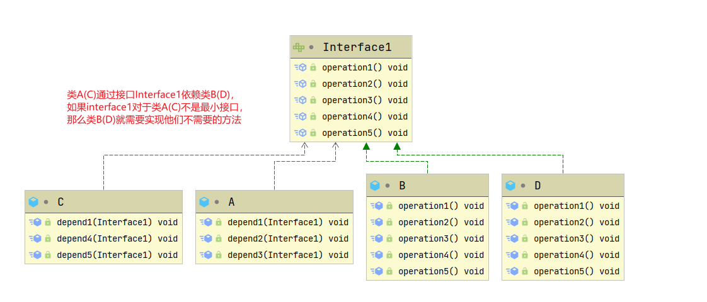
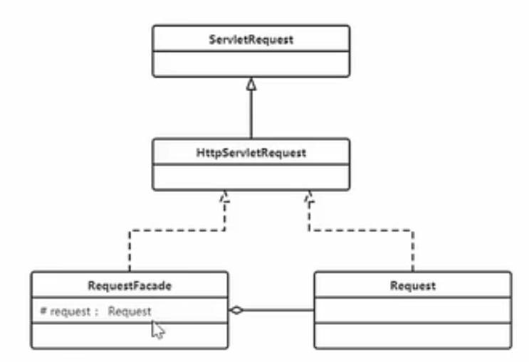
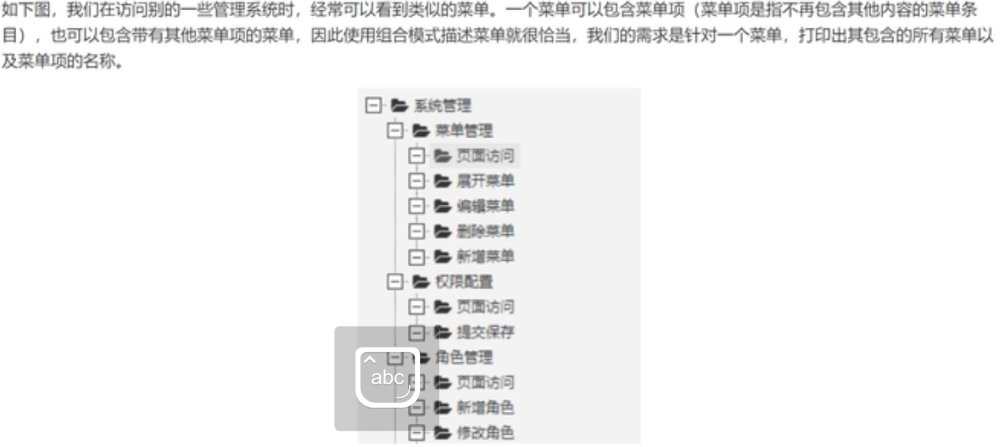
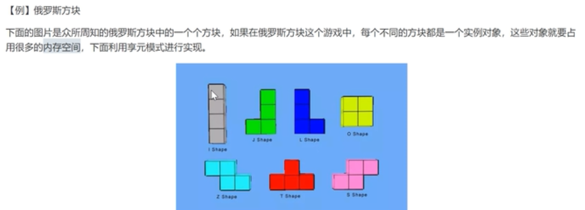
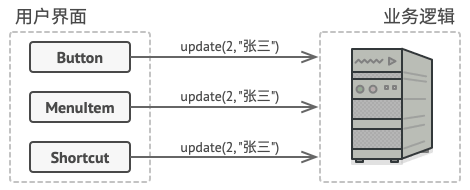

#   设计模式

> 大佬：https://refactoringguru.cn/design-patterns

## 简介

- 软件工程中，设计模式是对**软件设计中普遍存在(反复出现)的问题**，所提出的**解决方案**
- 是程序员在面对同类软件工程设计问题所总结出来的有用的经验，**模式不是代码，而是某类问题的通用解决方案**
- 使用设计模式，可以提高项目的**可扩展性，可维护性，规范性，并降低软件的复杂度**
- 设计模式的目的
  1. **代码重用性**: 相同功能的代码，不用多次编写
  2. **可读性**：编程规范性，便于团队开发
  3. **可扩展性**(可维护性)：当需要增加新的功能时，非常方便
  4. **可靠性**：当我们增加新的功能后，对原来的功能不会造成太大影响
  5. 使程序呈现**高内聚，低耦合**的特性
- 设计模式七大原则
  1. 单一职责原则
  2. 接口隔离原则
  3. 依赖倒转原则
  4. 里氏替换原则
  5. 开闭原则
  6. 迪米特法原则
  7. 合成复用原则

## 七大原则

### 单一职责原则

> 基本介绍

对一个类来说，我们需要保证其只负责一项职责；如果一个类 A 负责两个不同职责(1/2)，由于职责1的需求改变而改变 A 时，可能会导致职责2执行错误，这时候就需要将类 A 的粒度分解为 A1，A2

> 应用实例-交通工具案例

```java
/**
 * 交通工具案例  - 方案1
 * @author 小丶木曾义仲丶哈牛柚子露丶蛋卷
 * @version 1.0
 * @date 2022/5/9 10:52
 */
public class Demo1 {

    public static void main(String[] args) {
        new Vehicle().run("汽车");
        new Vehicle().run("摩托");
        new Vehicle().run("飞机");
    }

}

/**
 * 交通工具类
 *  - 违背了单一职责原则(这里一个方法管 天上飞的/地上跑的/水里游的)
 *  - 解决方案：根据交通方法的运行方式不同，分解成不同类即可
 */
class Vehicle {
    public void run(String vehicleName) {
        System.out.println(vehicleName + " 在公路上run");
    }
}
```


```java
/**
 * 交通工具案例  - 方案2
 * @author 小丶木曾义仲丶哈牛柚子露丶蛋卷
 * @version 1.0
 * @date 2022/5/9 10:56
 */
public class Demo2 {

    public static void main(String[] args) {
        new RoadVehicle().run("摩托车");
        new AirVehicle().run("飞机");
        new WaterVehicle().run("游轮");
    }

}

/**
 * 对方案1的改进 - 将一个职责拆分成一个类
 * 优点：遵守单一职责原则
 * 缺点：本身的代码量较少，但这样改动对 服务端&客户端 原本的代码修改太大了
 * 解决方案：基于方案1，只修改 Vehicle 类，减少改动的代码
 */
class RoadVehicle {

    public void run(String vehicleName) {
        System.out.println(vehicleName + " 在公路上run");
    }

}

class AirVehicle {

    public void run(String vehicleName) {
        System.out.println(vehicleName + " 在天空上run");
    }

}

class WaterVehicle {

    public void run(String vehicleName) {
        System.out.println(vehicleName + " 在水上run");
    }

}
```


```java
/**
 * 交通工具案例  - 方案3
 * @author 小丶木曾义仲丶哈牛柚子露丶蛋卷
 * @version 1.0
 * @date 2022/5/9 11:01
 */
public class Demo3 {

    public static void main(String[] args) {
        new Vehicle2().run("汽车");
        new Vehicle2().runAir("飞机");
        new Vehicle2().runWater("游轮");
    }

}

/**
 * 在代码量不多，耦合度不高时，可以不遵守[类级别的单一职责原则]，从而保证[方法级别的单一职责原则]
 */
class Vehicle2 {
    public void run(String vehicleName) {
        System.out.println(vehicleName + " 在公路上run");
    }

    public void runAir(String vehicleName) {
        System.out.println(vehicleName + " 在天空上run");
    }

    public void runWater(String vehicleName) {
        System.out.println(vehicleName + " 在水上run");
    }
}
```


> 注意事项和细节

1. 降低类的复杂度，尽量保证一个类只负责一项职责
2. 提高类的可读性，可维护性
3. 降低变更引起的风险
4. 通常情况下，**我们应当遵守单一职责原则**
   - 只有逻辑足够简单，才可以在代码级违反单一职责原则
   - 只有类中的方法数量足够少，才可以在方法级别保持单一职责原则

### 接口隔离原则

> 基本介绍

当一个类依赖一个接口，而为了避免实现该接口的实现类写多余的方法，导致代码臃肿，我们应该将接口进行拆分，进行**接口隔离**

> 应用案例 - 不使用接口隔离原则



```java
public class Demo1 {

    public static void main(String[] args) {
        A a = new A();
        // 类A只依赖类B中的三个方法
        a.depend1(new B());
        a.depend2(new B());
        a.depend3(new B());
        // 类C只依赖类D中的三个方法
        C c = new C();
        c.depend1(new D());
        c.depend4(new D());
        c.depend5(new D());

    }

}

interface Interface1 {
    void operation1();
    void operation2();
    void operation3();
    void operation4();
    void operation5();
}

class B implements Interface1 {
    @Override
    public void operation1() {
        System.out.println("B.operation1()....");
    }

    @Override
    public void operation2() {
        System.out.println("B.operation2()....");
    }

    @Override
    public void operation3() {
        System.out.println("B.operation3()....");
    }

    @Override
    public void operation4() {
        System.out.println("B.operation4()....");
    }

    @Override
    public void operation5() {
        System.out.println("B.operation5()....");
    }
}

class D implements Interface1 {
    @Override
    public void operation1() {
        System.out.println("D.operation1()....");
    }

    @Override
    public void operation2() {
        System.out.println("D.operation2()....");
    }

    @Override
    public void operation3() {
        System.out.println("D.operation3()....");
    }

    @Override
    public void operation4() {
        System.out.println("D.operation4()....");
    }

    @Override
    public void operation5() {
        System.out.println("D.operation5()....");
    }
}

class A {
    public void depend1(Interface1 i) {
        i.operation1();
    }
    public void depend2(Interface1 i) {
        i.operation2();
    }
    public void depend3(Interface1 i) {
        i.operation3();
    }
}

class C {
    public void depend1(Interface1 i) {
        i.operation1();
    }
    public void depend4(Interface1 i) {
        i.operation4();
    }
    public void depend5(Interface1 i) {
        i.operation5();
    }
}
```


> 应用案例 - 使用接口隔离原则


```java
public class Demo2 {

    public static void main(String[] args) {
        // 类A通过Interface1,Interface2依赖类B，类B并不需要因此实现多余的方法
        A a = new A();
        a.depend1(new B());
        a.depend2(new B());
        a.depend3(new B());
        // 类C通过Interface1,Interface3依赖类D，类D并不需要因此实现多余的方法
        C c = new C();
        c.depend1(new D());
        c.depend4(new D());
        c.depend5(new D());

    }

}

interface Interface1 {
    void operation1();
}

interface Interface2 {
    void operation2();

    void operation3();
}

interface Interface3 {
    void operation4();

    void operation5();
}

class B implements Interface1, Interface2 {
    @Override
    public void operation1() {
        System.out.println("B.operation1()....");
    }

    @Override
    public void operation2() {
        System.out.println("B.operation2()....");
    }

    @Override
    public void operation3() {
        System.out.println("B.operation3()....");
    }
}

class D implements Interface1, Interface3 {
    @Override
    public void operation1() {
        System.out.println("D.operation1()....");
    }

    @Override
    public void operation4() {
        System.out.println("D.operation4()....");
    }

    @Override
    public void operation5() {
        System.out.println("D.operation5()....");
    }
}

class A {
    public void depend1(Interface1 i) {
        i.operation1();
    }

    public void depend2(Interface2 i) {
        i.operation2();
    }

    public void depend3(Interface2 i) {
        i.operation3();
    }
}

class C {
    public void depend1(Interface1 i) {
        i.operation1();
    }

    public void depend4(Interface3 i) {
        i.operation4();
    }

    public void depend5(Interface3 i) {
        i.operation5();
    }
}
```

> 与单一职责原则的区别

- 单一职责原则原注重的是职责；而接口隔离原则注重对接口依赖的隔离
- 单一职责原则主要是约束类，其次才是接口和方法，它针对的是程序中的实现和细节；而接口隔离原则主要约束接口方法，主要针对抽象，针对程序整体框架的构建。

> 接口隔离的原则

- 接口尽量小，但是要有限度。对接口进行细化可以提高程序设计灵活性是不挣的事实，但是如果过小，则会造成接口数量过多，使设计复杂化。所以一定要适度。
- 为依赖接口的类定制服务，只暴露给调用的类它需要的方法，它不需要的方法则隐藏起来(private)。只有专注地为一个模块提供定制服务，才能建立最小的依赖关系。
- 提高内聚，减少对外交互。使接口用最少的方法去完成最多的事情。

### 依赖倒转原则

> 基本介绍

- 高层模块不应该直接依赖于底层模块，二者都应该依赖其抽象
- **抽象不应该依赖细节，细节应该依赖抽象**
- 依赖倒转的**核心**在于**面向接口编程**
- 设计理念：相对于细节的多变性，抽象的东西要稳定的多，以抽象为基础搭建的架构要比以细节为基础的架构要稳定的多。在 java 中，抽象指的是接口/抽象类，而细节就是实现类
- 使用**接口/抽象类**的目的就是定制好**规范**，而**不涉及任何具体的操作**，把展现细节的任务交给**实现类去完成**

> 应用案例 - 不使用依赖倒转

```java
class Email {
    public void send() {
        System.out.println("发送电子邮件");
    }
}

class Person {
    /**
     * 高层模块直接使用底层模块
     * 优点：编码简单
     * 缺点：可扩展性低，如果这个时候说要发送wx/qq等等其他消息就需要对代码进行重构
     * @param email
     */
    public void toSend(Email email) {
        email.send();
    }
}
```

> 应用案例 - 使用依赖倒转

```java
interface MessageType {
    void sendMessage();
}

class Email2 implements MessageType {
    @Override
    public void sendMessage() {
        System.out.println("发送邮件");
    }
}

class WeChat implements MessageType {

    @Override
    public void sendMessage() {
        System.out.println("发送微信");
    }
}

class Person2 {
    /**
     * 高层模块不直接使用底层模块细节(实现类)，而是依赖其抽象，从而屏蔽底层实现细节，提高代码的可扩展性和维护性
     * @param messageType
     */
    public void toSend(MessageType messageType) {
        messageType.sendMessage();
    }
}
```

> 依赖传递的三种方式

1. 接口传递

   ```java
   interface Type {
       void test();
   }
   
   class TypeA implements Type {
       @Override
       public void test() {
           System.out.println("TypeA....test");
       }
   }
   
   /**
    * 1. 接口传递
    */
   class Memeber {
       /**
        * 通过接口(方法)参数传递依赖
        * @param type
        */
       public void seeType(Type type) {
           type.test();
       }
   }
   ```

2. 构造方法传递

   ```java
   /**
    * 2. 通过构造器传递
    */
   class Member {
   
       private Type iType;
   
       public Member(Type iType) {
           this.iType = iType;
       }
   
       public void seeType() {
           this.iType.test();
       }
   }
   ```

3. setter 方式传递

   ```java
   /**
    * 3. 通过setter方法传递
    */
   class Member {
       private Type iType;
   
       public void seeType() {
           this.iType.test();
       }
   
       public void setiType(Type iType) {
           this.iType = iType;
       }
   }
   ```

> 原则和注意事项

1. 底层模块尽量都有抽象类或接口(也可以二者都有)，程序稳定性更好
2. 变量的声明类型尽量是抽象类/接口，这样变量和实际对象间，就存在一个缓冲层，利于程序的扩展和优化
3. 继承时遵守**里氏替换原则**

### 里氏替换原则

> OOP中的继承性的思考和说明

1. 继承其实包含了这样的一层含义：父类中凡是已经实现好的方法，实际上是在**设计规范和契约**，虽然不强制要求所有子类必须遵循这些契约。但如果子类对这些实现的方法任意修改，就会对整个继承体系造成破坏
2. 继承给程序设计带来便利的同时，也带来了弊端，比如使用继承会给程序带来侵入性，程序的可移植性降低，增加对象间的耦合性，当我们需要修改父类时，必须要考虑到所有子类，并且父类修改后，所有涉及到子类的功能可能会产生故障

> 基本介绍：

- 在我们使用父类的地方，如果将其全部替换成任意子类，也不会影响程序的运行，就能保证所有**引用基类的地方能透明的使用其子类的对象**
- 即在使用继承时，在子类中**尽量**不要重写父类的方法
- 其实继承让两个类的耦合性增强了，在适当的情况下，可以通过聚合，组合，依赖来解决问题

> 应用案例 - 不遵守里氏替换原则

```java
public class Demo1 {

    public static void main(String[] args) {
        A a = new A();
        System.out.println("1 + 8 ==> " + a.func1(1, 8));
        B b = new B();
        System.out.println("1 + 8 ==> " + b.func1(1, 8));
        // 输出结果并不同，该程序中类B不能代替类A，就违反了里氏替换原则
    }

}

class A {
    public int func1(int a, int b) {
        return  a + b;
    }
}

class B extends A {
    @Override
    public int func1(int a, int b) {
        return a - b;
    }

    public int func2(int a, int b, int c) {
        return func1(a, b) + c;
    }
}
```

当我们无意的去重写父类的方法后，可能会造成原有功能出错。在实际编程中，我们常常通过重写父类的方法完成新的功能，虽然写起来简单，但会导致继承体系的复用性比较差，特别是运行多态比较频繁的时候

通常的做法：原来的**父类和特殊的子类继承一个更通俗的基类**，将原有的继承关系去掉，采用依赖，聚合，组合等关系代替

> 应用案例 - 遵守里氏替换原则

```java
public class Demo2 {

    public static void main(String[] args) {
        C c = new C();
        System.out.println("8 + 8 ==> " + c.func1(8, 8));
        // 因为我们将 func1() 抽取了出来，并不作为父类的方法，所以这里是遵循里氏替换原则的(D not extends C)
        D d = new D();
        System.out.println("8 - 8 ==> " + d.func1(8, 8));

    }

}

class Base {
    // 抽取类C和类D的公共方法(代码)
}

class C extends Base {
    public int func1(int a, int b) {
        return  a + b;
    }
}

class D extends Base {
    // 使用组合的方式引用类C的对象
    private final C c = new C();

    public int func1(int a, int b) {
        return a - b;
    }

    public int func2(int a, int b, int c) {
        return this.c.func1(a, b) + c;
    }
}
```

### 开闭原则

> 基本介绍

1. 开闭原则(OCP)是编程中**最基础，最重要**的设计原则
2. 一个项目中的类/模块/函数应该**对扩展开放(从提供方的角度出发)，对修改关闭(从使用方的角度出发)**，用抽象构建框架，用实现扩展细节
3. 当软件需求变化时，尽量**通过扩展软件实体**的行为实现变化，而不是通过修改已有代码来实现变化
4. 编程中遵循其他原则，以及使用设计模式的目的就是遵循**开闭原则**

> 应用案例 - 不遵守开闭原则

```java
public class Demo1 {

    public static void main(String[] args) {
        new GraphicEditor().drawShape(new Rectangle());
        new GraphicEditor().drawShape(new Circle());
    }

}

class GraphicEditor {
    public void drawShape(Shape s) {
        if (s.type == 1) {
            drawRectangle(s);
        } else if (s.type == 2) {
            drawCircle(s);
        }
    }

    private void drawRectangle(Shape shape) {
        System.out.println("绘制矩形");
    }

    private void drawCircle(Shape shape) {
        System.out.println("绘制圆型");
    }
}

class Shape {
    int type;
}

class Rectangle extends Shape {
    public Rectangle() {
        this.type = 1;
    }
}


class Circle extends Shape {
    public Circle() {
        this.type = 2;
    }
}
```

存在问题：当我们需要扩展 Shape 类型时，不仅需要 新建类&修改客户端调用代码(Demo1.main())，还需要修改 **GraphicEditor.drawShape()** 方法里面的处理逻辑，不仅麻烦而且没有遵守 OCP

> 应用案例 - 遵守 OCP

```java
public class Demo1 {

    public static void main(String[] args) {
        new GraphicEditor().drawShape(new Rectangle());
        new GraphicEditor().drawShape(new Circle());
    }

}

class GraphicEditor {
    public void drawShape(Shape s) {
        s.draw();
    }
}

abstract class Shape {
    int type;

    abstract void draw();
}

class Rectangle extends Shape {
    public Rectangle() {
        this.type = 1;
    }

    @Override
    void draw() {
        System.out.println("绘制矩形");
    }
}


class Circle extends Shape {
    public Circle() {
        this.type = 2;
    }

    @Override
    void draw() {
        System.out.println("绘制圆型");
    }
}
```

将原父类修改为 `abstract` 并定义抽象方法 `draw()`，当提供方需要扩展程序时(例如新建一个类)，继承该抽象类然后实现方法即可，同时使用方(**GraphicEditor.drawShape()**)不需要进行任何修改，遵守了 OCP 开闭原则

### 迪米特法则

> 基本介绍

1. 一个对象应该对其他对象保持最少的了解

2. 类与类关系越密切，耦合度越大

3. 迪米特法则又称为 **最少知道原则**，即一个类对自己依赖的类知道的越少越好，也就是说，对于被依赖的类不管多复杂，都尽量将逻辑封装到类的内部，对外除了提供 public 方法，不对外泄露任何信息

4. 简单定义：只与**直接的朋友**通信

   直接的朋友：每个对象都会于其他对象有耦合关系，只要两个对象之间有耦合关系，就代表两个对象之间是朋友关系；耦合的方式很多(依赖/关联/组合/聚合等)，其中，我们称**成员变量/方法参数/方法返回值中的类**为直接的朋友，其他的类最好不要以局部变量的形式出现在类的内部

> 应用案例

```java
public class Demo1 {

    public static void main(String[] args) {
        SchoolManager schoolManager = new SchoolManager();
        schoolManager.printAllEmployee(new CollegeManager());
    }

}

//学院员工类
class CollegeEmployee {
    private String id;

    public String getId() {
        return id;
    }

    public void setId(String id) {
        this.id = id;
    }
}

//管理学院员工的管理类:
class CollegeManager {
    /**
     * 返回学院的所有员工，这里的 CollegeEmployee 就是直接朋友
     *
     * @return
     */
    public List<CollegeEmployee> getAllEmployee() {
        List<CollegeEmployee> list = new ArrayList<>();
        //这里我们增加了10 个员工到list ，
        for (int i = 0; i < 10; i++) {
            CollegeEmployee emp = new CollegeEmployee();
            emp.setId("学院员工id " + i);
            list.add(emp);
        }
        return list;
    }
}

//学校总部员工类
class SchoolEmployee {
    private String id;

    public String getId() {
        return id;
    }

    public void setId(String id) {
        this.id = id;
    }
}

//学校管理类
class SchoolManager {
    /**
     * 返回学校总部的员工，直接朋友 SchoolEmployee
     *
     * @return
     */
    public List<SchoolEmployee> getAllEmployee() {
        List<SchoolEmployee> list = new ArrayList<SchoolEmployee>();
        for (int i = 0; i < 5; i++) { //这里我们增加了5个员工到list
            SchoolEmployee emp = new SchoolEmployee();
            emp.setId("学校总部员工id= " + i);
            list.add(emp);
        }
        return list;
    }

    /**
     * 该方法完成输出学校总部和学院员工信息(id)
     *
     * @param sub CollegeManager 直接朋友
     */
    void printAllEmployee(CollegeManager sub) {
        // 获取到学院员工，并非直接的朋友 CollegeEmployee，想办法优化它
        List<CollegeEmployee> list1 = sub.getAllEmployee();
        System.out.println("---学院员工----");
        for (CollegeEmployee e : list1) {
            System.out.println(e.getId());
        }

        //获取到学校总部员工
        List<SchoolEmployee> list2 = this.getAllEmployee();
        System.out.println("------学校总部员工------");
        for (SchoolEmployee e : list2) {
            System.out.println(e.getId());
        }
    }
}
```

在第79行使用了局部变量**List\<CollegeEmployee>**而其中的**CollegeEmployee**并不是直接的朋友，所以我们需要想办法优化它

> 应用案例 - 遵守迪米特法则

```java
//管理学院员工的管理类:
class CollegeManager {
    ...

    public void printAllEmployee() {
        List<CollegeEmployee> list1 = this.getAllEmployee();
        System.out.println("---学院员工----");
        for (CollegeEmployee e : list1) {
            System.out.println(e.getId());
        }
    }
}

//学校管理类
class SchoolManager {
    ...
    /**
     * 该方法完成输出学校总部和学院员工信息(id)
     *
     * @param sub CollegeManager 直接朋友
     */
    void printAllEmployee(CollegeManager sub) {
        // 对于不是'直接的朋友'的类我们可以对代码进行封装，避免出现在该类中
        sub.printAllEmployee();

        //获取到学校总部员工
        List<SchoolEmployee> list2 = this.getAllEmployee();
        System.out.println("------学校总部员工------");
        for (SchoolEmployee e : list2) {
            System.out.println(e.getId());
        }
    }
}
```

> 注意事项和细节

1. 迪米特法则的核心是降低类之间的耦合
2. 但是注意：由于每个类都减少了不必要的依赖，因此迪米特法则只是降低了类间(对象间)耦合关系，并不是要求完全没有依赖关系

### 合成复用原则

> 基本介绍

原则是尽量使用合成/聚合的方式，而不是使用继承


### 设计原则核心思想

1. 找出应用可能需要变化之处，把它们独立出来，不要和那些不需要变化的代码混在一起
2. 针对接口编程，而不是针对实现编程
3. 为了交互对象之间的**松耦合设计**而努力

## UML 类图

> 基本介绍

- 统一建模语言，是一种用户软件系统分析和设计的语言工具，用户帮助软件开发人员进行思考和记录思路的结果
- UML 本身是一套符号的规定，就像数学符号和化学符号一样，这些符号用于描述软件模型中的各个元素和他们之间的关系(类/接口/实现/泛化等等)
- 使用 UML 来建模，常用工具有 Rational Rose，也可以使用一些插件来建模

> 使用

- 这里使用 **PlantUML** 进行 UML 建模，可以参考：https://plantuml.com/zh/class-diagram#6e0d446ea2c5bf82

> 分类

- 用例图(use case)
- 静态结构图：**类图**，对象图，包图，组件图，部署图
- 动态行为图：交互图(时序图/协作图)，状态图，活动图

> 说明

- 用于描述系统中类(对象)本身的组成和其他类(对象)之间的各种静态关系
- 类之间的关系：**依赖/泛化(继承)/实现/关联/聚合/组合**

> 类的依赖关系：只要在类中使用到了对方

 

比较常见的几种情况：

- 类的成员属性
- 方法的返回类型
- 方法接收的参数类型
- 方法中使用到的(局部变量)


> 类的泛化关系：实际上就是继承关系，是**依赖关系的特例**

 

如果A类继承了B类，那么A类与B类就存在泛化关系


> 类的实现关系：也是**依赖关系的特例**

 


> 类的关联关系：类与类之间的联系特征，也是**依赖关系的特例**

- 关联具有导航性(单向/双向)
- 关联具有多重性("1"表示有且只有一个;"0"表示0个或多个;"0,1"表示0/1个;"n...m"表示n到m个都可以;"m...*"表示最少m个等等)


> 类的聚合关系：表示的是整体和部分的关系，但**整体和部分可以分开，聚合关系是关联关系的特例**，所以它也具有关联的**导航性和多重性**

 

```pnml
@startuml
'https://plantuml.com/class-diagram

class Mouse
class Monitor
class Computer {
    - mouse: Mouse
    - monitor: Monitor
    + setMouse(mouse: Mouse): void
    + setMonitor(monitor: Monitor): void
}
note left: 属性的初始化和对象的初始化时机不同,\n所以是聚合关系

Computer o-- Mouse
Computer o-- Monitor

@enduml
```

> 类的组合关系：也是整体与部分的关系&关联关系的特例，但是**整体和部分不可以分开**

 


特殊情况：初始化不同，但在销毁当前对象时也要**级联删除**的成员对象属性，也是组合关系(例如再删除 Person 时将对应的 IDCard 也进行删除)

## 创建型模式

> 5种：单例模式 + 工厂模式(简单工厂&工厂方法) + 建造者模式 + 抽象工厂 + 原型模式

### 单例模式

#### 简介

采取一定的方法，保证整个系统中某个类只**存在一个对象实例**，并且该类提供一个可以获取去对象实例的方法(静态方法)

 

#### 实现方式

##### 饿汉式

> 静态常量

步骤：

1. 构造器私有化(防止外部 new)
2. 在内部创建类的对象
3. 对外暴漏一个静态的公共方法，可以用来获取创建的对象

代码：

```java
public class Demo1 {

    public static void main(String[] args) {
        Singleton01 instance = Singleton01.getInstance();
        Singleton01 instance2 = Singleton01.getInstance();
        System.out.println(instance == instance2);
    }

}

class Singleton01 {

    /**
     * 1. 私有化构造器
     */
    private Singleton01() {

    }

    /**
     * 2. 在类的内部创建对象实例
     */
    private final static Singleton01 INSTANCE = new Singleton01();

    /**
     * 3. 对外暴漏方法，返回该类的实例
     * @return
     */
    public static Singleton01 getInstance() {
        return INSTANCE;
    }

}
```

优缺点说明：

- 优点：
  - 写法简单
  - 在类加载时完成了实例化，避免了线程同步问题
- 缺点：
  - 在类加载的时候完成了实例化，没有达到 Lazy Loading 的效果
  - 加载后如果长时间不使用，会造成内存的浪费(进行类加载clasloader的可能是其他方法，不一定是 **getInstance**)

- 总结：能用，但可能会造成内存浪费

> 静态代码块

代码：

```java
public class Demo2 {

    public static void main(String[] args) {
        Singleton02 instance = Singleton02.getInstance();
        Singleton02 instance2 = Singleton02.getInstance();
        System.out.println(instance == instance2);
    }

}

class Singleton02 {

    /**
     * 1. 私有化构造器
     */
    private Singleton02() {

    }

    /**
     * 2. 定义实例的变量
     */
    private final static Singleton02 INSTANCE;

    static {
        // 3. 在代码块中完成对实例的初始化
        INSTANCE = new Singleton02();
    }

    /**
     * 4. 对外暴漏方法，返回该类的实例
     * @return
     */
    public static Singleton02 getInstance() {
        return INSTANCE;
    }

}
```

优缺点说明：

- 这种方式和[**静态常量**]差不多,只不过将类实例化的过程放在了静态代码块中；在类加载时，执行静态代码块中的方法，初始化类的实例，优缺点都一样
- 结论：能用，但可能会造成内存浪费

##### 懒汉式

> 线程不安全、

代码：

```java
public class Demo3 {

    public static void main(String[] args) {
        Singleton03 instance1 = Singleton03.getInstance();
        Singleton03 instance2 = Singleton03.getInstance();
        System.out.println(instance1 == instance2);
    }

}

class Singleton03 {
    private Singleton03() {

    }

    private static Singleton03 singleton03;

    /**
     * 懒汉式：只有在调用获取实例的方法时才创建实例
     * @return
     */
    public static Singleton03 getInstance() {
        if (singleton03 == null) {
            singleton03 = new Singleton03();
        }
        return singleton03;
    }
}
```

优缺点说明：

- 优点：起到了 Lazy Loading 的效果
- 缺点：只能在单线程下使用(在多线程情况下，一个线程进入到了 `if (singleton03 == null)` 判断语句块，还未来得及执行下一步，另一个线程也通过了该判断语句，**这时便会产生多个实例**)
- 结论：在实际开发中，不要使用这种方式!

> 线程安全，同步方法

代码：

```java
public class Demo4 {

    public static void main(String[] args) {
        Singleton4 instance = Singleton4.getInstance();
        Singleton4 instance2 = Singleton4.getInstance();
        System.out.println(instance == instance2);

    }

}

class Singleton4 {
    private Singleton4() {

    }

    private static Singleton4 singleton4;

    /**
     * 使用 synchronized 解决多线程问题
     * @return
     */
    public static synchronized Singleton4 getInstance() {
        if (singleton4 == null) {
            singleton4 = new Singleton4();
        }
        return singleton4;
    }
}
```

优缺点说明：

- 优点：完成了 Lazy Loading + 解决了多线程问题
- 缺点：效率太低了，其实只有保证执行一次实例化代码就好了，再后面使用时直接 return 即可，要是后面使用时还 synchronized 那也太慢了hhh
- 结论：在实际开发中，不推荐使用这种方式

> 线程不安全，同步代码块

代码:

```java
/**
 * 单例模式 - 懒汉式 - 同步方法，线程不安全
 * @author 小丶木曾义仲丶哈牛柚子露丶蛋卷
 * @version 1.0
 * @date 2022/5/10 11:35
 */
public class Demo5 {

    public static void main(String[] args) {
        Singleton5 instance = Singleton5.getInstance();
        Singleton5 instance1 = Singleton5.getInstance();
        System.out.println(instance == instance1);
    }

}

class Singleton5 {
    private Singleton5() {

    }

    private static Singleton5 singleton5;

    /**
     * 使用同步方法提高效率
     * @return
     */
    public static Singleton5 getInstance() {
        if (singleton5 == null) {
            synchronized (Singleton5.class) {
                singleton5 = new Singleton5();
            }
        }
        return singleton5;
    }
}
```

优缺点说明：

- 这种方式主要针对 [懒汉式-同步代码块] 中的效率太低的问题所提出的，本身在进行 `if(s5 == null)` 时还是有可能会产生线程安全问题
- 结论：在实际开发中，不能使用这种方式

##### 双重检查(double-check)

代码：

```java
/**
 * 单例模式 - 双重检查
 * @author 小丶木曾义仲丶哈牛柚子露丶蛋卷
 * @version 1.0
 * @date 2022/5/10 12:06
 */
public class Demo6 {

    public static void main(String[] args) {
        Singleton6 instance = Singleton6.getInstance();
        Singleton6 instance1 = Singleton6.getInstance();
        System.out.println(instance == instance1);
    }

}

class Singleton6 {
    private Singleton6() {

    }

    /**
     * 使用 volatile 保证可见性和禁止指令重排
     */
    private static volatile Singleton6 singleton6;

    /**
     * 使用两个 if + 同步代码块 解决 Lazy Loading + 线程安全 问题
     * @return
     */
    public static Singleton6 getInstance() {
        if (singleton6 == null) {
            synchronized (Singleton6.class) {
                if (singleton6 == null) {
                    singleton6 = new Singleton6();
                }
            }
        }
        return singleton6;
    }
}
```

结论：

1. `double-check` 概念是多线程开发中经常使用的，当我们使用两次 `if(s6 == null)` 保证线程安全 
2. 线程安全，Lazy Loading, 效率较高
3. 结论：在实际开发中，**推荐使用**

**为什么要使用 volatile**？

1. 当我们创建实例时 `singleton6 = new Singleton6();`这一行可以分解为三行代码(JVM 内部执行)

   ```java
   memory=allocate();        //1:分配对象的内存空间
   ctorInstance(memory);     //2:初始化对象
   instance = memory;          //3:设置instance指向刚分配的内存地址
   ```

2. 在上面三行代码执行过程中，可能会导致重排序，第2和3行的执行顺序可能会被重排序

   ```java
   memory=allocate();        //1:分配对象的内存空间
   instance = memory;        //3:设置instance指向刚分配的内存地址
                             //注意，此时对象还没有被初始化！
   ctorInstance(memory);     //2:初始化对象
   ```

##### 静态内部类

代码：

```java
/**
 * 单例模式 - 静态内部类
 * @author 小丶木曾义仲丶哈牛柚子露丶蛋卷
 * @version 1.0
 * @date 2022/5/10 22:17
 */
public class Demo7 {

    public static void main(String[] args) {
        Singleton7 instance = Singleton7.getInstance();
        Singleton7 instance2 = Singleton7.getInstance();
        System.out.println(instance == instance2);
    }

}

class Singleton7 {
    private Singleton7() {}

    /**
     * 当类加载时并不会加载对应的静态内部类
     */
    private static class Singleton7Instance{
        private static final Singleton7 SINGLETON7 = new Singleton7();
    }

    /**
     * Java 在进行 Classloader 时线程是安全的
     * @return
     */
    public static Singleton7 getInstance() {
        return Singleton7Instance.SINGLETON7;
    }
}
```

优缺点说明：

1. 这种方式采用了类装载的机制来保证初始化实例时只有一个线程
2. 静态内部类在外部类被装载时并不会被立即实例化，而是调用需要使用静态内部类的方法时，才会装载该内部类
3. 我们将外部类实例设置为内部类的静态属性，这样即实现了 Lazy Loading + 线程安全 + 效率高
4. 优点：避免了**线程不安全**，利用静态内部类特点实现 Lazy Loading，效率高
5. 结论：推荐使用

##### 枚举

代码：

```java
public class Demo8 {

    public static void main(String[] args) {
        Singleton8 instance = Singleton8.getInstance();
        Singleton8 instance1 = Singleton8.getInstance();
        System.out.println(instance == instance1);
    }

}

class Singleton8 {

    /**
     * 私有化构造器
     */
    private Singleton8() {

    }

    private enum Singleton8Enum {

        /**
         * 枚举类实例
         */
        INSTANCE_ENUM;

        private final Singleton8 singleton8;

        Singleton8Enum() {
            // 在初始化枚举类实例时完成对 外部类实例属性的 初始化
            singleton8 = new Singleton8();
        }

        /**
         * 提供一个方法将实例属性暴漏出去,也可以直接访问，但这样扩展性高一点
         * @return
         */
        public Singleton8 getInstance() {
            return singleton8;
        }
    }

    public static Singleton8 getInstance() {
        return Singleton8Enum.INSTANCE_ENUM.getInstance();
    }
    
}
```

优缺点说明：

1. 多线程安全 + Lazy Coding + 效率高
2. 反射安全
3. 序列化/反序列化安全
4. **写法简单**
5. 这种方式是`Effective Java`作者`Josh Bloch`提倡的方式，它不仅能避免多线程同步问题，而且还能防止反序列化**重新创建新的对象**，可谓是很坚强的壁垒啊。
6. 结论：**非常推荐使用**

#### JDK 源码

`java.lang.Runtime` -> [饿汉式-静态常量]

 

#### 注意事项和细节说明

1. 单例模式保证了系统内只存在该类的一个对象，节省系统资源，对于一些需要频繁创建/销毁的对象，使用单例模式可以提高性能
2. 要想实例化一个类是，是通过一个`public static`方法获取，而不是 `new`
3. 使用场景：需要频繁的进行创建/销毁的对象，创建对象时需要消耗过多的资源但又需要经常使用的对象

### 工厂模式

#### 简单工厂(静态工厂)

##### 需求分析

 

##### 传统实现

> UML 类图分析

 

> 代码实现

1. 定义披萨类

   ```java
   public abstract class Pizza {
   
       private String name;
   
       public Pizza(String name) {
           this.name = name;
       }
   
       /**
        * 制作原材料的过程
        */
       public abstract void prepare();
   
       public void bake() {
           System.out.println(this.name + "in bake");
       };
       public void cut() {
           System.out.println(this.name + "in cut");
       };
       public void box() {
           System.out.println(this.name + "in box");
       };
   }
   ```

   ```java
   public class GreekPizza extends Pizza{
   
       public GreekPizza(String name) {
           super(name);
       }
   
       @Override
       public void prepare() {
           System.out.println("Greek Pizza in prepare");
       }
   }
   ```

   ```java
   public class PepperPizza extends Pizza {
   
       public PepperPizza(String name) {
           super(name);
       }
   
       @Override
       public void prepare() {
           System.out.println("PepperPizza in prepare");
       }
   }
   ```

2. 定义一个订单披萨类，用来接收用户请求并创建披萨

   ```java
   public class OrderPizza {
   
       public Pizza createPizza() {
           Pizza pizza = null;
           String orderType = getType(); // 订购的披萨类型
   
           if ("greek".equals(orderType)) {
               pizza = new GreekPizza(" 希腊披萨 ");
           } else if ("pepper".equals(orderType)) {
               pizza = new PepperPizza("胡椒披萨");
           } else {
               System.out.println("该披萨类型不存在");
               return null;
           }
   
           //输出pizza 制作过程
           pizza.prepare();
           pizza.bake();
           pizza.cut();
           pizza.box();
   
           return pizza;
       }
   
       // 写一个方法，可以获取客户希望订购的披萨种类
       private String getType() {
           try {
               BufferedReader strin = new BufferedReader(new InputStreamReader(System.in));
               System.out.println("input pizza 种类:");
               String str = strin.readLine();
               return str;
           } catch (IOException e) {
               e.printStackTrace();
               return "";
           }
       }
   
   }
   ```

3. 创建一个 OrderStoreApp 类，用来下订单

   ```java
   public class PizzaStoreApp {
   
       public static void main(String[] args) {
           OrderPizza orderPizza = new OrderPizza();
           orderPizza.createPizza();
       }
   
   }
   ```

> 优缺点说明

- 优点：编码简单，易于操作

- 缺点：违反了 ocp 原则(对扩展开发，对修改关闭)，当我们给类新增一个功能时，对使用方来说尽量不修改代码(或尽可能少)

  这里如果我们需要新加一个 Pizza 类，不仅需要实现原来的抽象类，对于使用方 **OrderPizza** 中处理披萨的逻辑也要修改

> 改进思路分析：

我们可以将创建 Pizza 对象的过程封装到一个类中，这样当我们有了新的 Pizza 类时，统一修改那个类就好了，对外使用方就不用修改代码了 --> 简单工厂

##### 简单工厂

> UML 类图

 

> 代码实现

1. 创建一个 PizzaFactory 并提供一个方法统一创建 Pizza 对象

   ```java
   public class PizzaFactory {
   
       /**
        * 封装创建实例的过程，避免由于底层代码的扩展而倒是使用者修改大部分代码
        * @param type
        * @return
        */
       public Pizza createPizza(String type) {
           Pizza pizza;
   
           if ("greek".equals(type)) {
               pizza = new GreekPizza(" 希腊披萨 ");
           } else if ("pepper".equals(type)) {
               pizza = new PepperPizza("胡椒披萨");
           } else {
               System.out.println("该披萨类型不存在");
               return null;
           }
   
           //输出pizza 制作过程
           pizza.prepare();
           pizza.bake();
           pizza.cut();
           pizza.box();
   
           return pizza;
       }
   
   }
   ```

2. 重构 **OrderPizza**

   ```java
   public class OrderPizza {
   
       private PizzaFactory pizzaFactory;
   
       public void setPizzaFactory(PizzaFactory pizzaFactory) {
           this.pizzaFactory = pizzaFactory;
       }
   
       /**
        * 使用方只用整合 pizzaFactory，传递数据就能得到结果，而具体实现不用在意
        * @return
        */
       public Pizza createPizza() {
           String type = getType();
           return pizzaFactory.createPizza(type);
       }
   
       // 写一个方法，可以获取客户希望订购的披萨种类
       private String getType() {
           try {
               BufferedReader strin = new BufferedReader(new InputStreamReader(System.in));
               System.out.println("input pizza 种类:");
               String str = strin.readLine();
               return str;
           } catch (IOException e) {
               e.printStackTrace();
               return "";
           }
       }
   
   }
   ```

3. 使用

   ```java
   public class PizzaStoreApp {
   
       public static void main(String[] args) {
           OrderPizza orderPizza = new OrderPizza();
           orderPizza.setPizzaFactory(new PizzaFactory());
           orderPizza.createPizza();
       }
   
   }
   ```

> 优缺点说明

- 优点：
  - 封装了创建对象的过程，可以通过参数获取需要的实例对象，将对象的创建和业务逻辑分开，避免客户端修改代码
  - 如果要扩展新的类，修改工厂类即可，而不需要修改原代码，降低了客户端代码修改的可能性，更加容易扩展
- 缺点：增加新产品时还是需要修改工厂类，违背了 **开闭原则**

##### 静态工厂

其实就是将 Factory 中提供实例的方法改成静态的方便调用

```java
public static Pizza createPizza(String type)
```

```java
public Pizza createPizza() {
    String type = getType();
    return PizzaFactory.createPizza(type);
}
```

```java
public static void main(String[] args) {
    OrderPizza orderPizza = new OrderPizza();
    orderPizza.createPizza();
}
```

#### 工厂方法

##### 需求分析

- 针对简单工厂中没有遵守 ocp 原则的缺陷提出新的方法
- 概念：将进行生成实例的工厂接口化，让实现类决定要生成的产品类对象。工厂方法使一个产品类的实例化延迟到了工厂的子类
- 结构：
  - 抽象工厂：提供创建产品的接口，但具体的产品不在这里定义，只是定义一个规范，调用者可以访问具体工厂来创建具体产品
  - 具体工厂：根据抽象工厂的规范，实现对某一中产品的生产，完成对具体产品的创建
  - 抽象产品：定义了产品的规范，描述产品的主要特性和功能
  - 具体产品：根据抽象产品的规范，实现其接口，由一个对应的具体工厂来创建，与对应的具体工厂之间一一对应

##### 代码实现

> UML 类图

 

> 代码

1. 刚刚的 Pizza 类可以全部保留

2. 新建一个抽象工厂

   ```java
   public interface PizzaFactory {
   
       Pizza createPizza();
   
   }
   ```

3. 根据具体产品创建对应的具体工厂

   ```java
   public class PepperPizzaFactory implements PizzaFactory {
       @Override
       public Pizza createPizza() {
           return new PepperPizza("Pepper Pizza");
       }
   }
   ```

   ```java
   public class GreekPizzaFactory implements PizzaFactory {
       @Override
       public Pizza createPizza() {
           return new GreekPizza("Greek Pizza");
       }
   }
   ```

4. 修改 OrderPizza

   ```java
   public class OrderPizza {
   
       private PizzaFactory pizzaFactory;
   
       public void setPizzaFactory(PizzaFactory pizzaFactory) {
           this.pizzaFactory = pizzaFactory;
       }
   
       public void createPizza() {
           Pizza pizza = pizzaFactory.createPizza();
           pizza.prepare();
           pizza.bake();
           pizza.cut();
           pizza.box();
       }
   }
   ```

5. 使用

   ```java
   OrderPizza orderPizza = new OrderPizza();
   orderPizza.setPizzaFactory(new GreekPizzaFactory());
   orderPizza.createPizza();
   ```

##### 优缺点说明

- 优点：
  - 用户只要知道具体工厂的名称就可以得到所要的产品，无需知道产品的具体创建过程
  - 在系统新增产品的时候，只需要创建对应的具体产品和具体工厂，无须对原工厂和使用方进行任何修改，满足**开闭原则**
- 缺点：
  - 每增加一个产品就要新增两个类，增加了系统的复杂度

#### 抽象工厂

##### 简介

- 工厂方法提供的是针对一种产品的生产

- 一般我们将同类型的产品称为**同等级产品**(例如：笔记本，台式都是电脑)，而抽象工厂**主要应用于多等级产品的生产**

- 我们也将在**同一工厂内不同等级(类型)的产品**称为一个**产品族**

  

- 可以为客户端提供一个能**创建一组相关或相互依赖对象(产品)**的接口，且访问类无需指定所要产品的具体类就能得到**不同等级同一族(当然了是相关/相互依赖的不是瞎凑的)**的产品

- 结构

  

##### 代码实现

> UML 类图

 

> 代码

1. 新建一个抽象产品类 **Drinks** 和两个具体产品类 **Cola & Sprite**

   ```java
   public abstract class Drinks {
       private String name;
   
       public Drinks(String name) {
           this.name = name;
       }
   
       public String getName() {
           return name;
       }
   }
   ```

2. 创建一个抽象工厂并定义可以生产的产品规范

   ```java
   public interface ComboFactory {
   
       Pizza createPizza();
   
       Drinks createDrinks();
   
   }
   ```

3. 以产品族为依据，实现 **ComboFactory** 以实现生产不同的产品

   ```java
   public class PepperPizzaSpriteDrinksFactory implements ComboFactory {
       @Override
       public Pizza createPizza() {
           return new PepperPizza("PepperPizza");
       }
   
       @Override
       public Drinks createDrinks() {
           return new Sprite("Sprite");
       }
   }
   ```

   ```java
   public class GreekPizzaColaDrinksFactory implements ComboFactory {
       @Override
       public Pizza createPizza() {
           return new GreekPizza("Greek Pizza");
       }
   
       @Override
       public Drinks createDrinks() {
           return new Cola("Cola");
       }
   }
   ```

4. 使用

   ```java
   public static void main(String[] args) {
       // GreekPizzaColaDrinksFactory factory = new GreekPizzaColaDrinksFactory();
       PepperPizzaSpriteDrinksFactory factory = new PepperPizzaSpriteDrinksFactory();
       System.out.println(factory.createDrinks().getName());
       System.out.println(factory.createPizza().getName());
   }  
   ```

##### 优缺点说明

优点：当一个产品族的多个对象被设计成**一起工作时**，可以保证客户端始终使用的是同一个产品族中的对象

缺点：当产品族需要增加一个新的产品时，相关的工厂类都需要进行修改

##### 使用场景


#### 配置文件+简单工厂

##### 简介

- 可以通过**工厂模式 + 配置文件** ==>(实现) **工厂对象与产品对象的解耦**

- 在工厂类中加载配置文件，并创建对应的产品对象进行存储，客户端需要时直接获取即可

##### 代码实现

1. 创建 `bean.properties` 用来记录产品对象

   ```java
   greekPizza=pers.prover07.dp.creation.factory.propfactory.entity.GreekPizza
   pepperPizza=pers.prover07.dp.creation.factory.propfactory.entity.PepperPizza
   ```

2. 创建一个工厂类，在类加载时读取配置文件

   ```java
   public class PizzaFactory {
   
       private static HashMap<String, Pizza> pizzaHashMap = new HashMap<>();
   
       static {
           // 创建 properties 对象
           Properties properties = new Properties();
           // 获取配置文件输入流
           InputStream is = PizzaFactory.class.getClassLoader().getResourceAsStream("./pers/prover07/dp/creation/factory/propfactory/bean.properties");
           try {
               // 加载配置文件
               properties.load(is);
               // 获取 properties 文件中定义的 key
               for (Object key : properties.keySet()) {
                   // 获取定义的 className
                   String className = (String) properties.get(key);
                   // 通过反射创建对象
                   Pizza pizza = (Pizza) Class.forName(className).newInstance();
                   // 保存起来
                   pizzaHashMap.put((String) key, pizza);
               }
           } catch (IOException | ClassNotFoundException | IllegalAccessException | InstantiationException e) {
               e.printStackTrace();
           }
   
       }
   
       public static Pizza getPizza(String type) {
           return pizzaHashMap.get(type);
       }
   
   }
   ```

   注意：记得修改产品类，原本的产品类**没有无参构造器**!!

3. 使用

   ```java
   public class OrderStoreApp {
   
       public static void main(String[] args) {
           System.out.println(PizzaFactory.getPizza("greekPizza"));
       }
   
   }
   ```

#### JDK 源码

`java.util.Collection.iterator()` 方法中使用到了[工厂方法]模式 

使用其对集合进行遍历

```java
public class Demo {
    public static void main(String[] args) {
        Collection<String> collection = new ArrayList<>();
        collection.add("令狐冲");
        collection.add("风清扬");
        collection.add("任我行");
        // 获取迭代器对象, Iterator 是迭代器接口，这里实际上是 ArrayList 内部实现的迭代器(具体产品)
        Iterator<String> it = collection.iterator();
        // 使用迭代器遍历
        while(it.hasNext()) {
            String ele = it.next();
            System.out.println(ele);
        }
    }
}
```

可以发现，我们通过调用 `Collection.iterator()` 就能得到对应的 **Iterator** 对象，我们可以将其分个角色:

- Collection - 抽象工厂：由于不同集合的遍历方式不同，所以定义`iterator()`方法的规范，让每个具体工厂实现自己的具体产品
- Iterator - 抽象产品：规定了产品规范
- ArrayList - 具体工厂
- ArrayList$Itr - 具体产品：**ArrayList** 中的内部类，根据规范实现遍历 ArrayList(HashMap)


### 原型模式

#### 简介

- 通过原型实例(就是对象)来指定创建对象的种类(创建和当前对象一样类型的)，并通过拷贝这些原型(复制属性)，创建新的对象

- 原型模式是一种创建型设计模式，允许通过一个对象创建另一个相同类型的对象，而无需创建的细节

- 结构

   

#### 代码

> UML 类图

 

> 代码实现

1. 创建一个抽象原型类 **Shape**

   ```java
   public abstract class Shape implements Cloneable {
   
       private String id;
       private String name;
   
       abstract void draw();
   
       public String getId() {
           return id;
       }
   
       public String getName() {
           return name;
       }
   
       public void setId(String id) {
           this.id = id;
       }
   
       public void setName(String name) {
           this.name = name;
       }
   
       @Override
       public Object clone() {
           Object obj = null;
           try {
               obj =  super.clone();
           } catch (CloneNotSupportedException e) {
               e.printStackTrace();
           }
           return obj;
       }
   }
   ```

2. 创建具体原型类，继承 Shape 

   ```java
   public class Rectangle extends Shape{
   
       public Rectangle() {
           this.setName("rectangle");
       }
   
       @Override
       void draw() {
           System.out.println("draw rectangle");
       }
   }
   ```

3. 使用

   ```java
   public static void main(String[] args) {
       Rectangle rectangle = new Rectangle();
       Rectangle rectangle2 = (Rectangle) rectangle.clone();
       // false
       System.out.println(rectangle == rectangle2);
   }
   ```

#### Spring 源码

- 当我们创建一个 Bean 时可以指定它的 **scope**

  ```java
  @Bean("prototype")
  public Rectangle rectangle(){
  ```

- 在 `scope=prototype` 时获取对应的 Bean 实例，Spring 就会调用相应的 `.clone()` 方法完成对对象的创建

   

#### 深拷贝

- 浅拷贝与深拷贝的区别：

  - 浅拷贝：通过调用 `.clone()` 方法完成; 对于对象中的 **基本类型数据会直接复制，引用类型数据会直接复制引用,而不是新建**
  - 深拷贝：对于对象中的 **基本类型数据会直接复制，引用类型数据会重新申请存储空间,并复制每个引用数据类型成员变量所引用的对象,直到该对象可达的所有对象**

- 实现：https://juejin.cn/post/6844903693100417038#heading-15

- 扩展：通过 I/O 流完成深拷贝

  1. Shape(抽象原型类)实现序列化接口

     ```java
     public abstract class Shape implements Cloneable, Serializable
     ```

  2. 新增 `public deepClone()` 方法

     ```java
     public Object deepClone() {
         //创建流对象
         ByteArrayOutputStream bos = null;
         ObjectOutputStream oos = null;
         ByteArrayInputStream bis = null;
         ObjectInputStream ois = null;
         try {
     
             //序列化
             bos = new ByteArrayOutputStream();
             oos = new ObjectOutputStream(bos);
             oos.writeObject(this); //当前这个对象以对象流的方式输出
     
             //反序列化
             bis = new ByteArrayInputStream(bos.toByteArray());
             ois = new ObjectInputStream(bis);
     
             return ois.readObject();
     
         } catch (Exception e) {
             e.printStackTrace();
             return null;
         } finally {
             //关闭流
             try {
                 assert bos != null;
                 bos.close();
                 assert oos != null;
                 oos.close();
                 assert bis != null;
                 bis.close();
                 assert ois != null;
                 ois.close();
             } catch (Exception e2) {
                 // TODO: handle exception
                 System.out.println(e2.getMessage());
             }
         }
     }
     ```

#### 注意事项和细节

1. 不用重新初始化对象，而是动态地获得对象运行时的状态

2. 如果原始对象发生变化(增加或者减少属性)，其它克隆对象的也会发生相应的变化，无需修改代码

3. 一个对象需要提供给其他对象访问，而且各个调用者可能都需要修改其值时，可以考虑使用原型模式拷贝多个对象供调用者使用。

4. 在实际项目中，原型模式很少单独出现，一般是和**工厂方法模式**一起出现，通过 clone 的方法创建一个对象，然后由工厂方法提供给调用者。

5. 调用 `.clone()` 方法时是**不会调用无参构造器**的

   > 克隆时，根据源对象类型先分配和源对象相同的内存，然后将源对象中的各个域中数据拷贝过来，最后返回对象地址。
   >
   > new时，第1步也是先分配内存，然后调用构造方法初始化数据，最后将对象地址返回，外界就可以通过这个对象地址(引用)操作此对象。

6. 缺点：需要为每一个类配备一个克隆方法，这对全新的类来 说不是很难，但对已有的类进行改造时，需要修改其源代码， 违背了**ocp**原则

### 建造者模式

#### 简介

- 又称为生成器模式；是一种对象构建过程，可以将复杂对象的过程抽象出来，根据抽象过程的不同实现方法构造出来不同表现(属性)的对象
- 它允许用户只通过指定复杂对象的类型和内容就可以构建它们，用户不需要知道内部的具体构建细节。

#### 角色

1. Product（产品角色）： 一个具体的产品对象。

2. Builder（抽象建造者）： 创建一个 Product 对象的各个部件(抽象方法)指定的 接口/抽象类。

3. ConcreteBuilder（具体建造者）： 实现接口，构建和装配各个部件。

4. Director（指挥者）： 构建一个使用Builder接口的对象。它主要是用于创建一个复杂的对象。

  它主要有两个作用：一是：隔离了客户与对象的生产过程，二是：负责控制产品对象的生产过程。

#### 代码

> UML 类图

 

> 代码实现

1. 创建一个产品

   ```java
   public class Phone {
   
       private String name;
   
       private String cpu;
   
       private String camera;
   
       public String getName() {
           return name;
       }
   
       public void setName(String name) {
           this.name = name;
       }
   
       public String getCpu() {
           return cpu;
       }
   
       public void setCpu(String cpu) {
           this.cpu = cpu;
       }
   
       public String getCamera() {
           return camera;
       }
   
       public void setCamera(String camera) {
           this.camera = camera;
       }
   }
   ```

2. 定义一个抽象建造者

   ```java
   public abstract class PhoneBuilder {
   
       private Phone phone = new Phone();
   
       // 定义生产一个手机需要的生产过程
       public abstract PhoneBuilder buildName();
       public abstract PhoneBuilder buildCpu();
       public abstract PhoneBuilder buildCamera();
   
       /**
        * 返回产品
        * @return
        */
       public Phone getPhone() {
           return phone;
       }
   
   }
   ```

3. 编写具体建造者，制定每个产品实现的不同细节

   ```java
   public class HuaWeiBuilder extends PhoneBuilder{
       @Override
       public PhoneBuilder buildName() {
           this.getPhone().setName("华为手机");
           return this;
       }
   
       @Override
       public PhoneBuilder buildCpu() {
           this.getPhone().setCpu("华为手机Cpu");
           return this;
       }
   
       @Override
       public PhoneBuilder buildCamera() {
           this.getPhone().setCamera("华为手机Camrea");
           return this;
       }
   }
   ```

   ```java
   public class IPhoneBuilder extends PhoneBuilder{
       @Override
       public PhoneBuilder buildName() {
           this.getPhone().setName("苹果手机");
           return this;
       }
   
       @Override
       public PhoneBuilder buildCpu() {
           this.getPhone().setCpu("苹果手机Cpu");
           return this;
       }
   
       @Override
       public PhoneBuilder buildCamera() {
           this.getPhone().setCamera("苹果手机Camrea");
           return this;
       }
   }
   ```

4. 定义指挥者，负责产品具体的生产过程步骤以及和客户的交接

   ```java
   public class Sellers {
   
       private PhoneBuilder phoneBuilder;
   
       public void setPhoneBuilder(PhoneBuilder phoneBuilder) {
           this.phoneBuilder = phoneBuilder;
       }
   
       /**
        * 制定生产过程的步骤
        * @return
        */
       public Phone phoneBuild() {
           phoneBuilder.buildName();
           phoneBuilder.buildCpu();
           phoneBuilder.buildCamera();
           return phoneBuilder.getPhone();
       }
   
   }
   ```

5. 使用

   ```java
   Sellers sellers = new Sellers();
   sellers.setPhoneBuilder(new HuaWeiBuilder());
   Phone phone = sellers.phoneBuild();
   System.out.println(phone.getName());
   ```

#### JDK 源码分析

`java.lang.StringBuilder` 

- 由 **Appendable** 作为抽象建造者，定义产品生产过程的规范

   

- 由 **AbstractStringBuilder** 作为具体建造者，实现了构建对应产品的细节

   

- 由 **StringBuilder** 作为指挥者，负责与 Client 沟通并调用 **AbstractStringBuilder** 中的方法实现产品细节构建

  ```java
  @Override
  public StringBuilder append(int i) {
      super.append(i); // 调用 AbstractStringBuilder 中的方法
      return this;
  }
  ```

#### 注意事项

- 客户端不知道产品细节，既可以通过指挥者得到产品，也能通过'沟通'(调用方法)实现产品细节
- 每一个具体建造者都相对独立，而与其他的具体建造者无 关，因此可以很方便地替换具体建造者或增加新的具体建造者，**用户使用不同的具体建造者即可得到不同的产品对象**
- 可以更加精细地控制产品的创建过程，将**复杂产品的创建步骤分解在不同的方法**中，使得创建过程更加清晰，也更方便使用程序来控制创建过程
- 遵守开闭原则，因为**指挥者类针对抽象建造者类编程**，系统扩展方便，所以增加新的具体建造者无须修改原有类库的代码
- 建造者模式所创建的产品一般具有较多的共同点，其组成部分相似，如果**产品之间的差异性很大，则不适合使用建造者模式**，因此其使用范围受到一定的限制
- 如果产品的内部变化复杂，可能会导致需要定义很多具体建造者类来实现这种变化，导致系统变得很庞大，因此在这种情况下，要考虑是否选择建造者模式
- 抽象工厂 VS 建造者模式
  - 抽象工厂模式实现对产品家族的创建，一个产品家族是这样的一系列产品：具有不同分类维度的产品组合，采用抽象工厂模式不需要关心构建过程，只关心什么产品由什么工厂生产即可
  - 而建造者模式则是要求按照指定 的蓝图建造产品，它的主要目的是通过组装零配件而产生一个新产品

## 结构型模式

- 结构型模式主要描述的是将**类或对象按某种布局组成更大的结构**
- 分为类结构型模式和对象结构型模式，前者采用**继承机制**来组织接口/类，后者采用**聚合/组合**来使用对象
- 由于组合/聚合关系比继承关系耦合度低，满足“合成复用原则”，所以对象结构型模式比类结构型模式具有更大的灵活性

### 代理模式

#### 简介

- 由于某些原因需要给对象提供一个代理以控制该对象的访问; 这时访问对象无法直接使用目标对象，而是需要通过代理对象访问
- 在 Java 中，按照代理类生成时机不同又分为静态代理/动态代理
  - 静态代理：在编译器生成
  - 动态代理：在 Java 运行时动态生成，又称为 JDK/Cglib 两种

#### 结构

- 抽象主题(Subject)：通过接口/抽象类声明真实主题或代理对象实现的业务方法
- 真实主题(Real Subject)：实现了抽象主题的具体业务，是代理对象所代表的真实对象，是最终引用的对象
- 代理类(Proxy)：提供了与真实主题相同的接口，其内部含有对真实主题的引用，可以 访问/控制/扩展 真实主题的功能

#### 静态代理

> UML 类图

问题：


 

> 代码实现

1. 定义抽象主题

   ```java
   /**
    * 抽象主题
    */
   public interface SellTickets {
   
       /**
        * 卖票
        */
       void sell();
   
   }
   ```

2. 定义真实主题 - 火车站

   ```java
   public class TrainStation implements SellTickets{
       @Override
       public void sell() {
           System.out.println("火车站卖票");
       }
   }
   ```

3. 定义代理类 - 为了方便用户买票，在各地设置代理方便用户买票

   ```java
   public class ProxyPoint implements SellTickets{
       private TrainStation trainStation = new TrainStation();
   
       @Override
       public void sell() {
           System.out.println("收取代理商费用...");
           trainStation.sell();
       }
   }
   ```

4. 使用

   ```java
   public static void main(String[] args) {
       ProxyPoint proxyPoint = new ProxyPoint();
       // 通过代理商买票
       proxyPoint.sell();
   }
   ```

#### JDK 动态代理

> UML 类图

 

> 代码实现

1. 保持抽象主题和真实主题不变

2. 编写 **ProxyFactory** 类用来动态生成代理对象

   ```java
   public class ProxyFactory {
   
       private TrainStation trainStation = new TrainStation();
   
       public SellTickets createSellTicketsProxy() {
           return (SellTickets) Proxy.newProxyInstance(
               // 获取类加载器
               trainStation.getClass().getClassLoader(),
               // 获取真实主题实现的接口
               trainStation.getClass().getInterfaces(),
               /*
                   * 设置代理对象对方法的处理
                   *   -proxy:  代理对象
                   *   -method: 执行的方法
                   *   -args:   执行方法的参数
                   * */
               (proxy, method, args) -> {
                   // 代理类增强
                   System.out.println("代理商收取服务费用...");
                   // 执行原方法
                   return method.invoke(trainStation, args);
               }
           );
       }
   
   }
   ```

   tips: ProxyFactory 不是代理类，这里的代理类是程序运行时动态生成的!

3. 使用

   ```java
   public static void main(String[] args) {
       ProxyFactory proxyFactory = new ProxyFactory();
       SellTickets sellTicketsProxy = proxyFactory.createSellTicketsProxy();
       sellTicketsProxy.sell();
   }
   ```

> 底层分析

1. 获取代理类的全类名

   ```java
   System.out.println(sellTicketsProxy.getClass().getName());
   ```

2. 在代理类工作(ProxyFactory)中添加以下代码

   ```java
   public class ProxyFactory {
   
       static {
           System.getProperties().put( "sun.misc.ProxyGenerator.saveGeneratedFiles" , "true" );
       }
   ```

3. 运行代码，就可以看到代理类 `com.sun.proxy.$Proxy0`，简化一下，将默认方法和异常处理先删掉

   ```java
   public final class $Proxy0 extends Proxy implements SellTickets {
       private static Method m3;
   
       // 这里的 var1 就是 ProxyFactory 中定义的
       // super(InvocationHandler) 会将其保存到 Proxy.h 属性上
       public $Proxy0(InvocationHandler var1) throws  {
           super(var1);
       }
   
       public final void sell() throws  {
           // 通过 Proxy.h 调用刚刚定义 `invoke()` 方法
           super.h.invoke(this, m3, (Object[])null);
       }
   
       static {
           // 加载方法
           m3 = Class.forName("pers.prover07.dp.structural.proxy.jdkproxy.SellTickets").getMethod("sell");
       }
   }
   ```

   生成的代理类和真实类实现了同样的接口，刚刚在 ProxyFactory 中配置的 InvocationHandler 匿名内部类对象也传递给了父类

   

   

> 执行流程

1. 调用代理类.sell()方法
2. 代理类.sell()方法调用的就是InvocationHandler.invoke()
3. invoke()内部也会通过反射执行真实对象.sell()方法

​	

#### CGLIB 动态代理

- 如果没有定义**抽象主题**，JDK代理是无法使用的，因为 JDK 动态代理要求必须定义接口，对接口进行处理

- CGLIB 是一个功能强大，高性能的代理生成包；可以为没有实现接口的类提供代理，为 JDK 动态代理提供了补充

- Maven 依赖

  ```xml
  <dependencies>
      <dependency>
          <groupId>cglib</groupId>
          <artifactId>cglib</artifactId>
          <version>2.2.2</version>
      </dependency>
  </dependencies>
  ```

> 代码实现

1. 真实主题保留不变

2. 创建一个新的 **ProxyFactory**(代理工厂)

   ```java
   public class ProxyFactory implements MethodInterceptor {
   
       /**
        * 创建代理对象
        * @return
        */
       public TrainStation createTrainStationProxy() {
           // 类似于 JDK 代理中的 Proxy 类
           Enhancer enhancer = new Enhancer();
           // 设置父类(也就是真实主题类)
           enhancer.setSuperclass(TrainStation.class);
           // 设置增强类
           enhancer.setCallback(this);
           // 创建代理对象并返回
           return (TrainStation) enhancer.create();
       }
   
       /**
        * 代理类真正执行的方法
        * @param o
        * @param method
        * @param objects
        * @param methodProxy
        * @return
        * @throws Throwable
        */
       @Override
       public Object intercept(Object o, Method method, Object[] objects, MethodProxy methodProxy) throws Throwable {
           System.out.println("收取代理商费用");
           return method.invoke(new TrainStation(), objects);
       }
   }
   ```

3. 使用

   ```java
   public static void main(String[] args) {
       ProxyFactory proxyFactory = new ProxyFactory();
       TrainStation trainStationProxy = proxyFactory.createTrainStationProxy();
       trainStationProxy.sell();
   }
   ```

> 注意

- 实现 **MethodInterceptor** 接口的类就是'增强类'，其中的 `intercept()` 就是 **执行真实主题对象方法** 的方法

- 可以将 ProxyFactory 与 **MethodInterceptor**实现类 分开，这里为了方便就写在一起，如果分开记得改

  ```java
  enhancer.setCallback(增强类)
  ```

  

#### 三种代理的对比

- JDK代理和CGLIB代理

  CGLIB 底层使用了 **ASM字节码生成框架**，使用字节码技术生成代理类，在 JDK1.6 之前比 Java 反射效率高

  但需要注意：GCLIB 不能对声明为 `final` 的类/方法进行代理，因为 CGLIB 原理是**动态生成被代理类的子类**

  在 JDK1.6/1.7/1.8 对 JDK 动态代理逐步优化后，

  ​	调用次数少的情况下，JDK 代理效率高于 CGLIB 的代理效率; 

  ​	只有当进行大量调用的时候，JDK1.6/1.7比CGLIB代理效率低一点；

  ​	在 JDK1.8 的时候，JDK 效率高于 BGLIB 代理

  结论：**有接口使用 JDK 动态代理，没有接口用 CGLIB 代理**

- 动态代理和静态代理

  

#### 优缺点

优点：

- 代理模式在 客户端与目标对象 之间起到一个中介和保护目标对象的作用
- 代理对象可以扩展目标对象的功能
- 代理模式能将客户端与目标对象分离，在一定程度上降低了系统的耦合度

缺点

- 增加了系统的复杂度

#### 使用场景


### 适配器模式

#### 简介

- 作用：将某个类的接口转换为客户端所需要的另一个接口
- 目的：提高兼容性，让原本因为不匹配不能工作的两个类可以协同工作
- 主要分为三类：类适配器/接口适配器/对象适配器
- 工作原理：通过适配器类，让原本直接调用的类转换成合适的接口后再使用

#### 结构

- 目标接口(Target)： 当前系统业务所需要的接口，它可以是抽象类或接口
- 适配者类(Adaptee)：被访问/适配的现存组件库的组件接口(也就是需要适配的类)
- 适配器类(Adapter)：转换器，通过继承/引用适配者类的对象，将适配器转换成目标接口，让用户按照目标接口的格式访问适配者

#### 类适配器

核心：直接继承被被适配的类(看不懂没事先往下看)

> UML 类图

 

> 代码

1. 创建被适配的类和需要转换的接口

   ```java
   public class Voltage220V {
   
       /**
        * 返回 220v 电压
        * @return
        */
       public int get220V() {
           return 220;
       }
   
   }
   ```

   ```java
   public interface IVoltage5V {
   
       /**
        * 返回5V电压
        * @return
        */
       public int get5V();
   
   }
   ```

2. 创建一个手机类，还需要一个 **充电方法**，让其通过调用 **IVoltage5V** 获取5V电压完成充电

   ```java
   public class Phone {
   
       public void charging(IVoltage5V iVoltage5V) {
           if (iVoltage5V.get5V() == 5) {
               System.out.println("正在充电ing");
           } else {
               System.out.println("电压不足/过头啦");
           }
       }
   
   }
   ```

3. 这个时候我们并没有 **IVoltage5V** 的实现类，而且根据实际情况，我们不能直接造出5V电压，而是需要通过 **Voltage220V** 获取 220V 电压然后通过一定方式转换 --> 适配器

   ```java
   /**
    * !!!!!!!类适配器的核心: 在于直接继承被被适配的类
    */
   public class VoltageAdapter extends Voltage220V implements IVoltage5V{
       @Override
       public int get5V() {
           // 获取 220V 电压
           int v = this.get220V();
           // 进行处理转换成 5V 电压并返回
           return v / 44;
       }
   }
   ```

4. 使用

   ```java
   public static void main(String[] args) {
       Phone phone = new Phone();
       phone.charging(new VoltageAdapter());
   }
   ```

> 类适配器模式注意事项和细节

1. Java是单继承机制，所以类适配器需要**继承被适配的类**这一点算是一个缺点, 所以另一个转换出来的必须是接口，有一定局限性;
2. 不符合 **合成复用原则**

#### 对象适配器

区别：将 '继承' --> '组合'

> UML 类图

 

> 代码

1. 适配类/被适配类不变

2. 修改适配器类

   ```java
   public class VoltageAdapter implements IVoltage5V {
   
       private Voltage220V voltage220V;
   
       public VoltageAdapter() {
           this.voltage220V = new Voltage220V();
       }
   
       @Override
       public int get5V() {
           // 获取 220V 电压
           int v = voltage220V.get220V();
           // 进行处理转换成 5V 电压并返回
           return v / 44;
       }
   }
   ```

3. 使用

   ```java
   public static void main(String[] args) {
       Phone phone = new Phone();
       phone.charging(new VoltageAdapter(new Voltage220V()));
   }
   ```

​	对比其前者更加灵活

#### 接口适配器

> 简介

- 也称为缺省适配器模式，主要用在[一个接口不想使用其所有的方法]的情况下

> UML 类图：这个很简单，就不画图的

> 代码

1. 创建一个接口，并定义多个方法

   ```java
   public interface interfaceA {
   
       void func1();
   
       void func2();
   
       void func3();
   
       void func4();
   
   }
   ```

2. 如果这个使用我们只想实现 `func1()` 和 `func2()` 方法，如果全部都重写就太麻烦了(特别是接口里的抽象方法巨多的时候)

   这个时候我们可以创建一个**抽象类**，并实现所有的方法

   ```java
   public abstract class InterfaceAdapter implements interfaceA {
   
       @Override
       public void func1() {
   
       }
   
       @Override
       public void func2() {
   
       }
   
       @Override
       public void func3() {
   
       }
   
       @Override
       public void func4() {
   
       }
   }
   ```

   全部重写但是不做任何处理

3. 这个时候当我们需要使用 `func1()` 和 `func2()` 方法，继承上述类，然后只重写要的方法就好啦

   ```java
   public class InterfaceClass extends InterfaceAdapter{
   
       @Override
       public void func1() {
           System.out.println("test.func1()....");
           super.func1();
       }
   
       @Override
       public void func2() {
           System.out.println("test.func2()....");
           super.func2();
       }
   }
   ```

> tips

- JDK1.8 更新了 `default` 关键字，解决接口适配器这一模式
- 接口适配器和前面两种关联性不大

#### 应用场景

- 以前开发的系统存在满足新系统需求的类，但其接口同新系统接口不一致
- 使用第三方提供的组件，但组件接口定义和自己要求的接口定义不同

#### SpringMVC 源码

> 参考文档：https://cloud.tencent.com/developer/article/1516403

`HandlerAdapter`

- 由于 SpringMVC 中存在多种类型的 Controller(**Controller接口，HttpRequestHandler，Servlet、@RequestMapping**等)，每种 Controller 的处理方式有所不同，而 **HandlerAdapter** 作用在于将 request 中的各个属性，如 `request param` 适配为 Controller 能处理的形式

  **这里我们可以明确一个概念：** HandlerAdapter 是为了适配对应的 Handler(Controller) 的，将请求/响应转换成接口方法可以使用的类型

  ```java
  public interface HandlerAdapter {
  
      // 判断当前的这个HandlerAdapter  是否支持给与的handler
      // 因为一般来说：每个适配器只能作用于一种处理器（你总不能把手机适配器拿去用于电脑吧）
      boolean supports(Object handler);
  
      // 核心方法：利用 Handler 处理请求，然后返回一个ModelAndView 
      // DispatcherServlet最终就是调用此方法，来返回一个ModelAndView的~
      @Nullable
      ModelAndView handle(HttpServletRequest request, HttpServletResponse response, Object handler) throws Exception;
      
      // 同HttpServlet 的 getLastModified方法
      // Can simply return -1 if there's no support in the handler class.
      long getLastModified(HttpServletRequest request, Object handler);
  
  }
  ```

- 通过 **DispatcherServlet.doDispatch()** 使用 **HandlerAdapter**

  ```java
  protected void doDispatch(HttpServletRequest request, HttpServletResponse response) throws Exception {
      ...
      //1、根据URL（当然不一定非得是URL）匹配到一个处理器
      mappedHandler = getHandler(processedRequest);
      if (mappedHandler == null) {
          // 若匹配不到Handler处理器，就404了
          noHandlerFound(processedRequest, response);
          return;
      }
  
      //2、从Chain里拿出Handler（注意是Object类型哦~ ）然后找到属于它的适配器
      HandlerAdapter ha = getHandlerAdapter(mappedHandler.getHandler());
      ...
          //3、执行作用在此 Handler 上的所有拦截器的Pre方法
          if (!mappedHandler.applyPreHandle(processedRequest, response)) {
              return;
          }
      //4、真正执行 handle 方法（也就是你自己书写的逻辑方法），得到一个ModelAndView
      mv = ha.handle(processedRequest, response, mappedHandler.getHandler());
  
      //5、视图渲染
      applyDefaultViewName(processedRequest, mv);
      //6、执行拦截器的post方法（可见它是视图渲染完成了才会执行的哦~）
      mappedHandler.applyPostHandle(processedRequest, response, mv);
      ...
      //7、执行拦截器的afterCompletion方法（不管抛出与否）
  }
  ```

  URL -->(获得) Handler -->(获得) HandlerAdapter ->(执行，将 request/response 转换为 handler 需要的形式) Handler

### 装饰者模式

#### 简介

不改变现有对象结构的情况下，动态地给该对象增加一些职责(即增加额外功能)的模式

> 不理解没关系，看完代码就到了

#### 结构

- 抽象构件(Component): 定义一个 抽象类/接口 以 **规范准备接收附加责任** 的对象
- 具体构件(Concrete Component)：实现抽象构件，通过 **装饰角色** 为其添加一些职责
- 抽象装饰(Decorator)：继承/实现抽象构件，并**包含具体构件的实例**，可以通过其子类(具体装饰)扩展具体构件的功能
- 具体装饰(Concrete Decorator)：实现抽象装饰，并给具体构件对象添加职责

#### 代码

> 问题描述


> UML 类图

 

> 代码实现 

1. 创建抽象构件

   ```java
   public abstract class Food {
   
       private String desc;
       private float price;
   
       public Food() {
       }
   
       public Food(String desc, float price) {
           this.desc = desc;
           this.price = price;
       }
   
       public String getDesc() {
           return desc;
       }
   
       public void setDesc(String desc) {
           this.desc = desc;
       }
   
       public float getPrice() {
           return price;
       }
   
       public void setPrice(float price) {
           this.price = price;
       }
   
       /**
        * 计算食物的价格
        * @return
        */
       public float cost() {
           return this.getPrice();
       };
   }
   ```

2. 定义抽象装饰：需要继承抽象构件，并定义一个抽象构件的属性，用来多层装饰

   ```java
   /**
    * 抽象装饰 - 原料(定义配料的规范)
    * - 也需要遵守抽象构件的规范，所以继承抽象构件
    *
    * @author 小丶木曾义仲丶哈牛柚子露丶蛋卷
    * @version 1.0
    * @date 2022/5/14 22:04
    */
   public abstract class Ingredients extends Food {
   
       /**
        * 聚合抽象构件，方便对具体构件进行装饰
        */
       private Food food;
   
       public Ingredients(String desc, float price, Food food) {
           super(desc, price);
           this.food = food;
       }
   
       @Override
       public float cost() {
           return super.getPrice() + food.cost();
       }
   
       @Override
       public String getDesc() {
           return super.getDesc() + food.getDesc();
       }
   }
   ```

3. 定义具体构件 - 需要被装饰/包装的商品

   ```java
   public class FriedRice extends Food{
   
       public FriedRice() {
           super("炒饭", 10);
       }
   
   }
   ```

   ```java
   public class FriedNoodles extends Food {
   
       public FriedNoodles() {
           super("炒面", 8);
       }
   }
   ```

4. 定义具体装饰 - 用来包装/装饰商品的"配料"

   ```java
   public class Egg extends Ingredients {
       public Egg(Food food) {
           super("鸡蛋", 2, food);
       }
   }
   ```

   ```java
   public class Ham extends Ingredients {
       public Ham(Food food) {
           super("火腿", 2, food);
       }
   }
   ```

5. 使用

   ```java
   public static void main(String[] args) {
       Food food;
       food = new FriedRice();
       printFood(food);
       food = new Egg(food);
       printFood(food);
       food = new Ham(food);
       printFood(food);
   }
   
   private static void printFood(Food food) {
       System.out.println(food.getDesc() + ":" + food.cost());
   }
   ```

#### 好处

- 装饰者模式可以带来比继承更加灵活性的扩展功能，使用更加方便，可以通过**组合不同装饰对象来获取不同行为状态的多样化的结果**；装饰着模式比继承具有更好的扩展性，完美的遵循开闭原则，继承是静态的附加责任，装饰着则是动态的附加责任
- 装饰类和构件类可以独立发展，不会相互耦合，装饰模式是继承的一个替代模式，可以实现动态扩展一个实现类的功能

#### 使用场景

- 当**不能采用继承**的方式对系统进行扩充或**采用继承不利于**系统扩展和维护时

  不能采用继承的情况有两种：

  1. 系统中存在大量独立的扩展，为支持每一种组合将产生大量的子类，使得子类的数目呈爆炸性增长
  2. 类定义不能继承(`final`类)

- 在不影响其他对象的情况下，以 **动态，透明** 的方式给单个对象添加职责

- 当对象的功能要求**可以动态地添加，也可以动态地撤销时**(新增/删除装饰类，没有影响)

#### JDK 源码

`BufferedWriter` 等 IO 流中的包装类


**BufferedWriter** 类中聚合了 Writer 属性

 

结论：BufferedWriter 使用装饰者模式对 Writer 子实现类进行了增强(添加了缓冲区，提高了写数据的效率)

#### 代理和装饰者的区别

- 相同点

  - 都要实现与目标类相同的业务接口
  - 在两个类中都要声明目标对象
  - 都可以在不修改目标类的前提下增强目标方法

- 不同点

  - 目的不同

    装饰者是为了增强目标对象

    静态代理是为了保护和隐藏目标对象

  - 获取目标对象构建的地方不同

    装饰者模式：由外界传递进来，可以通过构造方法传递

    静态代理：在代理类内部创建，以此类隐藏目标对象

### 桥接模式

#### 简介

将抽象和实现分类，使它们可以独立变化，用**组合关系代替继承关系**，从而降低抽象和实现这两个可变维度的耦合度

#### 结构

- 抽象化角色：抽象类，包含一个对**实现化对象**的引用
- 扩展抽象化角色：抽象化角色的子类，实现**父类的业务方法**，并通过**组合关系调用实现化角色中的业务方法**
- 实现化角色：接口，供**扩展抽象化角色**调用
- 具体实现化角色：给出实现化角色具体实现

#### 代码

> 问题描述


- 两个维度：操纵系统 & 视频格式
- 当系统需要通过不同维度的配合实现某些业务时，就可以采用桥接模式(也可以用继承实现，但是会类爆炸且扩展性不高)

> UML 类图

 

感觉将 Video/System 互换身份影响也不大，只要符合桥接模式的规范即可

> 代码实现

1. 定义实现化角色 - VideoFile

   ```java
   public interface VideoFile {
   
       void play();
   
   }
   ```

2. 定义具体实现化角色 - 各种格式的视频

   ```java
   public class AviVideoFile implements VideoFile{
       @Override
       public void play() {
           System.out.println("播放 avi 格式的视频...");
       }
   }
   ```

   ```java
   public class Mp4VideoFile implements VideoFile{
       @Override
       public void play() {
           System.out.println("播放 mp4 格式的视频...");
       }
   }
   ```

3. 定义抽象化角色 - OperatingSystem

   ```java
   public abstract class OperatingSystem {
   
       /**
        * 聚合实现化角色
        */
       protected VideoFile videoFile;
   
       abstract void play();
   
   
       public void setVideoFile(VideoFile videoFile) {
           this.videoFile = videoFile;
       }
   }
   ```

4. 定义扩展抽象化角色 - 各种操作系统

   ```java
   public class Windows extends OperatingSystem{
       @Override
       void play() {
           System.out.println("windows 环境准备...");
           videoFile.play();
       }
   }
   ```

   ```java
   public class Mac extends OperatingSystem{
       @Override
       void play() {
           System.out.println("linux 环境准备...");
           videoFile.play();
       }
   }
   ```

5. 使用

   ```java
   public static void main(String[] args) {
       // 创建一个操作系统
       Windows windows = new Windows();
       // 设置要播放的视频格式
       windows.setVideoFile(new Mp4VideoFile());
       // 播放视频
       windows.play();
   }
   ```

#### 好处

- 提供了系统的可扩充性，在两个变化维护中任意扩展一个维度，都不需要修改原有系统

  例如：新增一个操作系统 Mac，只需要创建对应的类并继承**抽象化角色OperatingSystem**即可

- 实现细节对客户**透明**(无论它的内部是如何实现的，它提供的对外接口是一致的，调用接口的人无需关心其内部实现原理)

#### 使用场景

- 当一个类需要存在两个独立变化的维度(System/Video)，且这两个维度都需要进行独立扩展时
- 当一个系统不希望使用 继承/因为多层次继承导致类的个数急剧增加时
- 当一个系统需要在构件的抽象化角色和具体化角色之间增加更多的灵活性时，避免在两个层次之间建立**静态的继承联系**，通过桥接模式可以使它们在**抽象层建立一个关联关系**

### 外观模式

#### 简介

- 又称为门面模式，是一种通过为多个复杂的**子系统提供一个一致的接口**，而使这些子系统更加容易被访问的模式

- 该模式对外有一个统一接口，外部应用不用关系内部子系统的具体的细节，大大降低了应用程序的复杂度，提高了程序的可维护性

- 外观模式是**迪米特法则**的典型应用 

- 可以参考我们平日里购买的基金：

  

#### 结构

- 外观系统(Facade)：为多个子系统对外提供一个共同的接口
- 子系统：实现系统的部分功能，客户可以通过外观角色访问它

#### 代码

> 问题描述

 

> UML 类图

 

> 代码实现

1. 创建 TV/Light/AirCondition 三个设备类

   ```java
   public class TV {
   
       public void on() {
           System.out.println("TV.on...");
       }
   
       public void off() {
           System.out.println("TV.off...");
       }
   
   }
   ```

2. 创建 ApplicationFacade - 外观系统

   ```java
   public class ApplicationFacade {
   
       private TV tv;
   
       private Light light;
   
       private AirCondition airCondition;
   
       public ApplicationFacade() {
           tv = new TV();
           light = new Light();
           airCondition = new AirCondition();
       }
   
       public ApplicationFacade(TV tv, Light light, AirCondition airCondition) {
           this.tv = tv;
           this.light = light;
           this.airCondition = airCondition;
       }
   
       /**
        * 对外暴漏方法，内部自定义逻辑实现调用子系统
        * @param message
        */
       public void say(String message) {
           if (message.contains("开启")) {
               this.onAll();
           } else if (message.contains("关闭")) {
               this.offAll();
           } else {
               System.out.println("听不懂听不懂");
           }
       }
   
       private void onAll() {
           tv.on();
           light.on();
           airCondition.on();
       }
   
       private void offAll() {
           tv.off();
           light.off();
           airCondition.off();
       }
   }
   ```

3. 使用

   ```java
   public static void main(String[] args) {
       ApplicationFacade applicationFacade = new ApplicationFacade();
       applicationFacade.say("开启");
       applicationFacade.say("关闭");
   }
   ```

#### 优缺点及使用场景

> 优缺点

- 优点
  - 降低了子系统与客户端之间的耦合度，使得子系统的变化不会影响调用它的客户类
  - 对客户屏蔽了子系统组件，减少了客户处理的对象数目，并使得系统使用起来更加容易
- 缺点：不符合开闭原则，修改很麻烦

> 使用场景

- 对分层结构系统构件时，  使用外观模式定义系统中每层的入口点可以简化子系统之间的依赖关系
- 当一个复杂系统的子系统很多时，外观模式可以为系统设计一个简单的接口供外界访问
- 当客户端与多个子系统之间存在很大联系时，引入外观模式可以将它们分离，从而提高子系统的独立性和可移植性

#### Tomcat 源码

`RequestFacade`

当我们接收客户端发送过来的请求时，tomcat 会将请求封装成 ServletRequest 对象，一般我们都会使用其子接口 HttpServletRequest

 

而其底层的实现类是一个 **RequestFacade** 的对象

 

这里更多的是为了保护 Request 中的方法，防止其被不合理的访问

### 组合模式

#### 简介

- 传统的文件系统

  

- 组合模式又称为部分整体模式，主要用于将**一组相似的对象当作一个单一的对象**；

- 组合模式使用树型结构来表示部分以及整体层次

#### 结构

- 抽象根节点：定义系统各层次对象的共有方法和属性，可以预先定义一些默认行为和属性
- 树枝节点：定义树枝节点的行为，存储子节点，组合树枝节点和叶子节点形成一个树形结构
- 叶子节点：叶子节点对象，其下再无分支，是系统层次遍历的最小单位

#### 代码

> 问题描述



> UML 类图

 

> 代码实现

1. 创建 **MenuComponent** - 抽象根节点

   ```java
   /**
    * 组合模式 - 菜单组件(抽象根节点)
    * @author 小丶木曾义仲丶哈牛柚子露丶蛋卷
    * @version 1.0
    * @date 2022/5/15 15:36
    */
   public abstract class MenuComponent {
   
       protected String name;
   
       protected int level;
   
       /**
        * 添加菜单组件(菜单项组件不支持)
        * @param menuComponent
        */
       public void add(MenuComponent menuComponent) {
           throw new UnsupportedOperationException();
       }
   
       /**
        * 删除菜单组件(菜单项组件不支持)
        * @param menuComponent
        */
       public void remove(MenuComponent menuComponent) {
           throw new UnsupportedOperationException();
       }
   
       /**
        * 查找菜单组件(菜单项组件不支持)
        * @param index
        */
       public MenuComponent get(int index) {
           throw new UnsupportedOperationException();
       }
   
       public String getName() {
           return name;
       }
   
       public int getLevel() {
           return level;
       }
   
       /**
        * 打印其包含的所有菜单以及菜单项名称
        */
       abstract void print();
   }
   ```

2. 创建 **Menu** - 树枝节点

   ```java
   /**
    * 组合模式 - 菜单类(树枝节点)
    * @author 小丶木曾义仲丶哈牛柚子露丶蛋卷
    * @version 1.0
    * @date 2022/5/15 15:38
    */
   public class Menu extends MenuComponent{
   
       private List<MenuComponent> menuComplist = new ArrayList<>();
   
       public Menu(String name, int level) {
           this.name = name;
           this.level = level;
       }
   
       @Override
       public void add(MenuComponent menuComponent) {
           menuComplist.add(menuComponent);
       }
   
       @Override
       public void remove(MenuComponent menuComponent) {
           menuComplist.remove(menuComponent);
       }
   
       @Override
       public MenuComponent get(int index) {
           return menuComplist.get(index);
       }
   
       @Override
       void print() {
           for (int i = 0; i < level; i++) {
               System.out.print("-");
           }
           System.out.println(this.getName());
           menuComplist.forEach(MenuComponent::print);
       }
   }
   ```

3. 创建 MenuItem - 叶子节点

   ```java
   public class MenuItem extends MenuComponent{
   
       public MenuItem(String name, int level) {
           this.name = name;
           this.level = level;
       }
   
       @Override
       void print() {
           for (int i = 0; i < level; i++) {
               System.out.print("-");
           }
           System.out.println(this.getName());
       }
   }
   ```

4. 使用

   ```java
   public static void main(String[] args) {
       MenuComponent menu1 = new Menu("菜单管理", 2);
       menu1.add(new MenuItem("页面访问", 3));
       menu1.add(new MenuItem("展开菜单", 3));
       menu1.add(new MenuItem("编辑菜单", 3));
       menu1.add(new MenuItem("删除菜单", 3));
       MenuComponent menu2 = new Menu("权限配置", 2);
       menu2.add(new MenuItem("页面访问", 3));
       menu2.add(new MenuItem("提交保存", 3));
   
       MenuComponent root = new Menu("系统管理", 1);
       root.add(menu1);
       root.add(menu2);
   
       root.print();
   }
   ```

#### 分类

根据抽象构件类(抽象根节点)的定义形式，我们可将组合模式分为**透明组合模式和安全组合模式**两种形式

- 透明组合模式：

  - 在**抽象构件类**中定义管理成员对象的方法(add/remove/get等); 

  - 同时也是组合模式的**标准形式**；

  - 好处是确保所有构件类都有相同的接口

    缺点是不够安全，因为叶子节点和树枝节点本质上还是有区别的，为叶子节点提供这些方法没用，运行阶段还可能报错

- 安全组合模式：

  - 在**树枝节点**中定义并实现管理成员对象的方法，而不是在抽象构件类中定义；

  - 缺点是不够透明，因为叶子节点和树枝节点具有不同的方法，也没有在抽象构建类中定义，因此客户端无法完全针对抽象编程，必须有区别的对待叶子节点和树枝节点

    

#### 优点及使用场景

> 优点

- 组合模式可以清楚地定义**分层次的复杂对象**，表示对象的全部/部分层次，让客户端忽略层次的差异，方便对整个层次结构进行控制
- 客户端可以一致地使用一个 组合结构/其中的某个对象，不必关系处理的是单个对象还是整个组合结构，简化了客户端代码
- 在组合模式中增加新的树枝节点和叶子节点都很方便，无须对现有类库进行任何修改，符合"开闭原则"
- 组合模式为**树形结构的面向对象**提供了一种灵活的解决方案，通过叶子节点和树枝节点的递归组合，可以形成复杂的树型结构，但对树型结构的控制却非常简单

> 使用场景


### 享元模式

#### 简介

运用共享技术来有效地支持大量细粒度对象的复用，它通过共享以及存在的对象来大幅度减少需要场景的对象数量，避免大量相似对象的开销，从而提高系统资源的利用率

#### 结构

> 享元模式的状态

- 内部状态：即不会随着环境的改变而改变的可共享部分
- 外部状态：指随环境改变而改变的不可以共享的部分，享元模式的实现要领就是 **区分应用中的这两种状态，并将外部状态外部化**

> 角色

- 抽象享元：接口/抽象类，在抽象类中声明了**具体享元类**公共的方法，这些方法可以**向外界提供享元对象的内部数据**(内部状态)，同时也可以**通过这个方法来设置外部数据**(外部状态)
- 具体享元角色：实现了抽象享元类，称为享元对象；在具体享元类中**为内部状态提供了存储空间**，通常我们可以**结合单例模式来设计具体享元类，为每一个具体享元类提供唯一的享元对象**
- 非享元角色：并不是所有抽象享元类的子类都需要被共享，**不能被共享的子类可设计为非共享的具体享元类**(外部状态集合)；当需要一个非共享具体享元类时可以直接通过实例化创建
- 享元工厂角色：负责**创建和管理享元角色**，当客户对象请求一个享元对象时，享元工厂检查系统中是否存在符合要求的享元对象，如果存在则提供给客户，如果不存在的话，则创建一个新的享元对象

#### 代码

> 问题描述



> 类图

 

> 代码实现

1. 创建非享元角色 - 保存外部状态

   ```java
   public class UnShardBox {
   
       private String color;
   
       private int angle;
   
       public UnShardBox() {
       }
   
       public UnShardBox(String color, int angle) {
           this.color = color;
           this.angle = angle;
       }
   
       public String getColor() {
           return color;
       }
   
       public void setColor(String color) {
           this.color = color;
       }
   
       public int getAngle() {
           return angle;
       }
   
       public void setAngle(int angle) {
           this.angle = angle;
       }
   }
   ```

2. 创建享元抽象类 - 定义公共方法/属性

   ```java
   public abstract class AbstractBox {
   
       protected String shape;
   
       public void drawBox(UnShardBox state) {
           System.out.printf("颜色为%s,角度为%s度的%s形状%n", state.getColor(), state.getAngle(), this.shape);
       }
   
   }
   ```

3. 定义具体享元类(可以配合单例模式) - 保存内部状态

   ```java
   public class IBox extends AbstractBox {
   
       private IBox() {
           this.shape = "I";
       }
   
       public static IBox getInstance() {
           return IBoxEnum.INSTANCE.get();
       }
   
       private enum IBoxEnum {
           /**
            *
            */
           INSTANCE;
   
           private final IBox iBox;
   
           IBoxEnum() {
               iBox = new IBox();
           }
   
           public IBox get() {
               return iBox;
           }
       }
   }
   ```

   这个类懒得写了，开摆

   ```java
   public class LBox extends AbstractBox {
   
       public LBox() {
           this.shape = "l";
       }
   
   }
   ```

4. 创建享元工厂

   ```java
   public class BoxFactory {
   
       private static Map<String, AbstractBox> boxMap = new HashMap<>();
   
       static {
           boxMap.put("I", IBox.getInstance());
           boxMap.put("L", new LBox());
       }
   
       public static AbstractBox getBox(String type) {
           return boxMap.get(type);
       }
   }
   ```

5. 使用

   ```java
   public class Client {
   
       public static void main(String[] args) {
           AbstractBox IBox = BoxFactory.getBox("I");
           IBox.drawBox(new UnShardBox("红色", 90));
       }
   
   }
   ```

#### 优缺点和使用场景

> 优缺点

- 优点
  - 极大减少了内存中相似或相同属性的对象数量，节省系统资源，提高系统性能
  - 享元模式的外部状态相对独立，且不影响内部状态
- 缺点：为了使对象可以享元，需要将享元对象的部分状态外部化，分离内部状态和外部状态，使**程序逻辑复杂**

> 使用场景

- 一个系统有大量相同/相似的对象，造成内存的大量耗费
- 对象的大部分都可以外部化，可以将这些外部状态传入对象中
- 在使用享元模式时需要维护一个存储享元对象的享元池，也需要耗费一定的系统资源，因此，应当在需要多次重复使用享元对象才值得使用享元模式

#### JDK 源码

其实享元模式的实现最经典的实现就是**池技术**，例如：String常量池、数据库连接池、缓冲池等

而 `Integer.valueOf()` 中也使用了

```java
Integer x = 127; // 得到 x实例，类型 Integer ==> Integer.valueOf(127)
Integer y = new Integer(127); // 得到 y 实例，类型 Integer
Integer z = Integer.valueOf(127);//..
Integer w = new Integer(127);

System.out.println(x.equals(y)); // 大小，true
System.out.println(x == y); //  false
System.out.println(x == z); // true
System.out.println(w == x); // false
System.out.println(w == y); // false


Integer x1 = Integer.valueOf(200);
Integer x2 = Integer.valueOf(200);
System.out.println("x1==x2" + (x1 == x2)); // false
```


通过上述代码可以得知：内部使用了一个数组对 Integr 对象进行了缓存，valueOf(i) 的值 `大于-128小于127` 时会直接返回缓存的值

#### 补充

> https://refactoringguru.cn/design-patterns/flyweight

 

## 行为型模式

- 用于描述程序在运行时**复杂的流程控制**，即描述多个类/对象之间如何通过相互写作共同完成单个对象无法单独完成的任务(其中涉及到算法与对象间职责的分配)
- 行为型模式又分为类行为模式/对象行为模式；前者采用继承机制，后者采用聚合/组合；所以后者比前者耦合度低，满足"合成复用原则"，所以后者比前者具有更大的灵活性

### 模板方法模式

#### 简介

定义一个操作的算法骨架，可以将一些不确定的步骤延迟到子类中进行，使得子类可以不改变算法结构的情况下重新定义该算法的一个特定处理逻辑


#### 结构

- 抽象类：负责给出一个算法的轮廓和骨架，由 **一个模板方法** 和 **若干个基本方法** 构成
  - 模板方法：定义了**算法的骨架**，按某种顺序调用其包含的基本方法
  - 基本方法：实现算法各个步骤的方法，使模板方法的组成部分；基本方法又可以分为三种
    - 抽象方法：由抽象类声明，由子类实现
    - 具体方法：声明并实现的方法，子类也可以覆盖/直接继承
    - 钩子方法：在抽象类中已经实现，一般是用于 判断的逻辑方法(boolean isXxx)/需要子类重写的空方法 两种
- 具体子类：实现抽象类中定义的抽象方法，它们是一个顶级逻辑(模板方法)的组成步骤

#### 代码

> 问题描述


倒蔬菜和倒调料品是抽象方法 

> UML 类图

 

> 代码实现

1. 定义抽象类

   ```java
   /**
    * 模板方法 - 抽象类
    * @author 小丶木曾义仲丶哈牛柚子露丶蛋卷
    * @version 1.0
    * @date 2022/5/15 19:51
    */
   public abstract class dish {
   
       /**
        * 模板方法,定义基本方法的执行步骤
        */
       public final void cookProces() {
           this.pourOil();
           this.heatOil();
           this.pourVegetable();
           this.pourSauce();
           this.fry();
       }
   
       // 第一步：倒油是一样的，直接实现
       protected void pourOil() {
           System.out.println("倒油");
       }
       // 第二步：热油是一样的，直接实现
       protected void heatOil() {
           System.out.println("热油");
       }
   
       // 第三步：倒蔬菜是不一样的抽象方法
       protected abstract void pourVegetable();
       // 第四步：倒调味料是不一样，抽象方法
       protected abstract void pourSauce();
   
       // 第五步：翻炒是一样的，直接实现
       protected void fry() {
           System.out.println("炒啊炒啊炒到熟啊");
       }
   
   }
   ```

2. 定义实现子类 - 完成抽象类中定义的抽象方法

   ```java
   /**
    * 实现子类
    * @author 小丶木曾义仲丶哈牛柚子露丶蛋卷
    * @version 1.0
    * @date 2022/5/15 19:54
    */
   public class dishOne extends dish {
       @Override
       protected void pourVegetable() {
           System.out.println("下锅的蔬菜是包菜");
       }
   
       @Override
       protected void pourSauce() {
           System.out.println("下锅的酱料是辣椒");
       }
   }
   ```

   ```java
   /**
    * 实现子类
    * @author 小丶木曾义仲丶哈牛柚子露丶蛋卷
    * @version 1.0
    * @date 2022/5/15 19:54
    */
   public class dishTwo extends dish {
       @Override
       protected void pourVegetable() {
           System.out.println("下锅的蔬菜是菜心");
       }
   
       @Override
       protected void pourSauce() {
           System.out.println("下锅的酱料是蒜蓉");
       }
   }
   ```

3. 使用

   ```java
   public static void main(String[] args) {
       dish dishOne = new dishOne();
       dishOne.cookProces();
   }
   ```

#### 优缺点及适用场景

> 优缺点

- 优点：
  - 提高代码的复用性：将相同部分的代码放在抽象的父类中，而将不同的代码放入不同的子类中
  - 实现了反向控制： 通过一个父类调用其子类的操作，通过对子类的具体实现扩展不同的行为，实现了反向控制，并符合"开闭原则"
- 缺点：
  - 不同的实现都需要定义一个子类，会导致类的个数增加，系统庞大，设计抽象
  - 父类的抽象方法由子类实现，子类执行的结果会影响父类的结果，这导致了一种反向的控制结构，提高了代码阅读的难度

> 适用场景

- 算法的整体步骤很固定，但其中个别部分易变(具体方法，抽象方法)
- 需要通过**子类来决定父类算法中的某个步骤是否执行**，实现子类对父类的反向控制(利用钩子方法)

#### JDK源码

`InputStream` - 抽象类

```java
public abstract class InputStream implements Closeable {
    // 抽象方法，由子类实现
    public abstract int read() throws IOException;

    public int read(byte b[]) throws IOException {
        return read(b, 0, b.length);
    }

    public int read(byte b[], int off, int len) throws IOException {
        if (b == null) {
            throw new NullPointerException();
        } else if (off < 0 || len < 0 || len > b.length - off) {
            throw new IndexOutOfBoundsException();
        } else if (len == 0) {
            return 0;
        }
        // 调用子类的实现的 无参read() 抽象方法
        int c = read();
        ...
    }
}
```

### 策略模式

#### 定义

- 该模式定义了一系列算法，并将每个算法封装起来，使它们可以**相互替换**，且算法的变化不会影响适用算法的客户
- 策略模式属于**对象行为模式**，通过将算法进行封装，把适用算法的责任和算法的实现分割开来，并委托给不同对象对这些算法进行管理

#### 结构

- 抽象策略类：一个抽象角色(抽象类/接口)，此角色给出所有的具体策略类所需的接口
- 具体策略类：实现了抽象策略定义的接口，提供具体的算法实现/行为
- 环境类：持有一个策略类的引用，最终给客户端调用

#### 代码

> 问题描述


> UML 类图

 

> 代码实现

1. 创建抽象策略类

   ```java
   /**
    * 策略模式 - 抽象策略类
    * 作用：定义具体策略类需要实现的方法接口规范
    */
   public interface Strategy {
   
       /**
        * 显示策略信息
        */
       void show();
   
   }
   ```

2. 创建具体策略类

   ```java
   /**
    * 策略模式 - 具体策略类
    * 是一种具体策略算法的实现
    * @author 小丶木曾义仲丶哈牛柚子露丶蛋卷
    * @version 1.0
    * @date 2022/5/15 22:49
    */
   public class StrategyA implements Strategy{
       @Override
       public void show() {
           System.out.println("买一送一");
       }
   }
   
   public class StrategyB implements Strategy{
       @Override
       public void show() {
           System.out.println("满100减20");
       }
   }
   
   public class StrategyC implements Strategy{
       @Override
       public void show() {
           System.out.println("全场八折");
       }
   }
   ```

3. 创建**环境角色** - 这里对应的就是 **SalesMan(推销员)**

   ```java
   /**
    * 策略模式 - 环境
    * @author 小丶木曾义仲丶哈牛柚子露丶蛋卷
    * @version 1.0
    * @date 2022/5/15 22:50
    */
   public class SalesMan {
   
       /**
        * 聚合抽象策略类
        */
       private Strategy strategy;
   
       public void setStrategy(Strategy strategy) {
           this.strategy = strategy;
       }
   
       public void salesManShow() {
           strategy.show();
       }
   }
   ```

4. 使用

   ```java
   public class Client {
   
       public static void main(String[] args) {
           SalesMan salesMan = new SalesMan();
           salesMan.setStrategy(new StrategyA());
           salesMan.salesManShow();
       }
   
   }
   ```

#### 优缺点

- 优点
  - 策略类之间可以自由切换(都实现同一个接口)
  - 易于扩展(增加一个新的策略，实现接口即可，不需要修改源代码，符合**开闭原则**)
  - 避免多重选择语句(if else)，充分体现面向对象设计思想
- 缺点
  - 客户端必须知道所有的策略类，并自行决定要使用哪一个策略类
  - 策略模式将造成很多策略类，可以通过使用**享元模式**在一定程度上减少对象的数量

#### 使用场景

- 一个系统需要动态地在几种算法中选择一种时，可将每个算法封装到策略类中
- 一个类定义了多种行为，并且这些行为在这个类的操作中以多个条件语句的形式出现，可将每个分支移入它们各自的策略类中以代替这些条件语句
- 系统中各算法彼此完全独立，且要求对客户隐藏具体算法实现细节时
- 多个类的区别在于表现行为不同，可以使用策略模式，在运行时动态选择具体要执行的任务

#### JDK 源码

`Comparator` - 用来定义排序规则的

```java
public interface Comparator<T> {
    int compare(T o1, T o2);
    ...
}
```

- Comparator 就是抽象策略类；其实现类就是具体策略类

当我们需要进行排序时，例如使用 `Arrays.sort()` 时就可以传入对应的 **Comparator** 实现类按照指定的策略排序

```java
public static <T> void sort(T[] a, Comparator<? super T> c) {
```

### 命令模式

#### 简介

将一个请求封装为一个对象，使**发出请求和执行请求的责任分割开**，让两者通过**命令对象**进行沟通

#### 结构

- 抽象命令角色：定义命令的接口，声明执行的方法
- 具体命令角色：具体的命令，实现命令接口；通常会持有**接收者**，并调用接收者的功能来完成命令要执行的操作
- 实现者/接收者角色：接收者，真正执行命令的对象，任何类都可能成为一个接收者，只要它能够实现命令要求的相应功能
- 调用者/请求者角色：要求命令对象执行请求，通常会持有**命令角色**，可以持有很多命令角色，是客户端发送命令的入口

#### 代码

> 问题描述

在我们进行软件设计时，一般会将软件进行分层，一层负责用户图像界面，一层负责业务逻辑；

通过 GUI 对象传递一些参数来调用一个业务逻辑对象，这个过程通常被描述为**一个对象发送请求给另一个对象**

 

命令模式建议 GUI 对象**不直接提交请求**，而是将请求的细节(调用的对象，方法名称，参数列表)抽取出来组成命令类，由该类来负责触发请求

 

命令对象负责连接不同的业务逻辑对象

> UML 类图

 

> 代码实现

1. 创建 Receiver - 接收者

   ```java
   /**
    * 命令模式 - 接收者
    * @author 小丶木曾义仲丶哈牛柚子露丶蛋卷
    * @version 1.0
    * @date 2022/5/16 9:39
    */
   public class Receiver {
   
       public void action() {
           System.out.println("receiver...");
       }
   
   }
   ```

2. 创建抽象命令类

   ```java
   /**
    * 命令模式 - 抽象命令类
    */
   public abstract class Command {
   
       public Receiver receiver;
   
       public void setReceiver(Receiver receiver) {
           this.receiver = receiver;
       }
   
       abstract void execute();
   }
   ```

3. 创建具体命令类

   ```java
   /**
    * 策略模式 - 具体命令类
    * @author 小丶木曾义仲丶哈牛柚子露丶蛋卷
    * @version 1.0
    * @date 2022/5/16 9:41
    */
   public class CommandA extends Command{
   
       public CommandA() {
           this.receiver = new Receiver();
       }
   
       @Override
       void execute() {
           System.out.println("CommandA...");
           this.receiver.action();
       }
   }
   ```

   ```java
   /**
    * @author 小丶木曾义仲丶哈牛柚子露丶蛋卷
    * @version 1.0
    * @date 2022/5/16 9:41
    */
   public class CommandB extends Command{
   
       public CommandB() {
           this.receiver = new Receiver();
       }
   
       @Override
       void execute() {
           System.out.println("CommandB...");
           this.receiver.action();
       }
   }
   ```

4. 创建 GUI - 调用者

   ```java
   /**
    * 命令模式 - 调用者
    * @author 小丶木曾义仲丶哈牛柚子露丶蛋卷
    * @version 1.0
    * @date 2022/5/16 9:42
    */
   public class GUI {
   
       private Command command;
   
       public GUI() {
       }
   
       public GUI(Command command) {
           this.command = command;
       }
   
       public void setCommand(Command command) {
           this.command = command;
       }
   
       public void call() {
           command.execute();
       }
   }
   ```

5. 使用

   ```java
   public static void main(String[] args) {
       GUI gui = new GUI();
       gui.setCommand(new CommandA());
       gui.call();
   }
   ```

#### 优缺点

- 优点
  - 降低系统的耦合度，命令模式能将**调用操作的对象**和**实现该操作的对象**解耦
  - 增加或删除命令非常方便，采用命令模式增加与删除不会影响其他类，满足"开闭原则"，对扩展比较灵活
  - 可以与**组合模式**结合，将多个命令装配成一个组合命令，即**宏命令**
  - 方便实现 Undo 和 Redo 操作(与**备忘录模式**结合，实现命令的撤销与恢复)
- 缺点
  - 可能会导致系统有过多的具体命令类
  - 系统结构更加复杂

#### 使用场景

- 系统需要将**请求调用者**和**请求接收者**解耦，使得调用者和接收者不直接交互
- 系统需要在不同的时间指定请求，将请求排队和执行请求
- 系统需要支持命令的撤销(Undo)和恢复(Redo)操作

#### JDK 源码

`Runable` 是一个典型命令模式:

```java
//命令接口(抽象命令角色)
public interface Runnable {
    public abstract void run();
}
```

Thread 就是调用者,其中 `start()` 就是执行命令的方法，里面会调用一个 `native start0()` 方法去抢占线程

```java
public class Thread implements Runnable {
    private Runnable target;

    public synchronized void start() {
        if (threadStatus != 0)
            throw new IllegalThreadStateException();

        group.add(this);

        boolean started = false;
        try {
            start0();
            started = true;
        } finally {
            try {
                if (!started) {
                    group.threadStartFailed(this);
                }
            } catch (Throwable ignore) {
            }
        }
    }
    
    // 开启
    private native void start0();
}
```

当 `start0()` 方法成功抢占线程后就会执行 `target.run()` 方法

```java
// 具体命令
public class T implements Runnable {
    @Override
    public void run() {
        // 可以自己写个 receiver 然后在这调用它
        LazySingleton lazySingleton = LazySingleton.getInstance();
        System.out.println(Thread.currentThread().getName() + " : " + lazySingleton);
    }
}
```

```java
public static void main(String[] args) {
    Thread t1 = new Thread(new T());
    Thread t2 = new Thread(new T());
    t1.start();
    t2.start();
    System.out.println("Program End");
}
```

### 责任链模式

#### 简介

又名职责链模式，为了避免请求发送者与多个请求处理者耦合在一起，将所有的请求处理者通过**前一对象记住其下一个对象的引用**而连成一条链；当有请求发生时，可将请求沿着这条链传递，直到有对象处理它为止

#### 结构

- 抽象处理角色：定义一个处理请求的接口(抽象类)，包含抽象的处理方法和一个后继连接
- 具体处理角色：实现**抽象处理角色**方法，判断能否处理本次请求，如果可以则处理请求否则将请求转给它的**后继者**
- 客户类角色：创建处理链，并向连头的具体处理器者对象发送请求(并不关系细节处理和请求的传递过程 )

#### 代码

> 问题描述


> UML 类图

 

> 代码实现

1. 创建 LeaveRequest - 业务类

   ```java
   /**
    * 职责链模式 - 业务类
    * @author 小丶木曾义仲丶哈牛柚子露丶蛋卷
    * @version 1.0
    * @date 2022/5/16 10:56
    */
   public class LeaveRequest {
   
       private String name;
       private int num;
       private String content;
   
       public LeaveRequest(String name, int num, String content) {
           this.name = name;
           this.num = num;
           this.content = content;
       }
   
       public String getName() {
           return name;
       }
   
       public int getNum() {
           return num;
       }
   
       public String getContent() {
           return content;
       }
   }
   ```

2. 创建 Handler - 抽象处理角色

   ```java
   /**
    * 职责链模式 - 抽象处理角色
    * @author 小丶木曾义仲丶哈牛柚子露丶蛋卷
    * @version 1.0
    * @date 2022/5/16 10:59
    */
   public abstract class Handler {
   
       protected final static int NUM_ONE = 1;
       protected final static int NUM_TWO = 3;
       protected final static int NUM_THREE = 7;
   
       private Handler next;
       private int numEnd;
   
       public Handler(int numEnd) {
           this.numEnd = numEnd;
       }
   
       public void setNext(Handler next) {
           this.next = next;
       }
   
       abstract void handlerReq(LeaveRequest leaveRequest);
   
       public final void submit(LeaveRequest leaveRequest) {
           if (leaveRequest.getNum() > this.numEnd) {
               // 超过当前角色的权限
               this.next.submit(leaveRequest);
           } else {
               this.handlerReq(leaveRequest);
           }
       }
   }
   ```

3. 创建具体处理角色

   ```java
   public class GroupLeader extends Handler{
       public GroupLeader() {
           super(NUM_ONE);
       }
   
       @Override
       void handlerReq(LeaveRequest leaveRequest) {
           System.out.printf("请假人:%s;请假天数:%s;请假理由:%s%n", leaveRequest.getName(), leaveRequest.getNum(), leaveRequest.getContent());
           System.out.println("审批人:小组长");
       }
   }
   ```

   ```java
   public class Manager extends Handler {
       public Manager() {
           super(NUM_TWO);
       }
   
       @Override
       void handlerReq(LeaveRequest leaveRequest) {
           System.out.printf("请假人:%s;请假天数:%s;请假理由:%s%n", leaveRequest.getName(), leaveRequest.getNum(), leaveRequest.getContent());
           System.out.println("审批人:部门经理");
       }
   }
   ```

   ```java
   public class GeneralManager extends Handler {
       public GeneralManager() {
           super(NUM_THREE);
       }
   
       @Override
       void handlerReq(LeaveRequest leaveRequest) {
           System.out.printf("请假人:%s;请假天数:%s;请假理由:%s%n", leaveRequest.getName(), leaveRequest.getNum(), leaveRequest.getContent());
           System.out.println("审批人:总经理");
       }
   }
   ```

4. 使用

   ```java
   public static void main(String[] args) {
       // 创建职责链
       GroupLeader groupLeader = new GroupLeader();
       Manager manager = new Manager();
       groupLeader.setNext(manager);
       manager.setNext(new GeneralManager());
       // 提交请求
       LeaveRequest leaveRequest = new LeaveRequest("jack", 2, "身体不舒服");
       groupLeader.submit(leaveRequest);
   }
   ```

#### 优缺点

- 优点
  1. 降低了对象之间的耦合度(请求接收者&发送者)
  2. 增强了系统的可扩展性(满足开闭原则)
  3. 增强了对象指派职责的灵活性(可以修改工作流程)
  4. 简化了对象之间的连接(一个对象只需要保持一个指向其后继者的引用，避免在客户端需要使用过多的 `if...else` 语句)
  5. 责任分担(每个类只需要处理自己该处理的工作，不能处理的传递下一个对象完成，符合类的单一职责原则)
- 缺点
  1. 不能保证每个请求一定被处理，可能到职责链末端都不能处理
  2. 对比较长的职责链，请求的处理可能涉及多个处理对象，系统性能将受到一定影响
  3. 职责链建立的合理性需要靠客户端保证，增加了客户端的复杂性，可能会由于职责链的错误设置而导致系统出错(例如循环调用)

#### Tomcat源码

`Filter & FilterChain` 中就基于责任链模式实现了过滤器链

```java
// 抽象处理角色
public interface Filter {
    void init(FilterConfig var1) throws ServletException;
    //熟悉的doFilter(), 熟悉的3个参数request, reponse, filterChain.
    void doFilter(ServletRequest var1, ServletResponse var2, FilterChain var3) throws IOException, ServletException;

    void destroy();
}
```

```java
// 客户类角色，负责定义过滤器链
public interface FilterChain {
    void doFilter(ServletRequest var1, ServletResponse var2) throws IOException, ServletException;
}
```

网上的大佬参考源码后做了一个简单版本的过滤机制: https://www.cnblogs.com/TheGCC/p/14172799.html

SpringSecurity 也基于责任链实现的过滤器：TODO(SpringSecurity 源码分析)

### 状态模式

#### 简介

- 状态模式与[有限状态机](https://zhuanlan.zhihu.com/p/461094908)相关

  > 简单理解：一个对象只有固定的n个状态，且不同状态间的行为不同

- 对于有状态的对象，可以将不同状态抽取成不同的对象(类)，允许状态对象在其内部状态发生改变时改变其行为

#### 结构

- 环境角色：也称上下文，定义了客户程序要的接口，维护一个当前状态，并将状态相关的操作委托给当前状态来处理(例如电梯类)
- 抽象状态角色：定义一个接口，用来封装**环境对象中特定状态所对应的行为**(定义电梯的行为)
- 具体状态角色：实现抽象状态所对应的行为(实现不同状态下的电梯行为)

#### 实现

> 问题描述


> UML 类图

 

> 代码实现

1. 创建 LiftState - 抽象状态角色

   ```java
   /**
    * 状态模式 - 抽象状态类
    * @author 小丶木曾义仲丶哈牛柚子露丶蛋卷
    * @version 1.0
    * @date 2022/5/16 13:33
    */
   public abstract class LiftState {
   
       protected Lift lift;
   
       public LiftState(Lift lift) {
           this.lift = lift;
       }
   
       abstract void open();
   
       abstract void run();
   
       abstract void close();
   
       abstract void stop();
   
   }
   ```

2. 创建 Lift - 环境类

   ```java
   /**
    * 状态模式 - 环境类 
    * @author 小丶木曾义仲丶哈牛柚子露丶蛋卷
    * @version 1.0
    * @date 2022/5/16 13:31
    */
   public class Lift {
   
       private LiftState liftState;
   
       public Lift() {
           liftState = new LiftCloseState(this);
       }
   
       public void setLiftState(LiftState liftState) {
           this.liftState = liftState;
       }
   
       /**
        * 将状态相关的操作委托给当前状态来处理
        */
       public void open() {
           liftState.open();
       }
   
       public void close() {
           liftState.close();
       }
   
       public void run() {
           liftState.run();
       }
   
       public void stop() {
           liftState.stop();
       }
   }
   ```

3. 创建各种 LiftState - 具体状态类

   ```java
   /**
    * 状态模式 - 具体状态类
    * @author 小丶木曾义仲丶哈牛柚子露丶蛋卷
    * @version 1.0
    * @date 2022/5/16 13:36
    */
   public class LiftCloseState extends LiftState{
       public LiftCloseState(Lift lift) {
           super(lift);
       }
   
       @Override
       void open() {
           this.lift.setLiftState(new LiftOpenState(this.lift));
       }
   
       @Override
       void run() {
           this.lift.setLiftState(new LiftRunState(this.lift));
       }
   
       @Override
       void close() {
           System.out.println("closed...");
       }
   
       @Override
       void stop() {
           this.lift.setLiftState(new LiftStopState(this.lift));
       }
   }
   ```

   ```java
   public class LiftOpenState extends LiftState{
       public LiftOpenState(Lift lift) {
           super(lift);
       }
   
       @Override
       void open() {
           System.out.println("opened...");
       }
   
       @Override
       void run() {
           this.lift.setLiftState(new LiftRunState(this.lift));
       }
   
       @Override
       void close() {
           this.lift.setLiftState(new LiftCloseState(this.lift));
       }
   
       @Override
       void stop() {
           System.out.println("please close first...");
       }
   }
   ```

   ```java
   public class LiftRunState extends LiftState{
       public LiftRunState(Lift lift) {
           super(lift);
       }
   
       @Override
       void open() {
           this.lift.setLiftState(new LiftOpenState(this.lift));
       }
   
       @Override
       void run() {
           System.out.println("runing...");
       }
   
       @Override
       void close() {
           this.lift.setLiftState(new LiftCloseState(this.lift));
       }
   
       @Override
       void stop() {
           System.out.println("please close first...");
       }
   }
   ```

   ```java
   public class LiftStopState extends LiftState{
       public LiftStopState(Lift lift) {
           super(lift);
       }
   
       @Override
       void open() {
           this.lift.setLiftState(new LiftOpenState(this.lift));
       }
   
       @Override
       void run() {
           this.lift.setLiftState(new LiftRunState(this.lift));
       }
   
       @Override
       void close() {
           this.lift.setLiftState(new LiftCloseState(this.lift));
       }
   
       @Override
       void stop() {
           System.out.println("stoped...");
       }
   }
   ```

4. 使用

   ```java
   public static void main(String[] args) {
       Lift lift = new Lift();
       lift.run();
       lift.stop();
   }
   ```

#### 优缺点

- 优点
  - 将所有与状态有关的行为放到一个类中，并且可以方便地增加新的状态，只需要改变对象状态即可改变对象的行为
  - 允许状态转换逻辑与状态对象合成一体，而不是某一个巨大的条件语句块
- 缺点
  - 状态模式的使用必然会增加系统类和对象的格式
  - 状态模式的结构与实现都较为复杂，如果使用不当会导致程序和代码的混乱
  - 状态模式对 ”开闭原则“ 的支持不太好

#### 使用场景

- 当一个**对象的行为取决于它的状态**，并且它必须**在运行时根据状态改变它的行为**时，就可以考虑状态模式
- 一个操作中含有庞大的分支结构，并且这些**分支决定于对象的状态**

### 观察者模式

#### 简介

又称为发布-订阅(Publish/Subscribe)模式，它定义了一种多对多的依赖关系，可以实现让多个观察者同时监听某一个主题对象。当这个主题对象发生状态变化时，通知所有关联的观察者对象，是他们能自动更新自己

#### 结构

- 抽象主题(Subject)：抽象类/接口，可以定义一个属性将所有观察者对象保存到一个集合内，也可以增加和删除观察者
- 具体主题(Concete Subject)：实现抽象主题，当具体主题内部状态发生变化时，给所有注册过的观察者发送通知
- 抽象观察者(Observer)：观察者的抽象类，定义一个更新接口，使得在得到主题更改的通知时更新自己
- 具体观察者(Concrete Observer): 实现抽象观察者的接口，在得到主题更改后进行相关业务操作(更新自身状态)

#### 代码

> 问题描述


> UML 类图

 

> 代码实现

1. 定义Observer - 抽象观察者

   ```java
   /**
    * 观察者模式 - 抽象观察者
    * @author 小丶木曾义仲丶哈牛柚子露丶蛋卷
    * @version 1.0
    * @date 2022/5/16 14:40
    */
   public abstract class Observer {
   
       abstract void update(String message);
   
   }
   ```

2. 定义 WxUser - 具体观察者

   ```java
   /**
    * @author 小丶木曾义仲丶哈牛柚子露丶蛋卷
    * @version 1.0
    * @date 2022/5/16 14:41
    */
   public class WxUser extends Observer{
   
       private String name;
   
       public WxUser(String name) {
           this.name = name;
       }
   
       @Override
       void update(String message) {
           System.out.println(name + "接收到了消息:" + message);
       }
   }
   ```

3. 定义 Subject - 抽象主题

   ```java
   public interface Subject {
   
       void attach(Observer observer);
   
       void detach(Observer observer);
   
       void notify(String message);
   
   }
   ```

4. 定义 TestSubject - 具体主题

   ```java
   /**
    * @author 小丶木曾义仲丶哈牛柚子露丶蛋卷
    * @version 1.0
    * @date 2022/5/16 14:44
    */
   public class TestSubject implements Subject{
   
       private List<Observer> observerList = new ArrayList<>();
   
       @Override
       public void attach(Observer observer) {
           observerList.add(observer);
       }
   
       @Override
       public void detach(Observer observer) {
           observerList.add(observer);
       }
   
       @Override
       public void notify(String message) {
           observerList.forEach(observer -> observer.update(message));
       }
   }
   ```

5. 使用

   ```java
   public static void main(String[] args) {
       TestSubject testSubject = new TestSubject();
       testSubject.attach(new WxUser("张三"));
       testSubject.attach(new WxUser("李四"));
       testSubject.notify("new message");
   }
   ```

#### 优缺点

- 优点
  - 降低了目标与观察者之间的耦合关系，在观察者模式中两者是**抽象耦合关系**
  - 被观察者(主题)发送通知，所有注册的观察者都会受到信息(可以实现广播机制)
- 缺点
  - 观察者多时，排在后面的观察者可能需要一段时间才能受到通知
  - 一定要避免被观察者(主题)产生**循环依赖**

#### 使用场景

- 对象间存在**一对多关系**，且**一个对象的状态发生改变会影响其他状态**
- 当一个抽象模型有两个方面，且其中一个方面依赖于另一方面时

#### JDK 源码

`java.util.Observable`(主题) & `java.util.Observer`(观察者)

```java
// 主题类
public class Observable {
    private boolean changed = false;
    // 类似于 List，用来保存 Observer
    private Vector<Observer> obs;

    public Observable() {
        obs = new Vector<>();
    }
    // 添加新的观察者
    public synchronized void addObserver(Observer o) {
        if (o == null)
            throw new NullPointerException();
        if (!obs.contains(o)) {
            obs.addElement(o);
        }
    }
    // 删除已用的观察者
    public synchronized void deleteObserver(Observer o) {
        obs.removeElement(o);
    }
    
    public void notifyObservers() {
        notifyObservers(null);
    }
    
    // 通知所有观察者
    public void notifyObservers(Object arg) {
        Object[] arrLocal;

        synchronized (this) {
            // 设置一个标志位changed用来判断是否更新了
            if (!changed)
                return;
            arrLocal = obs.toArray();
            // 清空标志位，表示已经更新了
            clearChanged();
        }
        // 按照观察者添加的顺序，从后往前发送通知
        for (int i = arrLocal.length-1; i>=0; i--)
            ((Observer)arrLocal[i]).update(this, arg);
    }
	// 设置标志位，表示状态被更新
    protected synchronized void setChanged() {
        changed = true;
    }
}
```

**Observer** 是一个抽象观察者接口，可以监视目标对象的变化，当受到通知时会调用其 `update()` 方法，进行相应的业务处理

### 中介模式

#### 简介

- 又称为调停模式，可以定义一个**中介角色**来封装一系列对象之间的交互，使原有对象之间的耦合松散，且可以独立地改变它们之间地交互

- 一个好的设计，必定不会把所有的对象关系处理封装到本垒中，而是使用一个专门的类来管理那些不属于自己的行为

  

#### 结构

- 抽象中介者：提供了**同时对象注册**与**转发同事对象信息**的抽象方法
- 具体中介者：实现了中介者接口，使用一个 List 来管理**同事角色**，协调各个**同事角色之间的交互关系**，因此它依赖于同事角色
- 抽象同事类：定义同事类的接口，**保存中介者对象**，提供**同事对象交互的抽象方法**，实现所有相互影响的同事类的公共功能
- 具体同事类：抽象同事类的实现者，当需要于其他同事交互时，由**中介者对象负责后续的交互**

#### 代码实现

> 问题描述


> UML 类图

 

> 代码实现

1. 创建 Mediator - 抽象中介者

   ```java
   /**
    * 中介模式 - 抽象中介者
    * @author 小丶木曾义仲丶哈牛柚子露丶蛋卷
    * @version 1.0
    * @date 2022/5/16 15:39
    */
   public abstract class Mediator {
   
       abstract void notify(String message, Person person);
   
   }
   ```

2. 创建 Person - 抽象同事类

   ```java
   public abstract class Person {
   
       protected String name;
       protected Mediator mediator;
   
       public Person(String name, Mediator mediator) {
           this.name = name;
           this.mediator = mediator;
       }
   
       abstract void notify(String message);
   
       // 相互影响的同事类的公共功能
       public void getMessage(String message) {
           System.out.println(this.name + "受到消息:" + message);
       };
   
       public String getName() {
           return name;
       }
   }
   ```

3. 创建 HoueMediator - 具体中介者

   ```java
   public class HouseMediator extends Mediator{
   
       private List<Person> tenantList;
       private List<Person> homeownerList;
   
       public HouseMediator() {
           tenantList = new ArrayList<>();
           homeownerList = new ArrayList<>();
       }
   
       @Override
       void notify(String message, Person receiver) {
           receiver.getMessage(message);
       }
   
       public void notifyHomeowner(String message, Person person) {
           System.out.println(person.getName() + "发出租房消息:" + message);
           homeownerList.forEach(homeowner -> notify(message, homeowner));
       }
   
       public void notifyTenant(String message, Person person) {
           System.out.println(person.getName() + "发出房子消息:" + message);
           tenantList.forEach(tenant -> notify(message, tenant));
       }
   
       public List<Person> getTenantList() {
           return tenantList;
       }
   
       public List<Person> getHomeownerList() {
           return homeownerList;
       }
   }
   ```

4. 创建 Tenant&Homeowner - 具体同事类

   ```java
   public class Homeowner extends Person {
       public Homeowner(String name, HouseMediator houseMediator) {
           super(name, houseMediator);
       }
   
       @Override
       void notify(String message) {
           ((HouseMediator) mediator).notifyTenant(message, this);
       }
   }
   ```

   ```java
   public class Tenant extends Person {
       public Tenant(String name, HouseMediator houseMediator) {
           super(name, houseMediator);
       }
   
       @Override
       void notify(String message) {
           ((HouseMediator) mediator).notifyHomeowner(message, this);
       }
   }
   ```

5. 使用

   ```java
   public static void main(String[] args) {
       HouseMediator houseMediator = new HouseMediator();
   
       Tenant tenant1 = new Tenant("张三", houseMediator);
       Tenant tenant2 = new Tenant("李四", houseMediator);
       Homeowner homeowner = new Homeowner("王五", houseMediator);
   
       houseMediator.getTenantList().add(tenant1);
       houseMediator.getTenantList().add(tenant2);
       houseMediator.getHomeownerList().add(homeowner);
   
       // tenant1.notify("我要个三房的整租");
       homeowner.notify("有个二房的房子");
   }
   ```

#### 优缺点

- 优点
  - 松散耦合：该**模式将多个同事对象封装到中介者对象**中，从而使得同事对象之间松散耦合
  - 集中控制交互：多个同事对象的交互，可以被封装到中介者对象里面集中管理，使得这些交互行为发生变化时，只需要修改中介者对象即可
- 缺点：同事类多起来后，中介者的职责将变大，也会变得复杂而庞大，系统的可维护性降低

#### 使用场景

- 系统中对象之间**存在复杂的引用关系**，系统结构混乱且难以理解
